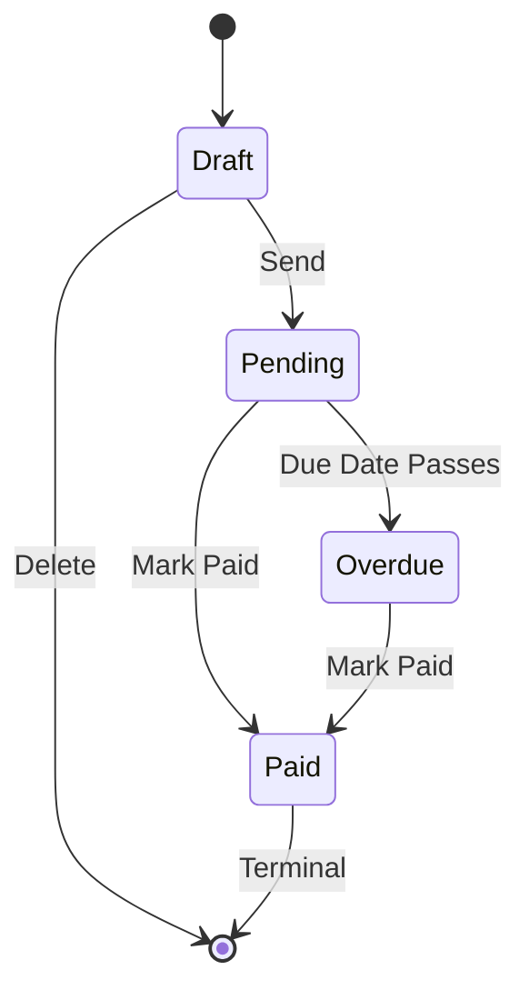
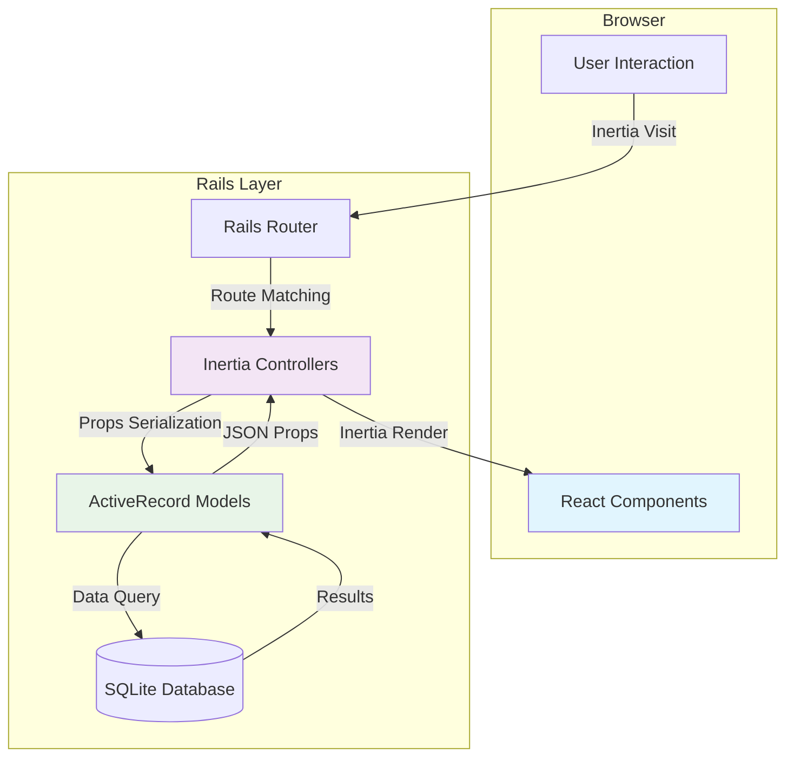
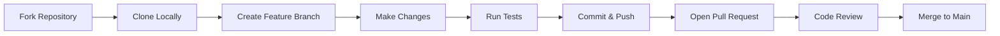

# package.json
```json
{
  "dependencies": {
    "@inertiajs/react": "^2.2.19",
    "@radix-ui/react-dialog": "^1.1.15",
    "@radix-ui/react-dropdown-menu": "^2.1.16",
    "@radix-ui/react-label": "^2.1.8",
    "@radix-ui/react-separator": "^1.1.8",
    "@radix-ui/react-slot": "^1.2.4",
    "@radix-ui/react-tabs": "^1.1.13",
    "@radix-ui/react-tooltip": "^1.2.8",
    "@tailwindcss/vite": "^4.1.17",
    "class-variance-authority": "^0.7.1",
    "clsx": "^2.1.1",
    "lucide-react": "^0.555.0",
    "react": "^19.2.1",
    "react-dom": "^19.2.1",
    "tailwind-merge": "^3.4.0",
    "tailwindcss": "^4.1.17"
  },
  "devDependencies": {
    "@types/react": "^19.2.7",
    "@types/react-dom": "^19.2.3",
    "@vitejs/plugin-react": "^5.1.1",
    "typescript": "^5.9.3"
  }
}

```

# config/routes.rb
```rb
# config/routes.rb
Rails.application.routes.draw do
  root "dashboard#index"
  
  get "dashboard", to: "dashboard#index"
  
  resources :clients, only: [:index]
  resources :invoices, only: [:index, :new, :edit]
  
  # Public shareable invoice (for Day 6)
  get "i/:token", to: "public_invoices#show", as: :public_invoice
end

```

# app/views/layouts/application.html.erb
```erb
<!-- app/views/layouts/application.html.erb -->
<!DOCTYPE html>
<html lang="en" class="h-full">
  <head>
    <meta charset="UTF-8">
    <meta name="viewport" content="width=device-width, initial-scale=1.0">
    <title>InvoiceForge</title>
    
    <!-- Google Fonts: Instrument Serif + Geist + Geist Mono -->
    <link rel="preconnect" href="https://fonts.googleapis.com">
    <link rel="preconnect" href="https://fonts.gstatic.com" crossorigin>
    <link href="https://fonts.googleapis.com/css2?family=Instrument+Serif:ital@0;1&family=Geist:wght@400;500;600;700&family=Geist+Mono:wght@400;500&display=swap" rel="stylesheet">
    
    <%= csrf_meta_tags %>
    <%= csp_meta_tag %>
    
    <%= vite_client_tag %>
    <%= vite_javascript_tag 'inertia' %>
    <%= vite_stylesheet_tag 'application' %>
  </head>
  <body class="h-full">
    <%= yield %>
  </body>
</html>

```

# app/assets/stylesheets/application.css
```css
/* app/assets/stylesheets/application.css */

/* ═══════════════════════════════════════════════════════════════════════════
   INVOICEFORGE DESIGN SYSTEM — v4.2 Neo-Editorial Precision
   ═══════════════════════════════════════════════════════════════════════════ */

@import "tailwindcss";

/* ═══════════════════════════════════════════════════════════════════════════
   THEME TOKENS
   ═══════════════════════════════════════════════════════════════════════════ */

@theme {
  /* Typography */
  --font-display: "Instrument Serif", Georgia, serif;
  --font-sans: "Geist", system-ui, sans-serif;
  --font-mono: "Geist Mono", ui-monospace, monospace;

  /* Primary Action Colors */
  --color-accent: var(--color-blue-500);
  --color-accent-hover: var(--color-blue-600);
  --color-accent-subtle: var(--color-blue-50);

  /* Status Colors */
  --color-status-draft: var(--color-slate-400);
  --color-status-pending: var(--color-amber-500);
  --color-status-paid: var(--color-emerald-500);
  --color-status-overdue: var(--color-rose-500);

  /* Brutalist Shadows */
  --shadow-brutal: 4px 4px 0px 0px var(--color-slate-900);
  --shadow-brutal-sm: 2px 2px 0px 0px var(--color-slate-900);
}

/* Utility class for browsers that don't support @theme shadow */
.shadow-brutal {
  box-shadow: 4px 4px 0px 0px rgb(15 23 42); /* slate-900 */
}

.dark .shadow-brutal {
  box-shadow: 4px 4px 0px 0px rgb(226 232 240); /* slate-200 in dark mode */
}

/* Dark Mode Shadow Overrides */
.dark {
  --shadow-brutal: 4px 4px 0px 0px var(--color-slate-100);
  --shadow-brutal-sm: 2px 2px 0px 0px var(--color-slate-100);
}

@keyframes fade-in-up {
  from {
    opacity: 0;
    transform: translateY(8px);
  }
  to {
    opacity: 1;
    transform: translateY(0);
  }
}

.animate-fade-in-up {
  animation: fade-in-up 0.3s ease-out forwards;
  opacity: 0;
}

/* ═══════════════════════════════════════════════════════════════════════════
   BASE STYLES
   ═══════════════════════════════════════════════════════════════════════════ */

@layer base {
  html {
    font-family: var(--font-sans);
    -webkit-font-smoothing: antialiased;
    -moz-osx-font-smoothing: grayscale;
  }

  /* Smooth color transitions for theme switching */
  * {
    @apply transition-colors duration-200;
  }

  /* Disable transitions during theme switch to prevent flash */
  html.no-transitions * {
    transition: none !important;
  }
}

/* ═══════════════════════════════════════════════════════════════════════════
   KEYFRAME DEFINITIONS (Outside @layer for global scope)
   ═══════════════════════════════════════════════════════════════════════════ */

@keyframes fadeInUp {
  from {
    opacity: 0;
    transform: translateY(8px);
  }
  to {
    opacity: 1;
    transform: translateY(0);
  }
}

@keyframes fadeIn {
  from {
    opacity: 0;
  }
  to {
    opacity: 1;
  }
}

@keyframes slideInFromRight {
  from {
    opacity: 0;
    transform: translateX(100%);
  }
  to {
    opacity: 1;
    transform: translateX(0);
  }
}

@keyframes slideInFromBottom {
  from {
    opacity: 0;
    transform: translateY(100%);
  }
  to {
    opacity: 1;
    transform: translateY(0);
  }
}

/* ═══════════════════════════════════════════════════════════════════════════
   ANIMATION UTILITIES
   ═══════════════════════════════════════════════════════════════════════════ */

@layer utilities {
  /* Staggered list entrance */
  .animate-fade-in-up {
    animation: fadeInUp 0.3s ease-out forwards;
    opacity: 0;
  }

  /* Simple fade in */
  .animate-fade-in {
    animation: fadeIn 0.2s ease-out forwards;
    opacity: 0;
  }

  /* Sheet/Drawer animations */
  .animate-slide-in-right {
    animation: slideInFromRight 0.3s ease-out forwards;
  }

  .animate-slide-in-bottom {
    animation: slideInFromBottom 0.3s ease-out forwards;
  }

  /* Respect reduced motion preferences */
  @media (prefers-reduced-motion: reduce) {
    .animate-fade-in-up,
    .animate-fade-in,
    .animate-slide-in-right,
    .animate-slide-in-bottom {
      animation: none;
      opacity: 1;
      transform: none;
    }
  }
}

/* ═══════════════════════════════════════════════════════════════════════════
   PRINT STYLES
   ═══════════════════════════════════════════════════════════════════════════ */

@media print {
  .no-print,
  nav,
  footer,
  button,
  .sidebar {
    display: none !important;
  }

  body {
    background: white !important;
    color: black !important;
    -webkit-print-color-adjust: exact;
    print-color-adjust: exact;
  }

  .invoice-container {
    box-shadow: none !important;
    border: 1px solid #e2e8f0 !important;
    width: 100% !important;
    page-break-inside: avoid;
  }
}

/* ─────────────────────────────────────────────────────────────────────────
   COMPLETE DAY 3 CSS ADDITIONS (Patch)
   ───────────────────────────────────────────────────────────────────────── */

/* Slide Out (Full) - for Sheet */
.slide-out-to-top { --tw-exit-translate-y: -100%; }
.slide-out-to-bottom { --tw-exit-translate-y: 100%; }
.slide-out-to-left { --tw-exit-translate-x: -100%; }
.slide-out-to-right { --tw-exit-translate-x: 100%; }

/* Slide In (Full) - for Sheet */
.slide-in-from-top { --tw-enter-translate-y: -100%; }
.slide-in-from-bottom { --tw-enter-translate-y: 100%; }
.slide-in-from-left { --tw-enter-translate-x: -100%; }
.slide-in-from-right { --tw-enter-translate-x: 100%; }

/* ─────────────────────────────────────────────────────────────────────────
   RADIX UI ANIMATION UTILITIES
   ───────────────────────────────────────────────────────────────────────── */

@keyframes radix-enter {
  from {
    opacity: var(--tw-enter-opacity, 0);
    transform: translate3d(var(--tw-enter-translate-x, 0), var(--tw-enter-translate-y, 0), 0)
      scale3d(var(--tw-enter-scale, 1), var(--tw-enter-scale, 1), var(--tw-enter-scale, 1));
  }
  to {
    opacity: 1;
    transform: translate3d(0, 0, 0) scale3d(1, 1, 1);
  }
}

@keyframes radix-exit {
  from {
    opacity: 1;
    transform: translate3d(0, 0, 0) scale3d(1, 1, 1);
  }
  to {
    opacity: var(--tw-exit-opacity, 0);
    transform: translate3d(var(--tw-exit-translate-x, 0), var(--tw-exit-translate-y, 0), 0)
      scale3d(var(--tw-exit-scale, 1), var(--tw-exit-scale, 1), var(--tw-exit-scale, 1));
  }
}

/* Animation triggers */
.animate-in {
  animation: radix-enter 150ms ease-out;
}

.animate-out {
  animation: radix-exit 150ms ease-in;
}

/* Fade */
.fade-in-0 { --tw-enter-opacity: 0; }
.fade-out-0 { --tw-exit-opacity: 0; }

/* Zoom */
.zoom-in-95 { --tw-enter-scale: 0.95; }
.zoom-out-95 { --tw-exit-scale: 0.95; }

/* Slide In (Small) */
.slide-in-from-top-2 { --tw-enter-translate-y: -0.5rem; }
.slide-in-from-bottom-2 { --tw-enter-translate-y: 0.5rem; }
.slide-in-from-left-2 { --tw-enter-translate-x: -0.5rem; }
.slide-in-from-right-2 { --tw-enter-translate-x: 0.5rem; }

/* Reduced motion */
@media (prefers-reduced-motion: reduce) {
  .animate-in,
  .animate-out {
    animation: none;
  }
}

```

# app/controllers/clients_controller.rb
```rb
class ClientsController < ApplicationController
  def index
    render inertia: 'Clients/Index'
  end
end

```

# app/controllers/dashboard_controller.rb
```rb
class DashboardController < ApplicationController
  def index
    render inertia: 'Dashboard'
  end
end

```

# app/controllers/invoices_controller.rb
```rb
# app/controllers/invoices_controller.rb
class InvoicesController < ApplicationController
  def index
    render inertia: 'Invoices/Index'
  end

  def new
    render inertia: 'Invoices/New'
  end

  def edit
    render inertia: 'Invoices/Edit', props: {
      id: params[:id]
    }
  end
end

```

# app/frontend/pages/Dashboard.tsx
```tsx
// app/frontend/pages/Dashboard.tsx
import { Link } from "@inertiajs/react"
import { AppLayout } from "@/layouts/AppLayout"
import { PageHeader } from "@/components/shared/PageHeader"
import { Button } from "@/components/ui/button"
import { 
  MetricCard, 
  RecentInvoices, 
  ActivityFeed 
} from "@/components/dashboard"
import { 
  mockDashboardMetrics, 
  mockInvoices, 
  mockRecentActivity 
} from "@/lib/mock-data"
import { formatCurrency } from "@/lib/utils"
import { 
  Plus, 
  DollarSign, 
  Clock, 
  TrendingUp, 
  AlertTriangle 
} from "lucide-react"
import type { DashboardMetrics, Invoice, RecentActivity } from "@/lib/types"

interface DashboardProps {
  /** Dashboard metrics from backend (optional - falls back to mock) */
  metrics?: DashboardMetrics
  /** Recent invoices from backend (optional - falls back to mock) */
  invoices?: Invoice[]
  /** Recent activities from backend (optional - falls back to mock) */
  activities?: RecentActivity[]
}

/**
 * Dashboard Page — Financial pulse and quick actions
 * 
 * Layout (v4.2):
 * - PageHeader with date and "New Invoice" CTA
 * - Metrics Grid: 4 columns desktop, 2 tablet, 1 mobile
 * - Two-column layout: Recent Invoices | Activity Feed
 */
export default function Dashboard({ 
  metrics: propsMetrics,
  invoices: propsInvoices,
  activities: propsActivities 
}: DashboardProps) {
  // Use props if provided, otherwise fall back to mock data
  const metrics = propsMetrics || mockDashboardMetrics
  const allInvoices = propsInvoices || mockInvoices
  const activities = propsActivities || mockRecentActivity

  // Format today's date
  const today = new Date().toLocaleDateString('en-SG', {
    weekday: 'long',
    day: 'numeric',
    month: 'long',
    year: 'numeric',
  })

  // Sort invoices by date (most recent first) for display
  const recentInvoices = [...allInvoices].sort(
    (a, b) => new Date(b.createdAt).getTime() - new Date(a.createdAt).getTime()
  )

  // Count invoices by status for subtext
  const pendingCount = allInvoices.filter(inv => inv.status === 'pending').length
  const overdueCount = allInvoices.filter(inv => inv.status === 'overdue').length
  const outstandingCount = pendingCount + overdueCount

  return (
    <AppLayout>
      {/* Page Header */}
      <PageHeader
        title="Dashboard"
        subtitle={today}
        actions={
          <Button asChild>
            <Link href="/invoices/new">
              <Plus className="h-4 w-4 mr-2" />
              New Invoice
            </Link>
          </Button>
        }
      />

      {/* Metrics Grid */}
      <div className="grid gap-4 grid-cols-1 sm:grid-cols-2 lg:grid-cols-4 mb-8">
        {/* Outstanding */}
        <MetricCard
          label="Outstanding"
          value={formatCurrency(metrics.totalOutstanding)}
          subtext={`${outstandingCount} invoice${outstandingCount !== 1 ? 's' : ''}`}
          icon={DollarSign}
        />

        {/* Paid This Month */}
        <MetricCard
          label="Paid (Month)"
          value={formatCurrency(metrics.totalPaidThisMonth)}
          trend={{
            value: "12%",
            direction: "up",
            positive: true,
          }}
          icon={TrendingUp}
        />

        {/* Paid YTD */}
        <MetricCard
          label="Paid (YTD)"
          value={formatCurrency(metrics.totalPaidYTD)}
          icon={DollarSign}
          variant="success"
        />

        {/* Overdue */}
        <MetricCard
          label="Overdue"
          value={formatCurrency(metrics.overdueAmount)}
          subtext={`${metrics.overdueCount} invoice${metrics.overdueCount !== 1 ? 's' : ''}`}
          variant="danger"
          icon={AlertTriangle}
        />
      </div>

      {/* Two Column Layout: Recent Invoices | Activity Feed */}
      <div className="grid gap-6 lg:grid-cols-2">
        {/* Recent Invoices */}
        <RecentInvoices invoices={recentInvoices} limit={4} />

        {/* Activity Feed */}
        <ActivityFeed activities={activities} limit={5} />
      </div>
    </AppLayout>
  )
}

```

# app/frontend/pages/Clients/Index.tsx
```tsx
// app/frontend/pages/Clients/Index.tsx
import { useState, useMemo } from "react"
import { AppLayout } from "@/layouts/AppLayout"
import { PageHeader } from "@/components/shared/PageHeader"
import { Button } from "@/components/ui/button"
import { Input } from "@/components/ui/input"
import { ClientList, ClientFormSheet } from "@/components/clients"
import { mockClients } from "@/lib/mock-data"
import { Plus, Search } from "lucide-react"
import type { Client } from "@/lib/types"

interface ClientsIndexProps {
  /** Clients from backend (optional - falls back to mock data) */
  clients?: Client[]
}

/**
 * Clients Page — Client directory with table/card views
 * 
 * Features:
 * - PageHeader with count and "New Client" button
 * - Search/filter input
 * - Responsive table (desktop) / cards (mobile)
 * - New/Edit client sheet
 */
export default function ClientsIndex({ clients: propsClients }: ClientsIndexProps) {
  // Use props clients if provided, otherwise fall back to mock data
  const allClients = propsClients || mockClients
  
  // Sheet state
  const [sheetOpen, setSheetOpen] = useState(false)
  const [editingClient, setEditingClient] = useState<Client | undefined>()

  // Search state
  const [searchQuery, setSearchQuery] = useState('')

  // Filter clients based on search
  const filteredClients = useMemo(() => {
    if (!searchQuery.trim()) {
      return allClients
    }

    const query = searchQuery.toLowerCase()
    return allClients.filter(client => 
      client.name.toLowerCase().includes(query) ||
      client.email.toLowerCase().includes(query) ||
      client.company?.toLowerCase().includes(query)
    )
  }, [allClients, searchQuery])

  // Handle opening the sheet for a new client
  const handleNewClient = () => {
    setEditingClient(undefined)
    setSheetOpen(true)
  }

  // Handle opening the sheet for editing a client
  const handleEditClient = (client: Client) => {
    setEditingClient(client)
    setSheetOpen(true)
  }

  // Handle deleting a client (mock - just logs for now)
  const handleDeleteClient = (client: Client) => {
    // In a real app, this would show a confirmation dialog
    // and then make an API call
    console.log('Delete client:', client.id, client.name)
    alert(`Delete "${client.name}"? (This is a mock action)`)
  }

  // Handle form submission
  const handleFormSubmit = (data: any) => {
    if (editingClient) {
      console.log('Update client:', editingClient.id, data)
    } else {
      console.log('Create client:', data)
    }
    // In a real app, this would make an API call
    // and refresh the client list
  }

  return (
    <AppLayout>
      {/* Page Header */}
      <PageHeader
        title="Clients"
        subtitle={`${allClients.length} total client${allClients.length !== 1 ? 's' : ''}`}
        actions={
          <Button onClick={handleNewClient}>
            <Plus className="h-4 w-4 mr-2" />
            New Client
          </Button>
        }
      />

      {/* Search Bar */}
      <div className="mb-6">
        <div className="relative max-w-md">
          <Search className="absolute left-3 top-1/2 -translate-y-1/2 h-4 w-4 text-slate-400" />
          <Input
            type="search"
            placeholder="Search clients..."
            value={searchQuery}
            onChange={(e) => setSearchQuery(e.target.value)}
            className="pl-10"
            aria-label="Search clients"
          />
        </div>
      </div>

      {/* Client List (responsive table/cards) */}
      <ClientList
        clients={filteredClients}
        onEdit={handleEditClient}
        onDelete={handleDeleteClient}
      />

      {/* Search Results Count (when searching) */}
      {searchQuery && (
        <p className="mt-4 text-sm text-slate-500 dark:text-slate-400" role="status">
          {filteredClients.length === 0 
            ? 'No clients found matching your search.'
            : `Showing ${filteredClients.length} of ${allClients.length} clients`
          }
        </p>
      )}

      {/* Client Form Sheet */}
      <ClientFormSheet
        open={sheetOpen}
        onOpenChange={setSheetOpen}
        client={editingClient}
        onSubmit={handleFormSubmit}
      />
    </AppLayout>
  )
}

```

# app/frontend/pages/PublicInvoice/Show.tsx
```tsx
// app/frontend/pages/PublicInvoice/Show.tsx
import { useState, useMemo } from "react"
import { PublicLayout } from "@/layouts/PublicLayout"
import { Button } from "@/components/ui/button"
import { StatusBadge } from "@/components/shared/StatusBadge"
import {
  PublicInvoiceHeader,
  PublicInvoiceLineItems,
  PublicInvoiceTotals,
  PaymentModal,
} from "@/components/public-invoice"
import { calculateTotals } from "@/components/invoices/InvoiceSummary"
import { mockInvoices } from "@/lib/mock-data"
import { formatCurrency } from "@/lib/utils"
import { CreditCard, Printer, Download } from "lucide-react"

interface PublicInvoiceShowProps {
  token: string
}

/**
 * Public Invoice Page — Client-facing shareable invoice
 * 
 * Features:
 * - Professional invoice layout
 * - Print-optimized styling
 * - Pay Now button (mock)
 * - Print and download options
 */
export default function PublicInvoiceShow({ token }: PublicInvoiceShowProps) {
  const [paymentModalOpen, setPaymentModalOpen] = useState(false)

  // Find invoice by token (in real app, this would come from API)
  const invoice = useMemo(
    () => mockInvoices.find(inv => inv.token === token),
    [token]
  )

  if (!invoice) {
    return (
      <PublicLayout>
        <div className="text-center py-12">
          <p className="text-slate-500">Invoice not found</p>
        </div>
      </PublicLayout>
    )
  }

  const { total } = calculateTotals(invoice.lineItems)
  const isPaid = invoice.status === 'paid'
  const canPay = invoice.status === 'pending' || invoice.status === 'overdue'

  const handlePrint = () => {
    window.print()
  }

  return (
    <PublicLayout>
      {/* Action Bar (hidden in print) */}
      <div className="flex items-center justify-between mb-6 print:hidden">
        <StatusBadge status={invoice.status} />
        <div className="flex 

```

# app/frontend/pages/Dashboard.tsx.test
```test
// app/frontend/pages/Dashboard.tsx 
// Step 1.3.9: Create Test Dashboard Page
export default function Dashboard() {
  return (
    <div className="p-8">
      <h1 className="text-4xl font-bold">Dashboard</h1>
      <p className="mt-4 text-slate-600">Inertia + React is working!</p>
    </div>
  )
}

```

# app/frontend/pages/Invoices/Edit.tsx
```tsx
// app/frontend/pages/Invoices/Edit.tsx
import { AppLayout } from "@/layouts/AppLayout"
import { PageHeader } from "@/components/shared/PageHeader"
import { Button } from "@/components/ui/button"
import { Link } from "@inertiajs/react"
import { ArrowLeft } from "lucide-react"

interface EditInvoiceProps {
  id: string
}

/**
 * Edit Invoice Page — Placeholder for Day 5
 */
export default function InvoicesEdit({ id }: EditInvoiceProps) {
  return (
    <AppLayout>
      <PageHeader
        title="Edit Invoice"
        subtitle={`Editing invoice ${id}`}
        actions={
          <Button variant="outline" asChild>
            <Link href="/invoices">
              <ArrowLeft className="h-4 w-4 mr-2" />
              Back to Invoices
            </Link>
          </Button>
        }
      />

      <div className="bg-white dark:bg-slate-900 border border-slate-200 dark:border-slate-800 rounded-lg shadow-sm p-8 text-center">
        <p className="text-slate-500 dark:text-slate-400">
          Invoice editor will be implemented on Day 5
        </p>
      </div>
    </AppLayout>
  )
}

```

# app/frontend/pages/Invoices/Index.tsx
```tsx
// app/frontend/pages/Invoices/Index.tsx
import { useState, useMemo, useCallback } from "react"
import { router } from "@inertiajs/react"
import { AppLayout } from "@/layouts/AppLayout"
import { PageHeader } from "@/components/shared/PageHeader"
import { Button } from "@/components/ui/button"
import { 
  InvoiceFilterTabs, 
  InvoiceList,
  type FilterValue 
} from "@/components/invoices"
import { mockInvoices } from "@/lib/mock-data"
import { Plus } from "lucide-react"
import type { Invoice } from "@/lib/types"

/**
 * Invoices Page — Command center for all invoices
 * 
 * Features:
 * - PageHeader with count and "New Invoice" button
 * - Filter tabs by status
 * - Responsive table (desktop) / cards (mobile)
 * - Contextual row actions
 */
export default function InvoicesIndex() {
  // Filter state
  const [activeFilter, setActiveFilter] = useState<FilterValue>('all')

  // Filter invoices based on active filter
  const filteredInvoices = useMemo(() => {
    if (activeFilter === 'all') {
      return mockInvoices
    }
    return mockInvoices.filter(invoice => invoice.status === activeFilter)
  }, [activeFilter])

  // Sort by most recent first
  const sortedInvoices = useMemo(() => {
    return [...filteredInvoices].sort(
      (a, b) => new Date(b.createdAt).getTime() - new Date(a.createdAt).getTime()
    )
  }, [filteredInvoices])

  // ─────────────────────────────────────────────────────────────────────────
  // Action Handlers
  // ─────────────────────────────────────────────────────────────────────────

  const handleEdit = useCallback((invoice: Invoice) => {
    // Navigate to invoice editor
    router.visit(`/invoices/${invoice.id}/edit`)
  }, [])

  const handleView = useCallback((invoice: Invoice) => {
    // Open public invoice in new tab
    window.open(`/i/${invoice.token}`, '_blank')
  }, [])

  const handleSend = useCallback((invoice: Invoice) => {
    // In a real app, this would call an API to send the invoice
    console.log('Send invoice:', invoice.invoiceNumber)
    alert(`Invoice ${invoice.invoiceNumber} would be sent to ${invoice.client?.email}`)
    // After sending, status would change to 'pending'
  }, [])

  const handleMarkPaid = useCallback((invoice: Invoice) => {
    // In a real app, this would call an API to mark as paid
    console.log('Mark paid:', invoice.invoiceNumber)
    alert(`Invoice ${invoice.invoiceNumber} marked as paid`)
    // After marking paid, status would change to 'paid'
  }, [])

  const handleDelete = useCallback((invoice: Invoice) => {
    // In a real app, this would show a confirmation dialog then call API
    console.log('Delete invoice:', invoice.invoiceNumber)
    const confirmed = window.confirm(
      `Delete invoice ${invoice.invoiceNumber}? This action cannot be undone.`
    )
    if (confirmed) {
      console.log('Confirmed delete')
      // Would refresh the list after deletion
    }
  }, [])

  const handleCopyLink = useCallback((invoice: Invoice) => {
    const url = `${window.location.origin}/i/${invoice.token}`
    navigator.clipboard.writeText(url).then(() => {
      alert('Invoice link copied to clipboard!')
    }).catch(() => {
      // Fallback for older browsers
      prompt('Copy this link:', url)
    })
  }, [])

  const handleNewInvoice = useCallback(() => {
    router.visit('/invoices/new')
  }, [])

  // ─────────────────────────────────────────────────────────────────────────
  // Render
  // ─────────────────────────────────────────────────────────────────────────

  return (
    <AppLayout>
      {/* Page Header */}
      <PageHeader
        title="Invoices"
        subtitle={`${mockInvoices.length} total invoice${mockInvoices.length !== 1 ? 's' : ''}`}
        actions={
          <Button onClick={handleNewInvoice}>
            <Plus className="h-4 w-4 mr-2" />
            New Invoice
          </Button>
        }
      />

      {/* Filter Tabs */}
      <div className="mb-6">
        <InvoiceFilterTabs
          invoices={mockInvoices}
          activeFilter={activeFilter}
          onFilterChange={setActiveFilter}
        />
      </div>

      {/* Invoice List (responsive table/cards) */}
      <InvoiceList
        invoices={sortedInvoices}
        isFiltered={activeFilter !== 'all'}
        onEdit={handleEdit}
        onView={handleView}
        onSend={handleSend}
        onMarkPaid={handleMarkPaid}
        onDelete={handleDelete}
        onCopyLink={handleCopyLink}
      />

      {/* Filter Result Count */}
      {activeFilter !== 'all' && filteredInvoices.length > 0 && (
        <p className="mt-4 text-sm text-slate-500 dark:text-slate-400">
          Showing {filteredInvoices.length} of {mockInvoices.length} invoices
        </p>
      )}
    </AppLayout>
  )
}

```

# app/frontend/pages/Invoices/New.tsx
```tsx
// app/frontend/pages/Invoices/New.tsx
import { AppLayout } from "@/layouts/AppLayout"
import { PageHeader } from "@/components/shared/PageHeader"
import { Button } from "@/components/ui/button"
import { Link } from "@inertiajs/react"
import { ArrowLeft } from "lucide-react"

/**
 * New Invoice Page — Placeholder for Day 5
 */
export default function InvoicesNew() {
  return (
    <AppLayout>
      <PageHeader
        title="New Invoice"
        subtitle="Create a new invoice"
        actions={
          <Button variant="outline" asChild>
            <Link href="/invoices">
              <ArrowLeft className="h-4 w-4 mr-2" />
              Back to Invoices
            </Link>
          </Button>
        }
      />

      <div className="bg-white dark:bg-slate-900 border border-slate-200 dark:border-slate-800 rounded-lg shadow-sm p-8 text-center">
        <p className="text-slate-500 dark:text-slate-400">
          Invoice editor will be implemented on Day 5
        </p>
      </div>
    </AppLayout>
  )
}

```

# app/frontend/layouts/PublicLayout.tsx
```tsx
// app/frontend/layouts/PublicLayout.tsx
import { cn } from "@/lib/utils"

interface PublicLayoutProps {
  children: React.ReactNode
  className?: string
}

/**
 * PublicLayout — Minimal layout for public-facing pages
 * 
 * Features:
 * - No navigation
 * - Centered content
 * - Print-optimized
 */
export function PublicLayout({ children, className }: PublicLayoutProps) {
  return (
    <div className={cn(
      "min-h-screen bg-slate-100 dark:bg-slate-950",
      "print:bg-white print:min-h-0",
      className
    )}>
      <main className="mx-auto max-w-4xl px-4 py-8 print:p-0 print:max-w-none">
        {children}
      </main>
    </div>
  )
}

```

# app/frontend/layouts/AppLayout.tsx
```tsx
// app/frontend/layouts/AppLayout.tsx
import { Sidebar } from "@/components/layout/Sidebar"
import { MobileNav } from "@/components/layout/MobileNav"
import { TooltipProvider } from "@/components/ui/tooltip"

interface AppLayoutProps {
  children: React.ReactNode
}

export function AppLayout({ children }: AppLayoutProps) {
  return (
    <TooltipProvider>
      {/* Canvas background - the "well" that cards sit in */}
      <div className="min-h-screen bg-slate-50 dark:bg-slate-950">
        {/* Desktop Sidebar */}
        <Sidebar />

        {/* Mobile Header */}
        <MobileNav />

        {/* Main Content Area */}
        <main className="lg:pl-64">
          <div className="px-4 py-6 sm:px-6 lg:px-8 lg:py-8">
            {children}
          </div>
        </main>
      </div>
    </TooltipProvider>
  )
}

```

# app/frontend/components/public-invoice/PaymentModal.tsx
```tsx
// app/frontend/components/public-invoice/PaymentModal.tsx
import { useState } from "react"
import {
  Dialog,
  DialogContent,
  DialogHeader,
  DialogTitle,
  DialogDescription,
} from "@/components/ui/dialog"
import { Button } from "@/components/ui/button"
import { Input } from "@/components/ui/input"
import { Label } from "@/components/ui/label"
import { formatCurrency } from "@/lib/utils"
import { CreditCard, Lock } from "lucide-react"

interface PaymentModalProps {
  open: boolean
  onOpenChange: (open: boolean) => void
  amount: number
  invoiceNumber: string
}

/**
 * PaymentModal — Mock Stripe payment form
 * 
 * Features:
 * - Card number, expiry, CVC fields
 * - Mock "Secured by Stripe" branding
 * - Pay Now button with amount
 */
export function PaymentModal({
  open,
  onOpenChange,
  amount,
  invoiceNumber,
}: PaymentModalProps) {
  const [isProcessing, setIsProcessing] = useState(false)
  const [cardNumber, setCardNumber] = useState('')
  const [expiry, setExpiry] = useState('')
  const [cvc, setCvc] = useState('')

  const handleSubmit = async (e: React.FormEvent) => {
    e.preventDefault()
    setIsProcessing(true)
    
    // Simulate payment processing
    await new Promise(resolve => setTimeout(resolve, 2000))
    
    setIsProcessing(false)
    alert('Payment successful! (This is a mock payment)')
    onOpenChange(false)
  }

  // Format card number with spaces
  const formatCardNumber = (value: string) => {
    const numbers = value.replace(/\D/g, '')
    const groups = numbers.match(/.{1,4}/g) || []
    return groups.join(' ').substr(0, 19)
  }

  // Format expiry as MM/YY
  const formatExpiry = (value: string) => {
    const numbers = value.replace(/\D/g, '')
    if (numbers.length >= 2) {
      return `${numbers.substr(0, 2)}/${numbers.substr(2, 2)}`
    }
    return numbers
  }

  return (
    <Dialog open={open} onOpenChange={onOpenChange}>
      <DialogContent className="sm:max-w-md">
        <DialogHeader>
          <DialogTitle className="flex items-center gap-2">
            <CreditCard className="h-5 w-5" />
            Pay Invoice {invoiceNumber}
          </DialogTitle>
          <DialogDescription>
            Enter your card details to pay {formatCurrency(amount)}
          </DialogDescription>
        </DialogHeader>

        <form onSubmit={handleSubmit} className="space-y-4 mt-4">
          {/* Card Number */}
          <div className="space-y-2">
            <Label htmlFor="card-number">Card Number</Label>
            <Input
              id="card-number"
              placeholder="4242 4242 4242 4242"
              value={cardNumber}
              onChange={(e) => setCardNumber(formatCardNumber(e.target.value))}
              maxLength={19}
              disabled={isProcessing}
            />
          </div>

          {/* Expiry and CVC */}
          <div className="grid grid-cols-2 gap-4">
            <div className="space-y-2">
              <Label htmlFor="expiry">Expiry</Label>
              <Input
                id="expiry"
                placeholder="MM/YY"
                value={expiry}
                onChange={(e) => setExpiry(formatExpiry(e.target.value))}
                maxLength={5}
                disabled={isProcessing}
              />
            </div>
            <div className="space-y-2">
              <Label htmlFor="cvc">CVC</Label>
              <Input
                id="cvc"
                placeholder="123"
                value={cvc}
                onChange={(e) => setCvc(e.target.value.replace(/\D/g, '').substr(0, 4))}
                maxLength={4}
                disabled={isProcessing}
              />
            </div>
          </div>

          {/* Secured by Stripe */}
          <div className="flex items-center justify-center gap-2 text-sm text-slate-500 dark:text-slate-400 py-2">
            <Lock className="h-4 w-4" />
            <span>Secured by Stripe</span>
          </div>

          {/* Submit Button */}
          <Button
            type="submit"
            className="w-full"
            size="lg"
            disabled={isProcessing}
          >
            {isProcessing ? (
              'Processing...'
            ) : (
              `Pay ${formatCurrency(amount)}`
            )}
          </Button>
        </form>
      </DialogContent>
    </Dialog>
  )
}

```

# app/frontend/components/public-invoice/PublicInvoiceHeader.tsx
```tsx
// app/frontend/components/public-invoice/PublicInvoiceHeader.tsx
import { Logo } from "@/components/layout/Logo"
import { formatDate } from "@/lib/utils"
import type { Invoice } from "@/lib/types"

interface PublicInvoiceHeaderProps {
  invoice: Invoice
}

/**
 * PublicInvoiceHeader — Header section of public invoice
 * 
 * Layout:
 * - Logo on left
 * - "INVOICE" + number on right
 * - Billed to section below
 */
export function PublicInvoiceHeader({ invoice }: PublicInvoiceHeaderProps) {
  return (
    <div className="mb-8">
      {/* Top Row: Logo and Invoice Info */}
      <div className="flex justify-between items-start mb-8">
        {/* Left: Logo and Sender Info */}
        <div>
          <Logo />
          <div className="mt-4 text-sm text-slate-600 dark:text-slate-400">
            <p>Your Company Name</p>
            <p>123 Business Street</p>
            <p>Singapore 123456</p>
          </div>
        </div>

        {/* Right: Invoice Title and Number */}
        <div className="text-right">
          <p className="text-sm font-medium uppercase tracking-widest text-slate-500 dark:text-slate-400">
            Invoice
          </p>
          <p className="font-mono text-4xl md:text-6xl tracking-tighter font-medium text-slate-900 dark:text-slate-50 mt-1">
            {invoice.invoiceNumber}
          </p>
        </div>
      </div>

      {/* Invoice Details Row */}
      <div className="grid grid-cols-2 md:grid-cols-4 gap-6 py-6 border-y border-slate-200 dark:border-slate-800">
        {/* Billed To */}
        <div className="col-span-2">
          <p className="text-xs font-medium uppercase tracking-widest text-slate-500 dark:text-slate-400 mb-2">
            Billed To
          </p>
          <p className="font-medium text-slate-900 dark:text-slate-50">
            {invoice.client?.name}
          </p>
          {invoice.client?.company && (
            <p className="text-sm text-slate-600 dark:text-slate-400">
              {invoice.client.company}
            </p>
          )}
          {invoice.client?.address && (
            <p className="text-sm text-slate-600 dark:text-slate-400 mt-1 whitespace-pre-line">
              {invoice.client.address}
            </p>
          )}
        </div>

        {/* Issue Date */}
        <div>
          <p className="text-xs font-medium uppercase tracking-widest text-slate-500 dark:text-slate-400 mb-2">
            Issue Date
          </p>
          <p className="text-slate-900 dark:text-slate-50">
            {formatDate(invoice.issueDate)}
          </p>
        </div>

        {/* Due Date */}
        <div>
          <p className="text-xs font-medium uppercase tracking-widest text-slate-500 dark:text-slate-400 mb-2">
            Due Date
          </p>
          <p className={`${
            invoice.status === 'overdue' 
              ? 'text-rose-600 dark:text-rose-400 font-medium' 
              : 'text-slate-900 dark:text-slate-50'
          }`}>
            {formatDate(invoice.dueDate)}
          </p>
        </div>
      </div>
    </div>
  )
}

```

# app/frontend/components/public-invoice/index.ts
```ts
// app/frontend/components/public-invoice/index.ts
export { PublicInvoiceHeader } from './PublicInvoiceHeader'
export { PublicInvoiceLineItems } from './PublicInvoiceLineItems'
export { PublicInvoiceTotals } from './PublicInvoiceTotals'
export { PaymentModal } from './PaymentModal'

```

# app/frontend/components/public-invoice/PublicInvoiceTotals.tsx
```tsx
// app/frontend/components/public-invoice/PublicInvoiceTotals.tsx
import { formatCurrency } from "@/lib/utils"
import { calculateTotals } from "@/components/invoices/InvoiceSummary"
import type { LineItem } from "@/lib/types"

interface PublicInvoiceTotalsProps {
  lineItems: LineItem[]
}

/**
 * PublicInvoiceTotals — Total section for public invoice
 * 
 * Layout:
 * - Right-aligned
 * - Subtotal, discounts, total
 * - Large total with emphasis
 */
export function PublicInvoiceTotals({ lineItems }: PublicInvoiceTotalsProps) {
  const { subtotal, totalDiscount, total } = calculateTotals(lineItems)

  return (
    <div className="flex justify-end mb-8">
      <div className="w-full max-w-xs space-y-3">
        {/* Subtotal */}
        <div className="flex justify-between text-sm">
          <span className="text-slate-600 dark:text-slate-400">Subtotal</span>
          <span className="font-mono text-slate-900 dark:text-slate-100">
            {formatCurrency(subtotal)}
          </span>
        </div>

        {/* Discount */}
        {totalDiscount > 0 && (
          <div className="flex justify-between text-sm">
            <span className="text-slate-600 dark:text-slate-400">Discount</span>
            <span className="font-mono text-rose-600 dark:text-rose-400">
              -{formatCurrency(totalDiscount)}
            </span>
          </div>
        )}

        {/* Divider */}
        <div className="h-px bg-slate-300 dark:bg-slate-700" />

        {/* Total Due */}
        <div className="flex justify-between items-center pt-2">
          <span className="text-lg font-semibold text-slate-900 dark:text-slate-100">
            Total Due
          </span>
          <span className="font-mono text-3xl font-bold text-slate-900 dark:text-slate-100">
            {formatCurrency(total)}
          </span>
        </div>
      </div>
    </div>
  )
}

```

# app/frontend/components/public-invoice/PublicInvoiceLineItems.tsx
```tsx
// app/frontend/components/public-invoice/PublicInvoiceLineItems.tsx
import { formatCurrency } from "@/lib/utils"
import { cn } from "@/lib/utils"
import type { LineItem } from "@/lib/types"

interface PublicInvoiceLineItemsProps {
  lineItems: LineItem[]
}

/**
 * PublicInvoiceLineItems — Line items table for public invoice
 * 
 * Layout:
 * - Section headers span full width
 * - Items show description, quantity, rate, amount
 * - Discounts shown in red
 */
export function PublicInvoiceLineItems({ lineItems }: PublicInvoiceLineItemsProps) {
  return (
    <div className="mb-8">
      {/* Table Header */}
      <div className="hidden md:grid md:grid-cols-12 gap-4 py-3 border-b-2 border-slate-900 dark:border-slate-100 text-sm font-medium text-slate-900 dark:text-slate-100">
        <div className="col-span-6">Description</div>
        <div className="col-span-2 text-right">Quantity</div>
        <div className="col-span-2 text-right">Rate</div>
        <div className="col-span-2 text-right">Amount</div>
      </div>

      {/* Line Items */}
      <div className="divide-y divide-slate-200 dark:divide-slate-800">
        {lineItems.map((item) => (
          <LineItemRow key={item.id} item={item} />
        ))}
      </div>
    </div>
  )
}

/**
 * LineItemRow — Single line item display
 */
function LineItemRow({ item }: { item: LineItem }) {
  // Section Header
  if (item.type === 'section') {
    return (
      <div className="py-4 bg-slate-50 dark:bg-slate-800/50 -mx-4 px-4 md:mx-0 md:px-0">
        <p className="font-semibold text-slate-900 dark:text-slate-100 uppercase tracking-wide text-sm">
          {item.description}
        </p>
      </div>
    )
  }

  // Discount Row
  if (item.type === 'discount') {
    const amount = Math.abs(item.unitPrice || 0)
    return (
      <div className="py-4 grid grid-cols-1 md:grid-cols-12 gap-2 md:gap-4">
        <div className="md:col-span-6">
          <p className="text-slate-600 dark:text-slate-400">{item.description}</p>
        </div>
        <div className="md:col-span-2" />
        <div className="md:col-span-2" />
        <div className="md:col-span-2 text-right">
          <span className="font-mono text-rose-600 dark:text-rose-400">
            -{formatCurrency(amount)}
          </span>
        </div>
      </div>
    )
  }

  // Regular Item Row
  const lineTotal = (item.quantity || 0) * (item.unitPrice || 0)
  const unitLabel = item.unitType === 'fixed' ? '' : ` ${item.unitType}`

  return (
    <div className="py-4 grid grid-cols-1 md:grid-cols-12 gap-2 md:gap-4">
      {/* Description */}
      <div className="md:col-span-6">
        <p className="text-slate-900 dark:text-slate-100">{item.description}</p>
      </div>

      {/* Quantity */}
      <div className="md:col-span-2 md:text-right">
        <span className="md:hidden text-sm text-slate-500">Qty: </span>
        <span className="text-slate-600 dark:text-slate-400">
          {item.quantity}{unitLabel}
        </span>
      </div>

      {/* Rate */}
      <div className="md:col-span-2 md:text-right">
        <span className="md:hidden text-sm text-slate-500">Rate: </span>
        <span className="font-mono text-slate-600 dark:text-slate-400">
          {formatCurrency(item.unitPrice || 0)}
        </span>
      </div>

      {/* Amount */}
      <div className="md:col-span-2 md:text-right">
        <span className="md:hidden text-sm text-slate-500">Amount: </span>
        <span className="font-mono font-medium text-slate-900 dark:text-slate-100">
          {formatCurrency(lineTotal)}
        </span>
      </div>
    </div>
  )
}

```

# app/frontend/components/layout/ThemeToggle.tsx
```tsx
// app/frontend/components/layout/ThemeToggle.tsx
import { Sun, Moon } from "lucide-react"
import { Button } from "@/components/ui/button"
import { useTheme } from "@/hooks/useTheme"
import { cn } from "@/lib/utils"

interface ThemeToggleProps {
  className?: string
}

export function ThemeToggle({ className }: ThemeToggleProps) {
  const { resolvedTheme, toggleTheme } = useTheme()

  return (
    <Button
      variant="ghost"
      size="icon"
      onClick={toggleTheme}
      className={cn("relative", className)}
      aria-label={`Switch to ${resolvedTheme === 'light' ? 'dark' : 'light'} mode`}
    >
      {/* Sun icon - visible in dark mode */}
      <Sun 
        className={cn(
          "h-5 w-5 transition-all",
          resolvedTheme === 'dark' 
            ? "rotate-0 scale-100" 
            : "rotate-90 scale-0 absolute"
        )} 
      />
      {/* Moon icon - visible in light mode */}
      <Moon 
        className={cn(
          "h-5 w-5 transition-all",
          resolvedTheme === 'light' 
            ? "rotate-0 scale-100" 
            : "-rotate-90 scale-0 absolute"
        )} 
      />
    </Button>
  )
}

```

# app/frontend/components/layout/NavItem.tsx
```tsx
// app/frontend/components/layout/NavItem.tsx
import { Link, usePage } from "@inertiajs/react"
import { cn } from "@/lib/utils"

interface NavItemProps {
  href: string
  icon: React.ComponentType<{ className?: string }>
  label: string
}

export function NavItem({ href, icon: Icon, label }: NavItemProps) {
  const { url } = usePage()
  
  // Check if current route matches (handle both exact and prefix matching)
  const isActive = url === href || url.startsWith(`${href}/`)

  return (
    <Link
      href={href}
      className={cn(
        "flex items-center gap-3 px-3 py-2 rounded-md text-sm font-medium transition-colors",
        isActive
          ? "bg-slate-100 dark:bg-slate-800 text-blue-600 dark:text-blue-400"
          : "text-slate-600 dark:text-slate-400 hover:bg-slate-100 dark:hover:bg-slate-800 hover:text-slate-900 dark:hover:text-slate-100"
      )}
    >
      <Icon className="h-5 w-5 flex-shrink-0" />
      <span>{label}</span>
    </Link>
  )
}

```

# app/frontend/components/layout/MobileNav.tsx
```tsx
// app/frontend/components/layout/MobileNav.tsx
import { Menu, LayoutDashboard, Users, FileText } from "lucide-react"
import { Link, usePage } from "@inertiajs/react"
import { Button } from "@/components/ui/button"
import {
  Sheet,
  SheetContent,
  SheetHeader,
  SheetTitle,
  SheetTrigger,
} from "@/components/ui/sheet"
import { Logo } from "./Logo"
import { ThemeToggle } from "./ThemeToggle"
import { Separator } from "@/components/ui/separator"
import { cn } from "@/lib/utils"
import { useState } from "react"

const navigation = [
  { href: "/dashboard", icon: LayoutDashboard, label: "Dashboard" },
  { href: "/clients", icon: Users, label: "Clients" },
  { href: "/invoices", icon: FileText, label: "Invoices" },
]

export function MobileNav() {
  const { url } = usePage()
  const [open, setOpen] = useState(false)

  return (
    <header className="lg:hidden sticky top-0 z-40 flex h-16 items-center gap-4 border-b border-slate-200 dark:border-slate-800 bg-white dark:bg-slate-900 px-4">
      {/* Hamburger Menu */}
      <Sheet open={open} onOpenChange={setOpen}>
        <SheetTrigger asChild>
          <Button variant="ghost" size="icon" aria-label="Open menu">
            <Menu className="h-5 w-5" />
          </Button>
        </SheetTrigger>
        <SheetContent side="left" className="w-64 p-0">
          <SheetHeader className="px-6 py-4">
            <SheetTitle className="sr-only">Navigation</SheetTitle>
            <Logo />
          </SheetHeader>
          <Separator />
          <nav className="flex-1 space-y-1 px-3 py-4">
            {navigation.map((item) => {
              const isActive = url === item.href || url.startsWith(`${item.href}/`)
              return (
                <Link
                  key={item.href}
                  href={item.href}
                  onClick={() => setOpen(false)}
                  className={cn(
                    "flex items-center gap-3 px-3 py-2 rounded-md text-sm font-medium transition-colors",
                    isActive
                      ? "bg-slate-100 dark:bg-slate-800 text-blue-600 dark:text-blue-400"
                      : "text-slate-600 dark:text-slate-400 hover:bg-slate-100 dark:hover:bg-slate-800"
                  )}
                >
                  <item.icon className="h-5 w-5 flex-shrink-0" />
                  <span>{item.label}</span>
                </Link>
              )
            })}
          </nav>
          <div className="border-t border-slate-200 dark:border-slate-800 p-4">
            <div className="flex items-center justify-between">
              <span className="text-sm text-slate-500 dark:text-slate-400">Theme</span>
              <ThemeToggle />
            </div>
          </div>
        </SheetContent>
      </Sheet>

      {/* Centered Logo (Mobile) */}
      <div className="flex-1 flex justify-center">
        <Logo />
      </div>

      {/* Right side - Theme Toggle */}
      <ThemeToggle />
    </header>
  )
}

```

# app/frontend/components/layout/index.ts
```ts
// app/frontend/components/layout/index.ts
export { Logo } from './Logo'
export { ThemeToggle } from './ThemeToggle'
export { NavItem } from './NavItem'
export { Sidebar } from './Sidebar'
export { MobileNav } from './MobileNav'

```

# app/frontend/components/layout/Sidebar.tsx
```tsx
// app/frontend/components/layout/Sidebar.tsx
import { LayoutDashboard, Users, FileText } from "lucide-react"
import { Logo } from "./Logo"
import { NavItem } from "./NavItem"
import { ThemeToggle } from "./ThemeToggle"
import { Separator } from "@/components/ui/separator"

const navigation = [
  { href: "/dashboard", icon: LayoutDashboard, label: "Dashboard" },
  { href: "/clients", icon: Users, label: "Clients" },
  { href: "/invoices", icon: FileText, label: "Invoices" },
]

export function Sidebar() {
  return (
    <aside className="hidden lg:fixed lg:inset-y-0 lg:flex lg:w-64 lg:flex-col">
      <div className="flex flex-1 flex-col bg-white dark:bg-slate-900 border-r border-slate-200 dark:border-slate-800">
        {/* Logo */}
        <div className="flex h-16 items-center px-6">
          <Logo />
        </div>

        <Separator />

        {/* Navigation */}
        <nav className="flex-1 space-y-1 px-3 py-4">
          {navigation.map((item) => (
            <NavItem
              key={item.href}
              href={item.href}
              icon={item.icon}
              label={item.label}
            />
          ))}
        </nav>

        {/* Footer with Theme Toggle */}
        <div className="border-t border-slate-200 dark:border-slate-800 p-4">
          <div className="flex items-center justify-between">
            <span className="text-sm text-slate-500 dark:text-slate-400">Theme</span>
            <ThemeToggle />
          </div>
        </div>
      </div>
    </aside>
  )
}

```

# app/frontend/components/layout/Logo.tsx
```tsx
// app/frontend/components/layout/Logo.tsx
import { cn } from "@/lib/utils"

interface LogoProps {
  collapsed?: boolean
  className?: string
}

export function Logo({ collapsed = false, className }: LogoProps) {
  if (collapsed) {
    // Compact version for collapsed sidebar (if needed later)
    return (
      <div className={cn("flex items-center", className)}>
        <span className="font-display text-xl font-bold leading-none text-slate-900 dark:text-slate-50">
          IF
        </span>
      </div>
    )
  }

  return (
    <div className={cn("flex items-center gap-2", className)}>
      <div className="flex flex-col">
        {/* INV in Instrument Serif */}
        <span className="font-display text-xl font-bold leading-none tracking-tight text-slate-900 dark:text-slate-50">
          INV
        </span>
        {/* Horizontal rule */}
        <div className="h-px bg-slate-900 dark:bg-slate-100 w-full my-0.5" />
        {/* FORGE in Geist Mono */}
        <span className="font-mono text-xs leading-none tracking-widest text-slate-900 dark:text-slate-50">
          FORGE
        </span>
      </div>
    </div>
  )
}

```

# app/frontend/components/ui/textarea.tsx
```tsx
// app/frontend/components/ui/textarea.tsx
import * as React from "react"
import { cn } from "@/lib/utils"

export interface TextareaProps
  extends React.TextareaHTMLAttributes<HTMLTextAreaElement> {}

/**
 * Textarea — Multi-line text input
 * 
 * Design (v4.2):
 * - Matches Input styling
 * - Minimum height with resize
 */
const Textarea = React.forwardRef<HTMLTextAreaElement, TextareaProps>(
  ({ className, ...props }, ref) => {
    return (
      <textarea
        className={cn(
          // Base styles
          "flex min-h-[80px] w-full rounded-md px-3 py-2",
          // Background
          "bg-white dark:bg-slate-950",
          // Border
          "border border-slate-300 dark:border-slate-700",
          // Text
          "text-sm text-slate-900 dark:text-slate-100",
          // Placeholder
          "placeholder:text-slate-400 dark:placeholder:text-slate-500",
          // Focus state
          "focus:outline-none focus:ring-2 focus:ring-blue-500 focus:border-transparent",
          // Disabled state
          "disabled:cursor-not-allowed disabled:opacity-50",
          className
        )}
        ref={ref}
        {...props}
      />
    )
  }
)
Textarea.displayName = "Textarea"

export { Textarea }

```

# app/frontend/components/ui/select.tsx
```tsx
// app/frontend/components/ui/select.tsx
import * as React from "react"
import * as SelectPrimitive from "@radix-ui/react-select"
import { Check, ChevronDown, ChevronUp } from "lucide-react"
import { cn } from "@/lib/utils"

const Select = SelectPrimitive.Root
const SelectGroup = SelectPrimitive.Group
const SelectValue = SelectPrimitive.Value

const SelectTrigger = React.forwardRef<
  React.ElementRef<typeof SelectPrimitive.Trigger>,
  React.ComponentPropsWithoutRef<typeof SelectPrimitive.Trigger>
>(({ className, children, ...props }, ref) => (
  <SelectPrimitive.Trigger
    ref={ref}
    className={cn(
      "flex h-10 w-full items-center justify-between rounded-md px-3 py-2",
      "bg-white dark:bg-slate-950",
      "border border-slate-300 dark:border-slate-700",
      "text-sm text-slate-900 dark:text-slate-100",
      "placeholder:text-slate-400",
      "focus:outline-none focus:ring-2 focus:ring-blue-500 focus:border-transparent",
      "disabled:cursor-not-allowed disabled:opacity-50",
      "[&>span]:line-clamp-1",
      className
    )}
    {...props}
  >
    {children}
    <SelectPrimitive.Icon asChild>
      <ChevronDown className="h-4 w-4 opacity-50" />
    </SelectPrimitive.Icon>
  </SelectPrimitive.Trigger>
))
SelectTrigger.displayName = SelectPrimitive.Trigger.displayName

const SelectScrollUpButton = React.forwardRef<
  React.ElementRef<typeof SelectPrimitive.ScrollUpButton>,
  React.ComponentPropsWithoutRef<typeof SelectPrimitive.ScrollUpButton>
>(({ className, ...props }, ref) => (
  <SelectPrimitive.ScrollUpButton
    ref={ref}
    className={cn(
      "flex cursor-default items-center justify-center py-1",
      className
    )}
    {...props}
  >
    <ChevronUp className="h-4 w-4" />
  </SelectPrimitive.ScrollUpButton>
))
SelectScrollUpButton.displayName = SelectPrimitive.ScrollUpButton.displayName

const SelectScrollDownButton = React.forwardRef<
  React.ElementRef<typeof SelectPrimitive.ScrollDownButton>,
  React.ComponentPropsWithoutRef<typeof SelectPrimitive.ScrollDownButton>
>(({ className, ...props }, ref) => (
  <SelectPrimitive.ScrollDownButton
    ref={ref}
    className={cn(
      "flex cursor-default items-center justify-center py-1",
      className
    )}
    {...props}
  >
    <ChevronDown className="h-4 w-4" />
  </SelectPrimitive.ScrollDownButton>
))
SelectScrollDownButton.displayName = SelectPrimitive.ScrollDownButton.displayName

const SelectContent = React.forwardRef<
  React.ElementRef<typeof SelectPrimitive.Content>,
  React.ComponentPropsWithoutRef<typeof SelectPrimitive.Content>
>(({ className, children, position = "popper", ...props }, ref) => (
  <SelectPrimitive.Portal>
    <SelectPrimitive.Content
      ref={ref}
      className={cn(
        "relative z-50 max-h-96 min-w-[8rem] overflow-hidden rounded-md",
        "bg-white dark:bg-slate-900",
        "border border-slate-200 dark:border-slate-800",
        "shadow-brutal",
        "data-[state=open]:animate-in data-[state=closed]:animate-out",
        "data-[state=closed]:fade-out-0 data-[state=open]:fade-in-0",
        "data-[state=closed]:zoom-out-95 data-[state=open]:zoom-in-95",
        "data-[side=bottom]:slide-in-from-top-2",
        "data-[side=left]:slide-in-from-right-2",
        "data-[side=right]:slide-in-from-left-2",
        "data-[side=top]:slide-in-from-bottom-2",
        position === "popper" &&
          "data-[side=bottom]:translate-y-1 data-[side=left]:-translate-x-1 data-[side=right]:translate-x-1 data-[side=top]:-translate-y-1",
        className
      )}
      position={position}
      {...props}
    >
      <SelectScrollUpButton />
      <SelectPrimitive.Viewport
        className={cn(
          "p-1",
          position === "popper" &&
            "h-[var(--radix-select-trigger-height)] w-full min-w-[var(--radix-select-trigger-width)]"
        )}
      >
        {children}
      </SelectPrimitive.Viewport>
      <SelectScrollDownButton />
    </SelectPrimitive.Content>
  </SelectPrimitive.Portal>
))
SelectContent.displayName = SelectPrimitive.Content.displayName

const SelectLabel = React.forwardRef<
  React.ElementRef<typeof SelectPrimitive.Label>,
  React.ComponentPropsWithoutRef<typeof SelectPrimitive.Label>
>(({ className, ...props }, ref) => (
  <SelectPrimitive.Label
    ref={ref}
    className={cn("py-1.5 pl-8 pr-2 text-sm font-semibold", className)}
    {...props}
  />
))
SelectLabel.displayName = SelectPrimitive.Label.displayName

const SelectItem = React.forwardRef<
  React.ElementRef<typeof SelectPrimitive.Item>,
  React.ComponentPropsWithoutRef<typeof SelectPrimitive.Item>
>(({ className, children, ...props }, ref) => (
  <SelectPrimitive.Item
    ref={ref}
    className={cn(
      "relative flex w-full cursor-default select-none items-center rounded-sm py-1.5 pl-8 pr-2 text-sm outline-none",
      "text-slate-900 dark:text-slate-100",
      "focus:bg-slate-100 dark:focus:bg-slate-800",
      "data-[disabled]:pointer-events-none data-[disabled]:opacity-50",
      className
    )}
    {...props}
  >
    <span className="absolute left-2 flex h-3.5 w-3.5 items-center justify-center">
      <SelectPrimitive.ItemIndicator>
        <Check className="h-4 w-4" />
      </SelectPrimitive.ItemIndicator>
    </span>
    <SelectPrimitive.ItemText>{children}</SelectPrimitive.ItemText>
  </SelectPrimitive.Item>
))
SelectItem.displayName = SelectPrimitive.Item.displayName

const SelectSeparator = React.forwardRef<
  React.ElementRef<typeof SelectPrimitive.Separator>,
  React.ComponentPropsWithoutRef<typeof SelectPrimitive.Separator>
>(({ className, ...props }, ref) => (
  <SelectPrimitive.Separator
    ref={ref}
    className={cn("-mx-1 my-1 h-px bg-slate-200 dark:bg-slate-800", className)}
    {...props}
  />
))
SelectSeparator.displayName = SelectPrimitive.Separator.displayName

export {
  Select,
  SelectGroup,
  SelectValue,
  SelectTrigger,
  SelectContent,
  SelectLabel,
  SelectItem,
  SelectSeparator,
  SelectScrollUpButton,
  SelectScrollDownButton,
}

```

# app/frontend/components/ui/popover.tsx
```tsx
// app/frontend/components/ui/popover.tsx
import * as React from "react"
import * as PopoverPrimitive from "@radix-ui/react-popover"
import { cn } from "@/lib/utils"

const Popover = PopoverPrimitive.Root
const PopoverTrigger = PopoverPrimitive.Trigger
const PopoverAnchor = PopoverPrimitive.Anchor

const PopoverContent = React.forwardRef<
  React.ElementRef<typeof PopoverPrimitive.Content>,
  React.ComponentPropsWithoutRef<typeof PopoverPrimitive.Content>
>(({ className, align = "center", sideOffset = 4, ...props }, ref) => (
  <PopoverPrimitive.Portal>
    <PopoverPrimitive.Content
      ref={ref}
      align={align}
      sideOffset={sideOffset}
      className={cn(
        "z-50 w-72 rounded-md p-4",
        "bg-white dark:bg-slate-900",
        "border border-slate-200 dark:border-slate-800",
        // Brutalist shadow (v4.2)
        "shadow-brutal",
        "outline-none",
        "data-[state=open]:animate-in data-[state=closed]:animate-out",
        "data-[state=closed]:fade-out-0 data-[state=open]:fade-in-0",
        "data-[state=closed]:zoom-out-95 data-[state=open]:zoom-in-95",
        "data-[side=bottom]:slide-in-from-top-2",
        "data-[side=left]:slide-in-from-right-2",
        "data-[side=right]:slide-in-from-left-2",
        "data-[side=top]:slide-in-from-bottom-2",
        className
      )}
      {...props}
    />
  </PopoverPrimitive.Portal>
))
PopoverContent.displayName = PopoverPrimitive.Content.displayName

export { Popover, PopoverTrigger, PopoverContent, PopoverAnchor }

```

# app/frontend/components/ui/tooltip.tsx
```tsx
// app/frontend/components/ui/tooltip.tsx
import * as React from "react"
import * as TooltipPrimitive from "@radix-ui/react-tooltip"
import { cn } from "@/lib/utils"

const TooltipProvider = TooltipPrimitive.Provider
const Tooltip = TooltipPrimitive.Root
const TooltipTrigger = TooltipPrimitive.Trigger

const TooltipContent = React.forwardRef<
  React.ElementRef<typeof TooltipPrimitive.Content>,
  React.ComponentPropsWithoutRef<typeof TooltipPrimitive.Content>
>(({ className, sideOffset = 4, ...props }, ref) => (
  <TooltipPrimitive.Portal>
    <TooltipPrimitive.Content
      ref={ref}
      sideOffset={sideOffset}
      className={cn(
        "z-50 overflow-hidden rounded-md bg-slate-900 dark:bg-slate-50 px-3 py-1.5 text-xs text-slate-50 dark:text-slate-900 animate-in fade-in-0 zoom-in-95 data-[state=closed]:animate-out data-[state=closed]:fade-out-0 data-[state=closed]:zoom-out-95 data-[side=bottom]:slide-in-from-top-2 data-[side=left]:slide-in-from-right-2 data-[side=right]:slide-in-from-left-2 data-[side=top]:slide-in-from-bottom-2",
        className
      )}
      {...props}
    />
  </TooltipPrimitive.Portal>
))
TooltipContent.displayName = TooltipPrimitive.Content.displayName

export { Tooltip, TooltipTrigger, TooltipContent, TooltipProvider }

```

# app/frontend/components/ui/card.tsx
```tsx
// app/frontend/components/ui/card.tsx
import * as React from "react"
import { cn } from "@/lib/utils"

/**
 * Card — Surface container component
 * 
 * Design (v4.2):
 * - Surface token: bg-white (light) / bg-slate-900 (dark)
 * - Border: border-slate-200 (light) / border-slate-800 (dark)
 * - Shadow: shadow-sm (subtle lift)
 * - Radius: rounded-lg
 */

const Card = React.forwardRef<
  HTMLDivElement,
  React.HTMLAttributes<HTMLDivElement>
>(({ className, ...props }, ref) => (
  <div
    ref={ref}
    className={cn(
      // Surface background
      "bg-white dark:bg-slate-900",
      // Border
      "border border-slate-200 dark:border-slate-800",
      // Radius & shadow
      "rounded-lg shadow-sm",
      className
    )}
    {...props}
  />
))
Card.displayName = "Card"

const CardHeader = React.forwardRef<
  HTMLDivElement,
  React.HTMLAttributes<HTMLDivElement>
>(({ className, ...props }, ref) => (
  <div
    ref={ref}
    className={cn("flex flex-col space-y-1.5 p-6", className)}
    {...props}
  />
))
CardHeader.displayName = "CardHeader"

const CardTitle = React.forwardRef<
  HTMLParagraphElement,
  React.HTMLAttributes<HTMLHeadingElement>
>(({ className, ...props }, ref) => (
  <h3
    ref={ref}
    className={cn(
      // Card Title level (v4.2)
      "font-sans text-lg font-semibold leading-none tracking-tight",
      "text-slate-900 dark:text-slate-50",
      className
    )}
    {...props}
  />
))
CardTitle.displayName = "CardTitle"

const CardDescription = React.forwardRef<
  HTMLParagraphElement,
  React.HTMLAttributes<HTMLParagraphElement>
>(({ className, ...props }, ref) => (
  <p
    ref={ref}
    className={cn("text-sm text-slate-600 dark:text-slate-400", className)}
    {...props}
  />
))
CardDescription.displayName = "CardDescription"

const CardContent = React.forwardRef<
  HTMLDivElement,
  React.HTMLAttributes<HTMLDivElement>
>(({ className, ...props }, ref) => (
  <div ref={ref} className={cn("p-6 pt-0", className)} {...props} />
))
CardContent.displayName = "CardContent"

const CardFooter = React.forwardRef<
  HTMLDivElement,
  React.HTMLAttributes<HTMLDivElement>
>(({ className, ...props }, ref) => (
  <div
    ref={ref}
    className={cn("flex items-center p-6 pt-0", className)}
    {...props}
  />
))
CardFooter.displayName = "CardFooter"

export { Card, CardHeader, CardFooter, CardTitle, CardDescription, CardContent }

```

# app/frontend/components/ui/command.tsx
```tsx
// app/frontend/components/ui/command.tsx
import * as React from "react"
import { Command as CommandPrimitive } from "cmdk"
import { Search } from "lucide-react"
import { cn } from "@/lib/utils"

const Command = React.forwardRef<
  React.ElementRef<typeof CommandPrimitive>,
  React.ComponentPropsWithoutRef<typeof CommandPrimitive>
>(({ className, ...props }, ref) => (
  <CommandPrimitive
    ref={ref}
    className={cn(
      "flex h-full w-full flex-col overflow-hidden rounded-md",
      "bg-white dark:bg-slate-900",
      "text-slate-900 dark:text-slate-100",
      className
    )}
    {...props}
  />
))
Command.displayName = CommandPrimitive.displayName

const CommandInput = React.forwardRef<
  React.ElementRef<typeof CommandPrimitive.Input>,
  React.ComponentPropsWithoutRef<typeof CommandPrimitive.Input>
>(({ className, ...props }, ref) => (
  <div className="flex items-center border-b border-slate-200 dark:border-slate-800 px-3" cmdk-input-wrapper="">
    <Search className="mr-2 h-4 w-4 shrink-0 opacity-50" />
    <CommandPrimitive.Input
      ref={ref}
      className={cn(
        "flex h-11 w-full rounded-md bg-transparent py-3 text-sm outline-none",
        "placeholder:text-slate-400 dark:placeholder:text-slate-500",
        "disabled:cursor-not-allowed disabled:opacity-50",
        className
      )}
      {...props}
    />
  </div>
))
CommandInput.displayName = CommandPrimitive.Input.displayName

const CommandList = React.forwardRef<
  React.ElementRef<typeof CommandPrimitive.List>,
  React.ComponentPropsWithoutRef<typeof CommandPrimitive.List>
>(({ className, ...props }, ref) => (
  <CommandPrimitive.List
    ref={ref}
    className={cn("max-h-[300px] overflow-y-auto overflow-x-hidden", className)}
    {...props}
  />
))
CommandList.displayName = CommandPrimitive.List.displayName

const CommandEmpty = React.forwardRef<
  React.ElementRef<typeof CommandPrimitive.Empty>,
  React.ComponentPropsWithoutRef<typeof CommandPrimitive.Empty>
>((props, ref) => (
  <CommandPrimitive.Empty
    ref={ref}
    className="py-6 text-center text-sm text-slate-500 dark:text-slate-400"
    {...props}
  />
))
CommandEmpty.displayName = CommandPrimitive.Empty.displayName

const CommandGroup = React.forwardRef<
  React.ElementRef<typeof CommandPrimitive.Group>,
  React.ComponentPropsWithoutRef<typeof CommandPrimitive.Group>
>(({ className, ...props }, ref) => (
  <CommandPrimitive.Group
    ref={ref}
    className={cn(
      "overflow-hidden p-1",
      "[&_[cmdk-group-heading]]:px-2 [&_[cmdk-group-heading]]:py-1.5",
      "[&_[cmdk-group-heading]]:text-xs [&_[cmdk-group-heading]]:font-medium",
      "[&_[cmdk-group-heading]]:text-slate-500 dark:[&_[cmdk-group-heading]]:text-slate-400",
      className
    )}
    {...props}
  />
))
CommandGroup.displayName = CommandPrimitive.Group.displayName

const CommandSeparator = React.forwardRef<
  React.ElementRef<typeof CommandPrimitive.Separator>,
  React.ComponentPropsWithoutRef<typeof CommandPrimitive.Separator>
>(({ className, ...props }, ref) => (
  <CommandPrimitive.Separator
    ref={ref}
    className={cn("-mx-1 h-px bg-slate-200 dark:bg-slate-800", className)}
    {...props}
  />
))
CommandSeparator.displayName = CommandPrimitive.Separator.displayName

const CommandItem = React.forwardRef<
  React.ElementRef<typeof CommandPrimitive.Item>,
  React.ComponentPropsWithoutRef<typeof CommandPrimitive.Item>
>(({ className, ...props }, ref) => (
  <CommandPrimitive.Item
    ref={ref}
    className={cn(
      "relative flex cursor-default select-none items-center rounded-sm px-2 py-1.5 text-sm outline-none",
      "data-[selected=true]:bg-slate-100 dark:data-[selected=true]:bg-slate-800",
      "data-[selected=true]:text-slate-900 dark:data-[selected=true]:text-slate-100",
      "data-[disabled=true]:pointer-events-none data-[disabled=true]:opacity-50",
      className
    )}
    {...props}
  />
))
CommandItem.displayName = CommandPrimitive.Item.displayName

const CommandShortcut = ({
  className,
  ...props
}: React.HTMLAttributes<HTMLSpanElement>) => {
  return (
    <span
      className={cn(
        "ml-auto text-xs tracking-widest text-slate-500",
        className
      )}
      {...props}
    />
  )
}
CommandShortcut.displayName = "CommandShortcut"

export {
  Command,
  CommandInput,
  CommandList,
  CommandEmpty,
  CommandGroup,
  CommandItem,
  CommandShortcut,
  CommandSeparator,
}

```

# app/frontend/components/ui/table.tsx
```tsx
// app/frontend/components/ui/table.tsx
import * as React from "react"
import { cn } from "@/lib/utils"

/**
 * Table — Data table component
 * 
 * Design (v4.2):
 * - Clean borders with slate colors
 * - Proper spacing and alignment
 * - Hover states on rows
 */

const Table = React.forwardRef<
  HTMLTableElement,
  React.HTMLAttributes<HTMLTableElement>
>(({ className, ...props }, ref) => (
  <div className="relative w-full overflow-auto">
    <table
      ref={ref}
      className={cn("w-full caption-bottom text-sm", className)}
      {...props}
    />
  </div>
))
Table.displayName = "Table"

const TableHeader = React.forwardRef<
  HTMLTableSectionElement,
  React.HTMLAttributes<HTMLTableSectionElement>
>(({ className, ...props }, ref) => (
  <thead 
    ref={ref} 
    className={cn("[&_tr]:border-b", className)} 
    {...props} 
  />
))
TableHeader.displayName = "TableHeader"

const TableBody = React.forwardRef<
  HTMLTableSectionElement,
  React.HTMLAttributes<HTMLTableSectionElement>
>(({ className, ...props }, ref) => (
  <tbody
    ref={ref}
    className={cn("[&_tr:last-child]:border-0", className)}
    {...props}
  />
))
TableBody.displayName = "TableBody"

const TableFooter = React.forwardRef<
  HTMLTableSectionElement,
  React.HTMLAttributes<HTMLTableSectionElement>
>(({ className, ...props }, ref) => (
  <tfoot
    ref={ref}
    className={cn(
      "border-t bg-slate-100/50 font-medium dark:bg-slate-800/50 [&>tr]:last:border-b-0",
      className
    )}
    {...props}
  />
))
TableFooter.displayName = "TableFooter"

const TableRow = React.forwardRef<
  HTMLTableRowElement,
  React.HTMLAttributes<HTMLTableRowElement>
>(({ className, ...props }, ref) => (
  <tr
    ref={ref}
    className={cn(
      "border-b border-slate-200 dark:border-slate-800",
      "transition-colors",
      "hover:bg-slate-50 dark:hover:bg-slate-800/50",
      "data-[state=selected]:bg-slate-100 dark:data-[state=selected]:bg-slate-800",
      className
    )}
    {...props}
  />
))
TableRow.displayName = "TableRow"

const TableHead = React.forwardRef<
  HTMLTableCellElement,
  React.ThHTMLAttributes<HTMLTableCellElement>
>(({ className, ...props }, ref) => (
  <th
    ref={ref}
    className={cn(
      "h-12 px-4 text-left align-middle font-medium",
      "text-slate-500 dark:text-slate-400",
      "[&:has([role=checkbox])]:pr-0",
      className
    )}
    {...props}
  />
))
TableHead.displayName = "TableHead"

const TableCell = React.forwardRef<
  HTMLTableCellElement,
  React.TdHTMLAttributes<HTMLTableCellElement>
>(({ className, ...props }, ref) => (
  <td
    ref={ref}
    className={cn(
      "p-4 align-middle",
      "[&:has([role=checkbox])]:pr-0",
      className
    )}
    {...props}
  />
))
TableCell.displayName = "TableCell"

const TableCaption = React.forwardRef<
  HTMLTableCaptionElement,
  React.HTMLAttributes<HTMLTableCaptionElement>
>(({ className, ...props }, ref) => (
  <caption
    ref={ref}
    className={cn("mt-4 text-sm text-slate-500 dark:text-slate-400", className)}
    {...props}
  />
))
TableCaption.displayName = "TableCaption"

export {
  Table,
  TableHeader,
  TableBody,
  TableFooter,
  TableHead,
  TableRow,
  TableCell,
  TableCaption,
}

```

# app/frontend/components/ui/select.tsx.bak
```bak
// app/frontend/components/ui/select.tsx
import * as React from "react"
import * as SelectPrimitive from "@radix-ui/react-select"
import { Check, ChevronDown, ChevronUp } from "lucide-react"
import { cn } from "@/lib/utils"

const Select = SelectPrimitive.Root
const SelectGroup = SelectPrimitive.Group
const SelectValue = SelectPrimitive.Value

const SelectTrigger = React.forwardRef<
  React.ElementRef<typeof SelectPrimitive.Trigger>,
  React.ComponentPropsWithoutRef<typeof SelectPrimitive.Trigger>
>(({ className, children, ...props }, ref) => (
  <SelectPrimitive.Trigger
    ref={ref}
    className={cn(
      "flex h-10 w-full items-center justify-between rounded-md",
      "bg-white dark:bg-slate-950",
      "border border-slate-300 dark:border-slate-700",
      "px-3 py-2 text-sm",
      "text-slate-900 dark:text-slate-100",
      "placeholder:text-slate-400",
      "focus:outline-none focus:ring-2 focus:ring-blue-500 focus:border-transparent",
      "disabled:cursor-not-allowed disabled:opacity-50",
      "[&>span]:line-clamp-1",
      className
    )}
    {...props}
  >
    {children}
    <SelectPrimitive.Icon asChild>
      <ChevronDown className="h-4 w-4 opacity-50" />
    </SelectPrimitive.Icon>
  </SelectPrimitive.Trigger>
))
SelectTrigger.displayName = SelectPrimitive.Trigger.displayName

const SelectScrollUpButton = React.forwardRef<
  React.ElementRef<typeof SelectPrimitive.ScrollUpButton>,
  React.ComponentPropsWithoutRef<typeof SelectPrimitive.ScrollUpButton>
>(({ className, ...props }, ref) => (
  <SelectPrimitive.ScrollUpButton
    ref={ref}
    className={cn(
      "flex cursor-default items-center justify-center py-1",
      className
    )}
    {...props}
  >
    <ChevronUp className="h-4 w-4" />
  </SelectPrimitive.ScrollUpButton>
))
SelectScrollUpButton.displayName = SelectPrimitive.ScrollUpButton.displayName

const SelectScrollDownButton = React.forwardRef<
  React.ElementRef<typeof SelectPrimitive.ScrollDownButton>,
  React.ComponentPropsWithoutRef<typeof SelectPrimitive.ScrollDownButton>
>(({ className, ...props }, ref) => (
  <SelectPrimitive.ScrollDownButton
    ref={ref}
    className={cn(
      "flex cursor-default items-center justify-center py-1",
      className
    )}
    {...props}
  >
    <ChevronDown className="h-4 w-4" />
  </SelectPrimitive.ScrollDownButton>
))
SelectScrollDownButton.displayName = SelectPrimitive.ScrollDownButton.displayName

const SelectContent = React.forwardRef<
  React.ElementRef<typeof SelectPrimitive.Content>,
  React.ComponentPropsWithoutRef<typeof SelectPrimitive.Content>
>(({ className, children, position = "popper", ...props }, ref) => (
  <SelectPrimitive.Portal>
    <SelectPrimitive.Content
      ref={ref}
      className={cn(
        "relative z-50 max-h-96 min-w-[8rem] overflow-hidden rounded-md",
        "bg-white dark:bg-slate-900",
        "border border-slate-200 dark:border-slate-800",
        "shadow-brutal",
        "data-[state=open]:animate-in data-[state=closed]:animate-out",
        "data-[state=closed]:fade-out-0 data-[state=open]:fade-in-0",
        "data-[state=closed]:zoom-out-95 data-[state=open]:zoom-in-95",
        "data-[side=bottom]:slide-in-from-top-2 data-[side=left]:slide-in-from-right-2",
        "data-[side=right]:slide-in-from-left-2 data-[side=top]:slide-in-from-bottom-2",
        position === "popper" &&
          "data-[side=bottom]:translate-y-1 data-[side=left]:-translate-x-1 data-[side=right]:translate-x-1 data-[side=top]:-translate-y-1",
        className
      )}
      position={position}
      {...props}
    >
      <SelectScrollUpButton />
      <SelectPrimitive.Viewport
        className={cn(
          "p-1",
          position === "popper" &&
            "h-[var(--radix-select-trigger-height)] w-full min-w-[var(--radix-select-trigger-width)]"
        )}
      >
        {children}
      </SelectPrimitive.Viewport>
      <SelectScrollDownButton />
    </SelectPrimitive.Content>
  </SelectPrimitive.Portal>
))
SelectContent.displayName = SelectPrimitive.Content.displayName

const SelectLabel = React.forwardRef<
  React.ElementRef<typeof SelectPrimitive.Label>,
  React.ComponentPropsWithoutRef<typeof SelectPrimitive.Label>
>(({ className, ...props }, ref) => (
  <SelectPrimitive.Label
    ref={ref}
    className={cn("py-1.5 pl-8 pr-2 text-sm font-semibold", className)}
    {...props}
  />
))
SelectLabel.displayName = SelectPrimitive.Label.displayName

const SelectItem = React.forwardRef<
  React.ElementRef<typeof SelectPrimitive.Item>,
  React.ComponentPropsWithoutRef<typeof SelectPrimitive.Item>
>(({ className, children, ...props }, ref) => (
  <SelectPrimitive.Item
    ref={ref}
    className={cn(
      "relative flex w-full cursor-default select-none items-center rounded-sm",
      "py-1.5 pl-8 pr-2 text-sm outline-none",
      "text-slate-900 dark:text-slate-100",
      "focus:bg-slate-100 dark:focus:bg-slate-800",
      "data-[disabled]:pointer-events-none data-[disabled]:opacity-50",
      className
    )}
    {...props}
  >
    <span className="absolute left-2 flex h-3.5 w-3.5 items-center justify-center">
      <SelectPrimitive.ItemIndicator>
        <Check className="h-4 w-4" />
      </SelectPrimitive.ItemIndicator>
    </span>
    <SelectPrimitive.ItemText>{children}</SelectPrimitive.ItemText>
  </SelectPrimitive.Item>
))
SelectItem.displayName = SelectPrimitive.Item.displayName

const SelectSeparator = React.forwardRef<
  React.ElementRef<typeof SelectPrimitive.Separator>,
  React.ComponentPropsWithoutRef<typeof SelectPrimitive.Separator>
>(({ className, ...props }, ref) => (
  <SelectPrimitive.Separator
    ref={ref}
    className={cn("-mx-1 

```

# app/frontend/components/ui/separator.tsx
```tsx
// app/frontend/components/ui/separator.tsx
import * as React from "react"
import * as SeparatorPrimitive from "@radix-ui/react-separator"
import { cn } from "@/lib/utils"

const Separator = React.forwardRef<
  React.ElementRef<typeof SeparatorPrimitive.Root>,
  React.ComponentPropsWithoutRef<typeof SeparatorPrimitive.Root>
>(
  (
    { className, orientation = "horizontal", decorative = true, ...props },
    ref
  ) => (
    <SeparatorPrimitive.Root
      ref={ref}
      decorative={decorative}
      orientation={orientation}
      className={cn(
        "shrink-0 bg-slate-200 dark:bg-slate-800",
        orientation === "horizontal" ? "h-[1px] w-full" : "h-full w-[1px]",
        className
      )}
      {...props}
    />
  )
)
Separator.displayName = SeparatorPrimitive.Root.displayName

export { Separator }

```

# app/frontend/components/ui/dropdown-menu.tsx
```tsx
// app/frontend/components/ui/dropdown-menu.tsx
import * as React from "react"
import * as DropdownMenuPrimitive from "@radix-ui/react-dropdown-menu"
import { Check, ChevronRight, Circle } from "lucide-react"
import { cn } from "@/lib/utils"

const DropdownMenu = DropdownMenuPrimitive.Root
const DropdownMenuTrigger = DropdownMenuPrimitive.Trigger
const DropdownMenuGroup = DropdownMenuPrimitive.Group
const DropdownMenuPortal = DropdownMenuPrimitive.Portal
const DropdownMenuSub = DropdownMenuPrimitive.Sub
const DropdownMenuRadioGroup = DropdownMenuPrimitive.RadioGroup

const DropdownMenuSubTrigger = React.forwardRef<
  React.ElementRef<typeof DropdownMenuPrimitive.SubTrigger>,
  React.ComponentPropsWithoutRef<typeof DropdownMenuPrimitive.SubTrigger> & {
    inset?: boolean
  }
>(({ className, inset, children, ...props }, ref) => (
  <DropdownMenuPrimitive.SubTrigger
    ref={ref}
    className={cn(
      "flex cursor-default select-none items-center rounded-sm px-2 py-1.5 text-sm outline-none",
      "focus:bg-slate-100 dark:focus:bg-slate-800",
      "data-[state=open]:bg-slate-100 dark:data-[state=open]:bg-slate-800",
      inset && "pl-8",
      className
    )}
    {...props}
  >
    {children}
    <ChevronRight className="ml-auto h-4 w-4" />
  </DropdownMenuPrimitive.SubTrigger>
))
DropdownMenuSubTrigger.displayName = DropdownMenuPrimitive.SubTrigger.displayName

const DropdownMenuSubContent = React.forwardRef<
  React.ElementRef<typeof DropdownMenuPrimitive.SubContent>,
  React.ComponentPropsWithoutRef<typeof DropdownMenuPrimitive.SubContent>
>(({ className, ...props }, ref) => (
  <DropdownMenuPrimitive.SubContent
    ref={ref}
    className={cn(
      "z-50 min-w-[8rem] overflow-hidden rounded-md p-1",
      "bg-white dark:bg-slate-900",
      "border border-slate-200 dark:border-slate-800",
      "shadow-brutal",
      "data-[state=open]:animate-in data-[state=closed]:animate-out",
      "data-[state=closed]:fade-out-0 data-[state=open]:fade-in-0",
      "data-[state=closed]:zoom-out-95 data-[state=open]:zoom-in-95",
      "data-[side=bottom]:slide-in-from-top-2 data-[side=left]:slide-in-from-right-2",
      "data-[side=right]:slide-in-from-left-2 data-[side=top]:slide-in-from-bottom-2",
      className
    )}
    {...props}
  />
))
DropdownMenuSubContent.displayName = DropdownMenuPrimitive.SubContent.displayName

const DropdownMenuContent = React.forwardRef<
  React.ElementRef<typeof DropdownMenuPrimitive.Content>,
  React.ComponentPropsWithoutRef<typeof DropdownMenuPrimitive.Content>
>(({ className, sideOffset = 4, ...props }, ref) => (
  <DropdownMenuPrimitive.Portal>
    <DropdownMenuPrimitive.Content
      ref={ref}
      sideOffset={sideOffset}
      className={cn(
        "z-50 min-w-[8rem] overflow-hidden rounded-md p-1",
        "bg-white dark:bg-slate-900",
        "border border-slate-200 dark:border-slate-800",
        // Brutalist shadow (v4.2)
        "shadow-brutal",
        "data-[state=open]:animate-in data-[state=closed]:animate-out",
        "data-[state=closed]:fade-out-0 data-[state=open]:fade-in-0",
        "data-[state=closed]:zoom-out-95 data-[state=open]:zoom-in-95",
        "data-[side=bottom]:slide-in-from-top-2 data-[side=left]:slide-in-from-right-2",
        "data-[side=right]:slide-in-from-left-2 data-[side=top]:slide-in-from-bottom-2",
        className
      )}
      {...props}
    />
  </DropdownMenuPrimitive.Portal>
))
DropdownMenuContent.displayName = DropdownMenuPrimitive.Content.displayName

const DropdownMenuItem = React.forwardRef<
  React.ElementRef<typeof DropdownMenuPrimitive.Item>,
  React.ComponentPropsWithoutRef<typeof DropdownMenuPrimitive.Item> & {
    inset?: boolean
  }
>(({ className, inset, ...props }, ref) => (
  <DropdownMenuPrimitive.Item
    ref={ref}
    className={cn(
      "relative flex cursor-default select-none items-center rounded-sm px-2 py-1.5 text-sm outline-none",
      "text-slate-900 dark:text-slate-100",
      "focus:bg-slate-100 dark:focus:bg-slate-800",
      "data-[disabled]:pointer-events-none data-[disabled]:opacity-50",
      "transition-colors",
      inset && "pl-8",
      className
    )}
    {...props}
  />
))
DropdownMenuItem.displayName = DropdownMenuPrimitive.Item.displayName

const DropdownMenuCheckboxItem = React.forwardRef<
  React.ElementRef<typeof DropdownMenuPrimitive.CheckboxItem>,
  React.ComponentPropsWithoutRef<typeof DropdownMenuPrimitive.CheckboxItem>
>(({ className, children, checked, ...props }, ref) => (
  <DropdownMenuPrimitive.CheckboxItem
    ref={ref}
    className={cn(
      "relative flex cursor-default select-none items-center rounded-sm py-1.5 pl-8 pr-2 text-sm outline-none",
      "focus:bg-slate-100 dark:focus:bg-slate-800",
      "data-[disabled]:pointer-events-none data-[disabled]:opacity-50",
      className
    )}
    checked={checked}
    {...props}
  >
    <span className="absolute left-2 flex h-3.5 w-3.5 items-center justify-center">
      <DropdownMenuPrimitive.ItemIndicator>
        <Check className="h-4 w-4" />
      </DropdownMenuPrimitive.ItemIndicator>
    </span>
    {children}
  </DropdownMenuPrimitive.CheckboxItem>
))
DropdownMenuCheckboxItem.displayName = DropdownMenuPrimitive.CheckboxItem.displayName

const DropdownMenuRadioItem = React.forwardRef<
  React.ElementRef<typeof DropdownMenuPrimitive.RadioItem>,
  React.ComponentPropsWithoutRef<typeof DropdownMenuPrimitive.RadioItem>
>(({ className, children, ...props }, ref) => (
  <DropdownMenuPrimitive.RadioItem
    ref={ref}
    className={cn(
      "relative flex cursor-default select-none items-center rounded-sm py-1.5 pl-8 pr-2 text-sm outline-none",
      "focus:bg-slate-100 dark:focus:bg-slate-800",
      "data-[disabled]:pointer-events-none data-[disabled]:opacity-50",
      className
    )}
    {...props}
  >
    <span className="absolute left-2 flex h-3.5 w-3.5 items-center justify-center">
      <DropdownMenuPrimitive.ItemIndicator>
        <Circle className="h-2 w-2 fill-current" />
      </DropdownMenuPrimitive.ItemIndicator>
    </span>
    {children}
  </DropdownMenuPrimitive.RadioItem>
))
DropdownMenuRadioItem.displayName = DropdownMenuPrimitive.RadioItem.displayName

const DropdownMenuLabel = React.forwardRef<
  React.ElementRef<typeof DropdownMenuPrimitive.Label>,
  React.ComponentPropsWithoutRef<typeof DropdownMenuPrimitive.Label> & {
    inset?: boolean
  }
>(({ className, inset, ...props }, ref) => (
  <DropdownMenuPrimitive.Label
    ref={ref}
    className={cn(
      "px-2 py-1.5 text-sm font-semibold text-slate-900 dark:text-slate-100",
      inset && "pl-8",
      className
    )}
    {...props}
  />
))
DropdownMenuLabel.displayName = DropdownMenuPrimitive.Label.displayName

const DropdownMenuSeparator = React.forwardRef<
  React.ElementRef<typeof DropdownMenuPrimitive.Separator>,
  React.ComponentPropsWithoutRef<typeof DropdownMenuPrimitive.Separator>
>(({ className, ...props }, ref) => (
  <DropdownMenuPrimitive.Separator
    ref={ref}
    className={cn("-mx-1 my-1 h-px bg-slate-200 dark:bg-slate-800", className)}
    {...props}
  />
))
DropdownMenuSeparator.displayName = DropdownMenuPrimitive.Separator.displayName

const DropdownMenuShortcut = ({
  className,
  ...props
}: React.HTMLAttributes<HTMLSpanElement>) => {
  return (
    <span
      className={cn("ml-auto text-xs tracking-widest text-slate-500", className)}
      {...props}
    />
  )
}
DropdownMenuShortcut.displayName = "DropdownMenuShortcut"

export {
  DropdownMenu,
  DropdownMenuTrigger,
  DropdownMenuContent,
  DropdownMenuItem,
  DropdownMenuCheckboxItem,
  DropdownMenuRadioItem,
  DropdownMenuLabel,
  DropdownMenuSeparator,
  DropdownMenuShortcut,
  DropdownMenuGroup,
  DropdownMenuPortal,
  DropdownMenuSub,
  DropdownMenuSubContent,
  DropdownMenuSubTrigger,
  DropdownMenuRadioGroup,
}

```

# app/frontend/components/ui/button.tsx
```tsx
// app/frontend/components/ui/button.tsx
import * as React from "react"
import { Slot } from "@radix-ui/react-slot"
import { cva, type VariantProps } from "class-variance-authority"
import { cn } from "@/lib/utils"

const buttonVariants = cva(
  // Base styles
  "inline-flex items-center justify-center whitespace-nowrap rounded-md text-sm font-medium transition-colors focus-visible:outline-none focus-visible:ring-2 focus-visible:ring-blue-500 focus-visible:ring-offset-2 disabled:pointer-events-none disabled:opacity-50",
  {
    variants: {
      variant: {
        default: "bg-blue-500 text-white hover:bg-blue-600",
        destructive: "bg-rose-500 text-white hover:bg-rose-600",
        outline: "border border-slate-300 dark:border-slate-700 bg-transparent hover:bg-slate-100 dark:hover:bg-slate-800 text-slate-900 dark:text-slate-100",
        secondary: "bg-slate-100 dark:bg-slate-800 text-slate-900 dark:text-slate-100 hover:bg-slate-200 dark:hover:bg-slate-700",
        ghost: "hover:bg-slate-100 dark:hover:bg-slate-800 text-slate-900 dark:text-slate-100",
        link: "text-blue-500 underline-offset-4 hover:underline",
      },
      size: {
        default: "h-10 px-4 py-2",
        sm: "h-9 rounded-md px-3",
        lg: "h-11 rounded-md px-8",
        icon: "h-10 w-10",
      },
    },
    defaultVariants: {
      variant: "default",
      size: "default",
    },
  }
)

export interface ButtonProps
  extends React.ButtonHTMLAttributes<HTMLButtonElement>,
    VariantProps<typeof buttonVariants> {
  asChild?: boolean
}

const Button = React.forwardRef<HTMLButtonElement, ButtonProps>(
  ({ className, variant, size, asChild = false, ...props }, ref) => {
    const Comp = asChild ? Slot : "button"
    return (
      <Comp
        className={cn(buttonVariants({ variant, size, className }))}
        ref={ref}
        {...props}
      />
    )
  }
)
Button.displayName = "Button"

export { Button, buttonVariants }

```

# app/frontend/components/ui/index.ts
```ts
// app/frontend/components/ui/index.ts
export { Button, buttonVariants } from './button'
export { Calendar } from './calendar'
export { 
  Card, 
  CardHeader, 
  CardFooter, 
  CardTitle, 
  CardDescription, 
  CardContent 
} from './card'
export {
  Command,
  CommandInput,
  CommandList,
  CommandEmpty,
  CommandGroup,
  CommandItem,
  CommandShortcut,
  CommandSeparator,
} from './command'
export {
  DropdownMenu,
  DropdownMenuTrigger,
  DropdownMenuContent,
  DropdownMenuItem,
  DropdownMenuCheckboxItem,
  DropdownMenuRadioItem,
  DropdownMenuLabel,
  DropdownMenuSeparator,
  DropdownMenuShortcut,
  DropdownMenuGroup,
  DropdownMenuPortal,
  DropdownMenuSub,
  DropdownMenuSubContent,
  DropdownMenuSubTrigger,
  DropdownMenuRadioGroup,
} from './dropdown-menu'
export { Input } from './input'
export { Label } from './label'
export { Popover, PopoverTrigger, PopoverContent, PopoverAnchor } from './popover'
export {
  Select,
  SelectGroup,
  SelectValue,
  SelectTrigger,
  SelectContent,
  SelectLabel,
  SelectItem,
  SelectSeparator,
} from './select'
export { Separator } from './separator'
export { 
  Sheet, 
  SheetContent, 
  SheetHeader, 
  SheetFooter, // Included for Day 5+ 
  SheetTitle, 
  SheetTrigger,
  SheetDescription,
  SheetClose 
} from './sheet'
export {
  Table,
  TableHeader,
  TableBody,
  TableFooter,
  TableHead,
  TableRow,
  TableCell,
  TableCaption,
} from './table'
export { Tabs, TabsList, TabsTrigger, TabsContent } from './tabs'
export { Textarea } from './textarea'
export { 
  Tooltip, 
  TooltipContent, 
  TooltipProvider, 
  TooltipTrigger 
} from './tooltip'

```

# app/frontend/components/ui/tabs.tsx
```tsx
// app/frontend/components/ui/tabs.tsx
import * as React from "react"
import * as TabsPrimitive from "@radix-ui/react-tabs"
import { cn } from "@/lib/utils"

/**
 * Tabs — Tab navigation component
 * 
 * Design (v4.2):
 * - Clean, minimal styling
 * - Active state with blue accent
 * - Keyboard accessible
 */

const Tabs = TabsPrimitive.Root

const TabsList = React.forwardRef<
  React.ElementRef<typeof TabsPrimitive.List>,
  React.ComponentPropsWithoutRef<typeof TabsPrimitive.List>
>(({ className, ...props }, ref) => (
  <TabsPrimitive.List
    ref={ref}
    className={cn(
      "inline-flex h-10 items-center justify-center rounded-md",
      "bg-slate-100 dark:bg-slate-800",
      "p-1 text-slate-500 dark:text-slate-400",
      className
    )}
    {...props}
  />
))
TabsList.displayName = TabsPrimitive.List.displayName

const TabsTrigger = React.forwardRef<
  React.ElementRef<typeof TabsPrimitive.Trigger>,
  React.ComponentPropsWithoutRef<typeof TabsPrimitive.Trigger>
>(({ className, ...props }, ref) => (
  <TabsPrimitive.Trigger
    ref={ref}
    className={cn(
      "inline-flex items-center justify-center whitespace-nowrap rounded-sm",
      "px-3 py-1.5 text-sm font-medium",
      "ring-offset-white dark:ring-offset-slate-950",
      "transition-all",
      "focus-visible:outline-none focus-visible:ring-2 focus-visible:ring-blue-500 focus-visible:ring-offset-2",
      "disabled:pointer-events-none disabled:opacity-50",
      // Active state
      "data-[state=active]:bg-white dark:data-[state=active]:bg-slate-900",
      "data-[state=active]:text-slate-900 dark:data-[state=active]:text-slate-50",
      "data-[state=active]:shadow-sm",
      className
    )}
    {...props}
  />
))
TabsTrigger.displayName = TabsPrimitive.Trigger.displayName

const TabsContent = React.forwardRef<
  React.ElementRef<typeof TabsPrimitive.Content>,
  React.ComponentPropsWithoutRef<typeof TabsPrimitive.Content>
>(({ className, ...props }, ref) => (
  <TabsPrimitive.Content
    ref={ref}
    className={cn(
      "mt-2",
      "ring-offset-white dark:ring-offset-slate-950",
      "focus-visible:outline-none focus-visible:ring-2 focus-visible:ring-blue-500 focus-visible:ring-offset-2",
      className
    )}
    {...props}
  />
))
TabsContent.displayName = TabsPrimitive.Content.displayName

export { Tabs, TabsList, TabsTrigger, TabsContent }

```

# app/frontend/components/ui/sheet.tsx
```tsx
// app/frontend/components/ui/sheet.tsx
import * as React from "react"
import * as SheetPrimitive from "@radix-ui/react-dialog"
import { cva, type VariantProps } from "class-variance-authority"
import { X } from "lucide-react"
import { cn } from "@/lib/utils"

const Sheet = SheetPrimitive.Root

const SheetTrigger = SheetPrimitive.Trigger

const SheetClose = SheetPrimitive.Close

const SheetPortal = SheetPrimitive.Portal

const SheetOverlay = React.forwardRef<
  React.ElementRef<typeof SheetPrimitive.Overlay>,
  React.ComponentPropsWithoutRef<typeof SheetPrimitive.Overlay>
>(({ className, ...props }, ref) => (
  <SheetPrimitive.Overlay
    className={cn(
      "fixed inset-0 z-50 bg-black/80",
      "data-[state=open]:animate-in data-[state=closed]:animate-out",
      "data-[state=closed]:fade-out-0 data-[state=open]:fade-in-0",
      className
    )}
    {...props}
    ref={ref}
  />
))
SheetOverlay.displayName = SheetPrimitive.Overlay.displayName

const sheetVariants = cva(
  cn(
    "fixed z-50 gap-4 bg-white dark:bg-slate-900 p-6 shadow-lg",
    "transition ease-in-out",
    "data-[state=open]:animate-in data-[state=closed]:animate-out",
    "data-[state=closed]:duration-300 data-[state=open]:duration-500"
  ),
  {
    variants: {
      side: {
        top: cn(
          "inset-x-0 top-0 border-b border-slate-200 dark:border-slate-800",
          "data-[state=closed]:slide-out-to-top data-[state=open]:slide-in-from-top"
        ),
        bottom: cn(
          "inset-x-0 bottom-0 border-t border-slate-200 dark:border-slate-800",
          "data-[state=closed]:slide-out-to-bottom data-[state=open]:slide-in-from-bottom"
        ),
        left: cn(
          "inset-y-0 left-0 h-full w-3/4 border-r border-slate-200 dark:border-slate-800 sm:max-w-sm",
          "data-[state=closed]:slide-out-to-left data-[state=open]:slide-in-from-left"
        ),
        right: cn(
          "inset-y-0 right-0 h-full w-3/4 border-l border-slate-200 dark:border-slate-800 sm:max-w-sm",
          "data-[state=closed]:slide-out-to-right data-[state=open]:slide-in-from-right"
        ),
      },
    },
    defaultVariants: {
      side: "right",
    },
  }
)

interface SheetContentProps
  extends React.ComponentPropsWithoutRef<typeof SheetPrimitive.Content>,
    VariantProps<typeof sheetVariants> {}

const SheetContent = React.forwardRef<
  React.ElementRef<typeof SheetPrimitive.Content>,
  SheetContentProps
>(({ side = "right", className, children, ...props }, ref) => (
  <SheetPortal>
    <SheetOverlay />
    <SheetPrimitive.Content
      ref={ref}
      className={cn(sheetVariants({ side }), className)}
      {...props}
    >
      {children}
      <SheetPrimitive.Close className={cn(
        "absolute right-4 top-4 rounded-sm opacity-70",
        "ring-offset-white dark:ring-offset-slate-950",
        "transition-opacity hover:opacity-100",
        "focus:outline-none focus:ring-2 focus:ring-blue-500 focus:ring-offset-2",
        "disabled:pointer-events-none",
        "data-[state=open]:bg-slate-100 dark:data-[state=open]:bg-slate-800"
      )}>
        <X className="h-4 w-4" />
        <span className="sr-only">Close</span>
      </SheetPrimitive.Close>
    </SheetPrimitive.Content>
  </SheetPortal>
))
SheetContent.displayName = SheetPrimitive.Content.displayName

const SheetHeader = ({
  className,
  ...props
}: React.HTMLAttributes<HTMLDivElement>) => (
  <div
    className={cn(
      "flex flex-col space-y-2 text-center sm:text-left",
      className
    )}
    {...props}
  />
)
SheetHeader.displayName = "SheetHeader"

const SheetFooter = ({
  className,
  ...props
}: React.HTMLAttributes<HTMLDivElement>) => (
  <div
    className={cn(
      "flex flex-col-reverse sm:flex-row sm:justify-end sm:space-x-2",
      "mt-auto pt-4",
      className
    )}
    {...props}
  />
)
SheetFooter.displayName = "SheetFooter"

const SheetTitle = React.forwardRef<
  React.ElementRef<typeof SheetPrimitive.Title>,
  React.ComponentPropsWithoutRef<typeof SheetPrimitive.Title>
>(({ className, ...props }, ref) => (
  <SheetPrimitive.Title
    ref={ref}
    className={cn(
      "text-lg font-semibold text-slate-900 dark:text-slate-50",
      className
    )}
    {...props}
  />
))
SheetTitle.displayName = SheetPrimitive.Title.displayName

const SheetDescription = React.forwardRef<
  React.ElementRef<typeof SheetPrimitive.Description>,
  React.ComponentPropsWithoutRef<typeof SheetPrimitive.Description>
>(({ className, ...props }, ref) => (
  <SheetPrimitive.Description
    ref={ref}
    className={cn("text-sm text-slate-500 dark:text-slate-400", className)}
    {...props}
  />
))
SheetDescription.displayName = SheetPrimitive.Description.displayName

export {
  Sheet,
  SheetPortal,
  SheetOverlay,
  SheetTrigger,
  SheetClose,
  SheetContent,
  SheetHeader,
  SheetFooter,
  SheetTitle,
  SheetDescription,
}

```

# app/frontend/components/ui/calendar.tsx
```tsx
// app/frontend/components/ui/calendar.tsx
import * as React from "react"
import { ChevronLeft, ChevronRight } from "lucide-react"
import { DayPicker } from "react-day-picker"
import { cn } from "@/lib/utils"
import { buttonVariants } from "@/components/ui/button"

export type CalendarProps = React.ComponentProps<typeof DayPicker>

function Calendar({
  className,
  classNames,
  showOutsideDays = true,
  ...props
}: CalendarProps) {
  return (
    <DayPicker
      showOutsideDays={showOutsideDays}
      className={cn("p-3", className)}
      classNames={{
        months: "flex flex-col sm:flex-row space-y-4 sm:space-x-4 sm:space-y-0",
        month: "space-y-4",
        caption: "flex justify-center pt-1 relative items-center",
        caption_label: "text-sm font-medium text-slate-900 dark:text-slate-100",
        nav: "space-x-1 flex items-center",
        nav_button: cn(
          buttonVariants({ variant: "outline" }),
          "h-7 w-7 bg-transparent p-0 opacity-50 hover:opacity-100"
        ),
        nav_button_previous: "absolute left-1",
        nav_button_next: "absolute right-1",
        table: "w-full border-collapse space-y-1",
        head_row: "flex",
        head_cell:
          "text-slate-500 dark:text-slate-400 rounded-md w-9 font-normal text-[0.8rem]",
        row: "flex w-full mt-2",
        cell: "h-9 w-9 text-center text-sm p-0 relative [&:has([aria-selected].day-range-end)]:rounded-r-md [&:has([aria-selected].day-outside)]:bg-slate-100/50 dark:[&:has([aria-selected].day-outside)]:bg-slate-800/50 [&:has([aria-selected])]:bg-slate-100 dark:[&:has([aria-selected])]:bg-slate-800 first:[&:has([aria-selected])]:rounded-l-md last:[&:has([aria-selected])]:rounded-r-md focus-within:relative focus-within:z-20",
        day: cn(
          buttonVariants({ variant: "ghost" }),
          "h-9 w-9 p-0 font-normal aria-selected:opacity-100"
        ),
        day_range_end: "day-range-end",
        day_selected:
          "bg-blue-500 text-white hover:bg-blue-600 hover:text-white focus:bg-blue-500 focus:text-white",
        day_today: "bg-slate-100 dark:bg-slate-800 text-slate-900 dark:text-slate-100",
        day_outside:
          "day-outside text-slate-400 dark:text-slate-500 opacity-50 aria-selected:bg-slate-100/50 dark:aria-selected:bg-slate-800/50 aria-selected:text-slate-400 dark:aria-selected:text-slate-500 aria-selected:opacity-30",
        day_disabled: "text-slate-400 dark:text-slate-500 opacity-50",
        day_range_middle:
          "aria-selected:bg-slate-100 dark:aria-selected:bg-slate-800 aria-selected:text-slate-900 dark:aria-selected:text-slate-100",
        day_hidden: "invisible",
        ...classNames,
      }}
      components={{
        IconLeft: ({ ...props }) => <ChevronLeft className="h-4 w-4" />,
        IconRight: ({ ...props }) => <ChevronRight className="h-4 w-4" />,
      }}
      {...props}
    />
  )
}
Calendar.displayName = "Calendar"

export { Calendar }

```

# app/frontend/components/ui/label.tsx
```tsx
// app/frontend/components/ui/label.tsx
import * as React from "react"
import * as LabelPrimitive from "@radix-ui/react-label"
import { cva, type VariantProps } from "class-variance-authority"
import { cn } from "@/lib/utils"

const labelVariants = cva(
  "text-sm font-medium leading-none peer-disabled:cursor-not-allowed peer-disabled:opacity-70 text-slate-900 dark:text-slate-100"
)

const Label = React.forwardRef<
  React.ElementRef<typeof LabelPrimitive.Root>,
  React.ComponentPropsWithoutRef<typeof LabelPrimitive.Root> &
    VariantProps<typeof labelVariants>
>(({ className, ...props }, ref) => (
  <LabelPrimitive.Root
    ref={ref}
    className={cn(labelVariants(), className)}
    {...props}
  />
))
Label.displayName = LabelPrimitive.Root.displayName

export { Label }

```

# app/frontend/components/ui/input.tsx
```tsx
// app/frontend/components/ui/input.tsx
import * as React from "react"
import { cn } from "@/lib/utils"

export interface InputProps
  extends React.InputHTMLAttributes<HTMLInputElement> {}

/**
 * Input — Form input component
 * 
 * Design (v4.2):
 * - Surface background (bg-white / bg-slate-950)
 * - Border with focus ring
 * - Consistent sizing with buttons
 * - Proper dark mode focus ring offset
 */
const Input = React.forwardRef<HTMLInputElement, InputProps>(
  ({ className, type, ...props }, ref) => {
    return (
      <input
        type={type}
        className={cn(
          // Base styles
          "flex h-10 w-full rounded-md px-3 py-2",
          // Background
          "bg-white dark:bg-slate-950",
          // Border
          "border border-slate-300 dark:border-slate-700",
          // Text
          "text-sm text-slate-900 dark:text-slate-100",
          // Placeholder
          "placeholder:text-slate-400 dark:placeholder:text-slate-500",
          // Focus state with proper ring offset
          "focus:outline-none focus:ring-2 focus:ring-blue-500 focus:border-transparent",
          "focus:ring-offset-2 focus:ring-offset-white dark:focus:ring-offset-slate-950",
          // Disabled state
          "disabled:cursor-not-allowed disabled:opacity-50",
          "disabled:bg-slate-100 dark:disabled:bg-slate-900",
          // Read-only state
          "read-only:bg-slate-50 dark:read-only:bg-slate-900",
          // File input specifics
          "file:border-0 file:bg-transparent file:text-sm file:font-medium",
          "file:text-slate-900 dark:file:text-slate-100",
          className
        )}
        ref={ref}
        {...props}
      />
    )
  }
)
Input.displayName = "Input"

export { Input }

```

# app/frontend/components/dashboard/ActivityFeed.tsx
```tsx
// app/frontend/components/dashboard/ActivityFeed.tsx

import { ActivityItem } from "./ActivityItem"
import { Card, CardHeader, CardTitle, CardContent } from "@/components/ui/card"
import { Activity, Clock } from "lucide-react"
import type { RecentActivity } from "@/lib/types"

interface ActivityFeedProps {
  activities: RecentActivity[]
  limit?: number
}

export function ActivityFeed({ activities, limit = 5 }: ActivityFeedProps) {
  const displayedActivities = activities.slice(0, limit)

  return (
    <Card>
      <CardHeader className="pb-4">
        <CardTitle className="flex items-center gap-2">
          <Activity className="h-5 w-5 text-slate-400" />
          Recent Activity
        </CardTitle>
      </CardHeader>
      
      <CardContent>
        {displayedActivities.length > 0 ? (
          <div className="space-y-4">
            {displayedActivities.map((activity, index) => (
              <ActivityItem
                key={activity.id}
                activity={activity}
                isLast={index === displayedActivities.length - 1}
                index={index}
              />
            ))}
          </div>
        ) : (
          <EmptyState />
        )}
      </CardContent>
    </Card>
  )
}

function EmptyState() {
  return (
    <div className="flex flex-col items-center justify-center py-8 text-center">
      <Clock className="h-12 w-12 text-slate-300 dark:text-slate-600 mb-3" />
      <p className="text-sm font-medium text-slate-900 dark:text-slate-50">
        No activity yet
      </p>
      <p className="text-sm text-slate-500 dark:text-slate-400 mt-1">
        Your recent actions will appear here
      </p>
    </div>
  )
}

```

# app/frontend/components/dashboard/RecentInvoiceCard.tsx
```tsx
// app/frontend/components/dashboard/RecentInvoiceCard.tsx
// Update the component to include the animation class

import { Link } from "@inertiajs/react"
import { cn } from "@/lib/utils"
import { formatCurrency, formatDate } from "@/lib/utils"
import { StatusBadge } from "@/components/shared/StatusBadge"
import type { Invoice } from "@/lib/types"
import { ChevronRight } from "lucide-react"

interface RecentInvoiceCardProps {
  invoice: Invoice
  /** Animation delay index (multiplied by 50ms) */
  index?: number
  className?: string
}

/**
 * RecentInvoiceCard — Compact invoice display for dashboard
 * Updated with staggered animation support
 */
export function RecentInvoiceCard({
  invoice,
  index = 0,
  className,
}: RecentInvoiceCardProps) {
  return (
    <Link
      href={`/invoices/${invoice.id}/edit`}
      className={cn(
        // Animation
        "animate-fade-in-up",
        // Surface styling
        "block bg-white dark:bg-slate-900",
        "border border-slate-200 dark:border-slate-800",
        "rounded-lg p-4",
        // Hover state — border color change (v4.2: no movement)
        "transition-colors duration-150",
        "hover:border-slate-300 dark:hover:border-slate-700",
        // Focus state
        "focus:outline-none focus:ring-2 focus:ring-blue-500 focus:ring-offset-2",
        "dark:focus:ring-offset-slate-950",
        // Group for hover effects
        "group",
        className
      )}
      style={{
        animationDelay: `${index * 50}ms`,
      }}
    >
      <div className="flex items-center justify-between gap-4">
        {/* Left: Invoice details */}
        <div className="min-w-0 flex-1">
          {/* Invoice Number — Prominent, monospace */}
          <p className="font-mono text-sm font-medium text-slate-900 dark:text-slate-50">
            #{invoice.invoiceNumber}
          </p>
          
          {/* Client Name */}
          <p className="text-sm text-slate-600 dark:text-slate-400 truncate mt-0.5">
            {invoice.client?.name || 'Unknown Client'}
          </p>
        </div>

        {/* Right: Amount, Status, Chevron */}
        <div className="flex items-center gap-3 flex-shrink-0">
          {/* Amount */}
          <div className="text-right hidden sm:block">
            <p className="font-mono text-sm font-medium text-slate-900 dark:text-slate-50">
              {formatCurrency(invoice.total || 0)}
            </p>
            <p className="text-xs text-slate-500 dark:text-slate-400 mt-0.5">
              Due {formatDate(invoice.dueDate, { month: 'short', day: 'numeric' })}
            </p>
          </div>

          {/* Mobile: Just show amount */}
          <p className="font-mono text-sm font-medium text-slate-900 dark:text-slate-50 sm:hidden">
            {formatCurrency(invoice.total || 0)}
          </p>

          {/* Status Badge */}
          <StatusBadge status={invoice.status} />

          {/* Chevron — Appears on hover */}
          <ChevronRight 
            className={cn(
              "h-4 w-4 text-slate-400",
              "opacity-0 group-hover:opacity-100",
              "transition-opacity duration-150",
              "hidden sm:block"
            )} 
          />
        </div>
      </div>
    </Link>
  )
}

```

# app/frontend/components/dashboard/RecentInvoices.tsx
```tsx
// app/frontend/components/dashboard/RecentInvoices.tsx
// Update the map to pass index

import { Link } from "@inertiajs/react"
import { RecentInvoiceCard } from "./RecentInvoiceCard"
import { Card, CardHeader, CardTitle, CardContent } from "@/components/ui/card"
import { Button } from "@/components/ui/button"
import { FileText, ArrowRight } from "lucide-react"
import type { Invoice } from "@/lib/types"

interface RecentInvoicesProps {
  invoices: Invoice[]
  limit?: number
}

export function RecentInvoices({ invoices, limit = 5 }: RecentInvoicesProps) {
  const displayedInvoices = invoices.slice(0, limit)

  return (
    <Card>
      <CardHeader className="flex flex-row items-center justify-between space-y-0 pb-4">
        <CardTitle className="flex items-center gap-2">
          <FileText className="h-5 w-5 text-slate-400" />
          Recent Invoices
        </CardTitle>
        <Button variant="ghost" size="sm" asChild>
          <Link href="/invoices" className="gap-1">
            View All
            <ArrowRight className="h-4 w-4" />
          </Link>
        </Button>
      </CardHeader>
      
      <CardContent className="space-y-3">
        {displayedInvoices.length > 0 ? (
          displayedInvoices.map((invoice, index) => (
            <RecentInvoiceCard
              key={invoice.id}
              invoice={invoice}
              index={index}
            />
          ))
        ) : (
          <EmptyState />
        )}
      </CardContent>
    </Card>
  )
}

function EmptyState() {
  return (
    <div className="flex flex-col items-center justify-center py-8 text-center">
      <FileText className="h-12 w-12 text-slate-300 dark:text-slate-600 mb-3" />
      <p className="text-sm font-medium text-slate-900 dark:text-slate-50">
        No invoices yet
      </p>
      <p className="text-sm text-slate-500 dark:text-slate-400 mt-1">
        Create your first invoice to get started
      </p>
      <Button size="sm" className="mt-4" asChild>
        <Link href="/invoices/new">Create Invoice</Link>
      </Button>
    </div>
  )
}

```

# app/frontend/components/dashboard/MetricCard.tsx
```tsx
// app/frontend/components/dashboard/MetricCard.tsx
import { cn } from "@/lib/utils"
import { TrendingUp, TrendingDown } from "lucide-react"

interface MetricCardProps {
  /** Uppercase label above the value */
  label: string
  /** Main metric value (pre-formatted) */
  value: string
  /** Optional subtext below value */
  subtext?: string
  /** Color variant for the value */
  variant?: 'default' | 'danger' | 'success'
  /** Optional trend indicator */
  trend?: {
    value: string
    direction: 'up' | 'down'
    /** Is the trend positive (green) or negative (red)? */
    positive: boolean
  }
  /** Optional icon to display */
  icon?: React.ComponentType<{ className?: string }>
  /** Additional class names */
  className?: string
}

/**
 * MetricCard — Dashboard metric display
 * 
 * Typography (v4.2):
 * - Label: text-xs uppercase tracking-wide
 * - Value: font-mono text-3xl font-medium
 * - Subtext: text-sm text-slate-500
 * 
 * Layout:
 * - Surface card with p-6
 * - Optional icon in top-right
 */
export function MetricCard({
  label,
  value,
  subtext,
  variant = 'default',
  trend,
  icon: Icon,
  className,
}: MetricCardProps) {
  return (
    <div
      className={cn(
        // Surface styling (v4.2)
        "bg-white dark:bg-slate-900",
        "border border-slate-200 dark:border-slate-800",
        "rounded-lg shadow-sm",
        "p-6",
        // Relative for icon positioning
        "relative",
        className
      )}
    >
      {/* Optional Icon */}
      {Icon && (
        <div className="absolute top-4 right-4">
          <Icon className="h-5 w-5 text-slate-400 dark:text-slate-500" />
        </div>
      )}

      {/* Label — Uppercase, tracking-wide */}
      <p className="text-xs font-medium uppercase tracking-wide text-slate-500 dark:text-slate-400">
        {label}
      </p>

      {/* Value — Monospace, large */}
      <p
        className={cn(
          "font-mono text-3xl font-medium mt-2",
          variantStyles[variant]
        )}
      >
        {value}
      </p>

      {/* Subtext & Trend Row */}
      <div className="flex items-center gap-2 mt-1">
        {/* Subtext */}
        {subtext && (
          <p className="text-sm text-slate-500 dark:text-slate-400">
            {subtext}
          </p>
        )}

        {/* Trend Indicator */}
        {trend && (
          <div
            className={cn(
              "flex items-center gap-1 text-sm font-medium",
              trend.positive
                ? "text-emerald-600 dark:text-emerald-400"
                : "text-rose-600 dark:text-rose-400"
            )}
          >
            {trend.direction === 'up' ? (
              <TrendingUp className="h-4 w-4" />
            ) : (
              <TrendingDown className="h-4 w-4" />
            )}
            <span>{trend.value}</span>
          </div>
        )}
      </div>
    </div>
  )
}

// Value color variants
const variantStyles = {
  default: "text-slate-900 dark:text-slate-50",
  danger: "text-rose-600 dark:text-rose-400",
  success: "text-emerald-600 dark:text-emerald-400",
}

```

# app/frontend/components/dashboard/ActivityItem.tsx
```tsx
// app/frontend/components/dashboard/ActivityItem.tsx
import { cn } from "@/lib/utils"
import { getRelativeTime } from "@/lib/utils"
import type { RecentActivity, ActivityType } from "@/lib/types"
import { 
  FileText, 
  Send, 
  CheckCircle, 
  UserPlus,
  AlertCircle
} from "lucide-react"

interface ActivityItemProps {
  activity: RecentActivity
  /** Is this the last item? (affects timeline styling) */
  isLast?: boolean
  /** Animation index for staggered entrance */
  index?: number
}

/**
 * ActivityItem — Single activity entry in the feed
 * 
 * Layout:
 * - Left: Icon with colored background
 * - Center: Description text
 * - Bottom: Relative timestamp
 * - Vertical line connecting items (timeline)
 */
export function ActivityItem({ 
  activity, 
  isLast = false,
  index = 0
}: ActivityItemProps) {
  const config = activityConfig[activity.type] || activityConfig.invoice_created

  return (
    <div 
      className={cn(
        "relative flex gap-4",
        "animate-fade-in-up"
      )}
      style={{ animationDelay: `${index * 50}ms` }}
    >
      {/* Timeline connector line */}
      {!isLast && (
        <div 
          className={cn(
            "absolute left-[15px] top-8 w-px h-[calc(100%+8px)]",
            "bg-slate-200 dark:bg-slate-700"
          )} 
          aria-hidden="true"
        />
      )}

      {/* Icon Container */}
      <div
        className={cn(
          "relative flex h-8 w-8 flex-shrink-0 items-center justify-center rounded-full",
          config.color
        )}
        aria-hidden="true"
      >
        <config.icon className="h-4 w-4" />
      </div>

      {/* Content */}
      <div className="flex-1 min-w-0 py-0.5">
        <p className="text-sm text-slate-700 dark:text-slate-300">
          {activity.description}
        </p>
        <p className="text-xs text-slate-500 dark:text-slate-400 mt-1">
          <time dateTime={activity.timestamp}>
            {getRelativeTime(activity.timestamp)}
          </time>
        </p>
      </div>
    </div>
  )
}

/**
 * Activity type configuration
 * Maps activity types to icons and colors
 */
const activityConfig: Record<ActivityType, { 
  icon: React.ComponentType<{ className?: string }>
  color: string 
}> = {
  invoice_created: {
    icon: FileText,
    color: "bg-blue-100 text-blue-600 dark:bg-blue-900 dark:text-blue-400",
  },
  invoice_sent: {
    icon: Send,
    color: "bg-amber-100 text-amber-600 dark:bg-amber-900 dark:text-amber-400",
  },
  invoice_paid: {
    icon: CheckCircle,
    color: "bg-emerald-100 text-emerald-600 dark:bg-emerald-900 dark:text-emerald-400",
  },
  invoice_overdue: {
    icon: AlertCircle,
    color: "bg-rose-100 text-rose-600 dark:bg-rose-900 dark:text-rose-400",
  },
  client_created: {
    icon: UserPlus,
    color: "bg-purple-100 text-purple-600 dark:bg-purple-900 dark:text-purple-400",
  },
}

```

# app/frontend/components/dashboard/index.ts
```ts
// app/frontend/components/dashboard/index.ts
export { MetricCard } from './MetricCard'
export { RecentInvoiceCard } from './RecentInvoiceCard'
export { RecentInvoices } from './RecentInvoices'
export { ActivityItem } from './ActivityItem'
export { ActivityFeed } from './ActivityFeed'

```

# app/frontend/components/invoices/InvoiceRowActions.tsx
```tsx
// app/frontend/components/invoices/InvoiceRowActions.tsx
import { Button } from "@/components/ui/button"
import {
  DropdownMenu,
  DropdownMenuContent,
  DropdownMenuItem,
  DropdownMenuSeparator,
  DropdownMenuTrigger,
} from "@/components/ui/dropdown-menu"
import {
  MoreHorizontal,
  Pencil,
  Eye,
  Send,
  CheckCircle,
  Trash2,
  ExternalLink,
  Copy,
} from "lucide-react"
import type { Invoice } from "@/lib/types"

interface InvoiceRowActionsProps {
  invoice: Invoice
  onEdit?: (invoice: Invoice) => void
  onView?: (invoice: Invoice) => void
  onSend?: (invoice: Invoice) => void
  onMarkPaid?: (invoice: Invoice) => void
  onDelete?: (invoice: Invoice) => void
  onCopyLink?: (invoice: Invoice) => void
}

/**
 * InvoiceRowActions — Contextual actions menu for invoice rows
 * 
 * Actions vary by status:
 * - Draft: Edit, Send, Delete
 * - Pending: Edit, View Public, Mark Paid, Copy Link
 * - Paid: Edit, View Public, Copy Link
 * - Overdue: Edit, View Public, Mark Paid, Copy Link
 */
export function InvoiceRowActions({
  invoice,
  onEdit,
  onView,
  onSend,
  onMarkPaid,
  onDelete,
  onCopyLink,
}: InvoiceRowActionsProps) {
  const { status } = invoice
  
  const isDraft = status === 'draft'
  const canMarkPaid = status === 'pending' || status === 'overdue'
  const hasPublicLink = status !== 'draft'

  return (
    <DropdownMenu>
      <DropdownMenuTrigger asChild>
        <Button
          variant="ghost"
          size="icon"
          className="h-8 w-8"
          aria-label={`Actions for invoice ${invoice.invoiceNumber}`}
        >
          <MoreHorizontal className="h-4 w-4" />
        </Button>
      </DropdownMenuTrigger>
      <DropdownMenuContent align="end" className="w-48">
        {/* Edit — Available for all statuses */}
        <DropdownMenuItem onClick={() => onEdit?.(invoice)}>
          <Pencil className="mr-2 h-4 w-4" />
          Edit Invoice
        </DropdownMenuItem>

        {/* View Public — Not available for drafts */}
        {hasPublicLink && (
          <DropdownMenuItem onClick={() => onView?.(invoice)}>
            <ExternalLink className="mr-2 h-4 w-4" />
            View Public
          </DropdownMenuItem>
        )}

        {/* Copy Link — Not available for drafts */}
        {hasPublicLink && (
          <DropdownMenuItem onClick={() => onCopyLink?.(invoice)}>
            <Copy className="mr-2 h-4 w-4" />
            Copy Link
          </DropdownMenuItem>
        )}

        <DropdownMenuSeparator />

        {/* Send — Only for drafts */}
        {isDraft && (
          <DropdownMenuItem onClick={() => onSend?.(invoice)}>
            <Send className="mr-2 h-4 w-4" />
            Send Invoice
          </DropdownMenuItem>
        )}

        {/* Mark Paid — For pending and overdue */}
        {canMarkPaid && (
          <DropdownMenuItem onClick={() => onMarkPaid?.(invoice)}>
            <CheckCircle className="mr-2 h-4 w-4" />
            Mark as Paid
          </DropdownMenuItem>
        )}

        {/* Delete — Only for drafts */}
        {isDraft && (
          <>
            <DropdownMenuSeparator />
            <DropdownMenuItem
              onClick={() => onDelete?.(invoice)}
              className="text-rose-600 dark:text-rose-400 focus:text-rose-600 dark:focus:text-rose-400"
            >
              <Trash2 className="mr-2 h-4 w-4" />
              Delete Invoice
            </DropdownMenuItem>
          </>
        )}
      </DropdownMenuContent>
    </DropdownMenu>
  )
}

```

# app/frontend/components/invoices/InvoiceCard.tsx
```tsx
// app/frontend/components/invoices/InvoiceCard.tsx
import { cn } from "@/lib/utils"
import { formatCurrency, formatDate } from "@/lib/utils"
import { StatusBadge } from "@/components/shared/StatusBadge"
import { InvoiceRowActions } from "./InvoiceRowActions"
import type { Invoice } from "@/lib/types"

interface InvoiceCardProps {
  invoice: Invoice
  /** Animation delay index */
  index?: number
  onEdit?: (invoice: Invoice) => void
  onView?: (invoice: Invoice) => void
  onSend?: (invoice: Invoice) => void
  onMarkPaid?: (invoice: Invoice) => void
  onDelete?: (invoice: Invoice) => void
  onCopyLink?: (invoice: Invoice) => void
  className?: string
}

/**
 * InvoiceCard — Mobile card view for a single invoice
 * 
 * Layout (v4.2):
 * - Invoice number prominent at top
 * - Client name and amount
 * - Due date and status badge
 * - Actions menu in corner
 * 
 * Displayed on mobile, hidden on desktop (md:hidden)
 */
export function InvoiceCard({
  invoice,
  index = 0,
  onEdit,
  onView,
  onSend,
  onMarkPaid,
  onDelete,
  onCopyLink,
  className,
}: InvoiceCardProps) {
  return (
    <div
      className={cn(
        // Animation
        "animate-fade-in-up",
        // Surface styling
        "bg-white dark:bg-slate-900",
        "border border-slate-200 dark:border-slate-800",
        "rounded-lg shadow-sm",
        "p-4",
        // Clickable
        "cursor-pointer",
        "transition-colors hover:border-slate-300 dark:hover:border-slate-700",
        className
      )}
      style={{ animationDelay: `${index * 50}ms` }}
      onClick={() => onEdit?.(invoice)}
    >
      {/* Header Row: Invoice # + Actions */}
      <div className="flex items-start justify-between gap-3 mb-3">
        <div>
          {/* Invoice Number — Prominent, monospace */}
          <p className="font-mono text-lg font-medium text-slate-900 dark:text-slate-50">
            #{invoice.invoiceNumber}
          </p>
          {/* Client Name */}
          <p className="text-sm text-slate-600 dark:text-slate-400 mt-0.5">
            {invoice.client?.name || 'Unknown Client'}
          </p>
        </div>

        {/* Actions Menu */}
        <div onClick={(e) => e.stopPropagation()}>
          <InvoiceRowActions
            invoice={invoice}
            onEdit={onEdit}
            onView={onView}
            onSend={onSend}
            onMarkPaid={onMarkPaid}
            onDelete={onDelete}
            onCopyLink={onCopyLink}
          />
        </div>
      </div>

      {/* Divider */}
      <div className="h-px bg-slate-100 dark:bg-slate-800 my-3" />

      {/* Bottom Row: Amount, Due Date, Status */}
      <div className="flex items-center justify-between gap-3">
        {/* Amount */}
        <p className="font-mono text-lg font-medium text-slate-900 dark:text-slate-50">
          {formatCurrency(invoice.total || 0)}
        </p>

        {/* Right side: Due Date + Status */}
        <div className="flex items-center gap-3">
          {/* Due Date */}
          <span className={`text-sm ${
            invoice.status === 'overdue'
              ? 'text-rose-600 dark:text-rose-400 font-medium'
              : 'text-slate-500 dark:text-slate-400'
          }`}>
            {invoice.status === 'overdue' ? 'Overdue: ' : 'Due: '}
            {formatDate(invoice.dueDate, { month: 'short', day: 'numeric' })}
          </span>

          {/* Status Badge */}
          <StatusBadge status={invoice.status} />
        </div>
      </div>
    </div>
  )
}

```

# app/frontend/components/invoices/LineItemRow.tsx
```tsx
// app/frontend/components/invoices/LineItemRow.tsx
import { Input } from "@/components/ui/input"
import { Button } from "@/components/ui/button"
import {
  Select,
  SelectContent,
  SelectItem,
  SelectTrigger,
  SelectValue,
} from "@/components/ui/select"
import { GripVertical, X } from "lucide-react"
import { cn } from "@/lib/utils"
import { formatCurrency } from "@/lib/utils"
import { calculateLineTotal, unitTypeOptions } from "@/lib/invoice-utils"
import type { LineItem, UnitType } from "@/lib/types"

interface LineItemRowProps {
  item: LineItem
  onChange: (item: LineItem) => void
  onDelete: () => void
  disabled?: boolean
}

/**
 * LineItemRow — Editable row for regular line items
 * 
 * Layout:
 * - Drag handle | Description | Quantity | Unit Type | Unit Price | Line Total | Delete
 */
export function LineItemRow({
  item,
  onChange,
  onDelete,
  disabled = false,
}: LineItemRowProps) {
  const lineTotal = calculateLineTotal(item)

  const handleChange = <K extends keyof LineItem>(field: K, value: LineItem[K]) => {
    onChange({ ...item, [field]: value })
  }

  return (
    <div className={cn(
      "flex items-center gap-2 p-3 rounded-lg",
      "bg-slate-50 dark:bg-slate-800/50",
      "border border-slate-200 dark:border-slate-700"
    )}>
      {/* Drag Handle */}
      <div className="flex-shrink-0 cursor-grab text-slate-400 hover:text-slate-600 dark:hover:text-slate-300">
        <GripVertical className="h-5 w-5" />
      </div>

      {/* Description */}
      <div className="flex-1 min-w-0">
        <Input
          value={item.description}
          onChange={(e) => handleChange('description', e.target.value)}
          placeholder="Item description"
          disabled={disabled}
          className="bg-white dark:bg-slate-900"
        />
      </div>

      {/* Quantity */}
      <div className="w-20 flex-shrink-0">
        <Input
          type="number"
          min="0"
          step="0.5"
          value={item.quantity ?? ''}
          onChange={(e) => handleChange('quantity', parseFloat(e.target.value) || 0)}
          placeholder="Qty"
          disabled={disabled}
          className="bg-white dark:bg-slate-900 text-right"
        />
      </div>

      {/* Unit Type */}
      <div className="w-24 flex-shrink-0">
        <Select
          value={item.unitType}
          onValueChange={(value) => handleChange('unitType', value as UnitType)}
          disabled={disabled}
        >
          <SelectTrigger className="bg-white dark:bg-slate-900">
            <SelectValue placeholder="Unit" />
          </SelectTrigger>
          <SelectContent>
            {unitTypeOptions.map(option => (
              <SelectItem key={option.value} value={option.value}>
                {option.label}
              </SelectItem>
            ))}
          </SelectContent>
        </Select>
      </div>

      {/* Unit Price */}
      <div className="w-28 flex-shrink-0">
        <Input
          type="number"
          min="0"
          step="0.01"
          value={item.unitPrice ?? ''}
          onChange={(e) => handleChange('unitPrice', parseFloat(e.target.value) || 0)}
          placeholder="Price"
          disabled={disabled}
          className="bg-white dark:bg-slate-900 text-right"
        />
      </div>

      {/* Line Total */}
      <div className="w-28 flex-shrink-0 text-right">
        <span className="font-mono text-sm font-medium text-slate-900 dark:text-slate-50">
          {formatCurrency(lineTotal)}
        </span>
      </div>

      {/* Delete Button */}
      <Button
        variant="ghost"
        size="icon"
        onClick={onDelete}
        disabled={disabled}
        className="flex-shrink-0 h-8 w-8 text-slate-400 hover:text-rose-500"
        aria-label="Remove item"
      >
        <X className="h-4 w-4" />
      </Button>
    </div>
  )
}

```

# app/frontend/components/invoices/DatePicker.tsx
```tsx
// app/frontend/components/invoices/DatePicker.tsx
import * as React from "react"
import { format } from "date-fns"
import { Calendar as CalendarIcon } from "lucide-react"
import { cn } from "@/lib/utils"
import { Button } from "@/components/ui/button"
import { Calendar } from "@/components/ui/calendar"
import {
  Popover,
  PopoverContent,
  PopoverTrigger,
} from "@/components/ui/popover"

interface DatePickerProps {
  date: Date | undefined
  onSelect: (date: Date | undefined) => void
  placeholder?: string
  disabled?: boolean
  className?: string
}

/**
 * DatePicker — Calendar date selector
 * 
 * Features:
 * - Opens calendar in popover
 * - Displays formatted date
 * - Supports placeholder when empty
 */
export function DatePicker({
  date,
  onSelect,
  placeholder = "Select date",
  disabled = false,
  className,
}: DatePickerProps) {
  const [open, setOpen] = React.useState(false)

  const handleSelect = (selectedDate: Date | undefined) => {
    onSelect(selectedDate)
    setOpen(false)
  }

  return (
    <Popover open={open} onOpenChange={setOpen}>
      <PopoverTrigger asChild>
        <Button
          variant="outline"
          disabled={disabled}
          className={cn(
            "w-full justify-start text-left font-normal",
            !date && "text-slate-400",
            className
          )}
        >
          <CalendarIcon className="mr-2 h-4 w-4" />
          {date ? format(date, "dd MMM yyyy") : placeholder}
        </Button>
      </PopoverTrigger>
      <PopoverContent className="w-auto p-0" align="start">
        <Calendar
          mode="single"
          selected={date}
          onSelect={handleSelect}
          initialFocus
        />
      </PopoverContent>
    </Popover>
  )
}

```

# app/frontend/components/invoices/SectionHeaderRow.tsx
```tsx
// app/frontend/components/invoices/SectionHeaderRow.tsx
import { Input } from "@/components/ui/input"
import { Button } from "@/components/ui/button"
import { GripVertical, X } from "lucide-react"
import { cn } from "@/lib/utils"
import type { LineItem } from "@/lib/types"

interface SectionHeaderRowProps {
  item: LineItem
  onChange: (item: LineItem) => void
  onDelete: () => void
  disabled?: boolean
}

/**
 * SectionHeaderRow — Editable row for section headers
 * 
 * Layout:
 * - Drag handle | Section title spanning full width | Delete
 */
export function SectionHeaderRow({
  item,
  onChange,
  onDelete,
  disabled = false,
}: SectionHeaderRowProps) {
  const handleChange = (description: string) => {
    onChange({ ...item, description })
  }

  return (
    <div className={cn(
      "flex items-center gap-2 p-3 rounded-lg",
      "bg-slate-100 dark:bg-slate-800",
      "border border-slate-300 dark:border-slate-600"
    )}>
      {/* Drag Handle */}
      <div className="flex-shrink-0 cursor-grab text-slate-400 hover:text-slate-600 dark:hover:text-slate-300">
        <GripVertical className="h-5 w-5" />
      </div>

      {/* Section Label */}
      <span className="text-xs font-medium uppercase tracking-wide text-slate-500 dark:text-slate-400 flex-shrink-0">
        Section:
      </span>

      {/* Section Title */}
      <div className="flex-1 min-w-0">
        <Input
          value={item.description}
          onChange={(e) => handleChange(e.target.value)}
          placeholder="Section title"
          disabled={disabled}
          className="bg-white dark:bg-slate-900 font-semibold"
        />
      </div>

      {/* Delete Button */}
      <Button
        variant="ghost"
        size="icon"
        onClick={onDelete}
        disabled={disabled}
        className="flex-shrink-0 h-8 w-8 text-slate-400 hover:text-rose-500"
        aria-label="Remove section"
      >
        <X className="h-4 w-4" />
      </Button>
    </div>
  )
}

```

# app/frontend/components/invoices/InvoiceTable.tsx
```tsx
// app/frontend/components/invoices/InvoiceTable.tsx
import { Link } from "@inertiajs/react"
import {
  Table,
  TableBody,
  TableCell,
  TableHead,
  TableHeader,
  TableRow,
} from "@/components/ui/table"
import { StatusBadge } from "@/components/shared/StatusBadge"
import { InvoiceRowActions } from "./InvoiceRowActions"
import { formatCurrency, formatDate } from "@/lib/utils"
import { FileText } from "lucide-react"
import type { Invoice } from "@/lib/types"

interface InvoiceTableProps {
  invoices: Invoice[]
  onEdit?: (invoice: Invoice) => void
  onView?: (invoice: Invoice) => void
  onSend?: (invoice: Invoice) => void
  onMarkPaid?: (invoice: Invoice) => void
  onDelete?: (invoice: Invoice) => void
  onCopyLink?: (invoice: Invoice) => void
}

/**
 * InvoiceTable — Desktop table view for invoices
 * 
 * Layout (v4.2):
 * - Invoice # | Client | Amount | Due Date | Status | Actions
 * - Row hover states
 * - Contextual actions per status
 * 
 * Hidden on mobile (md:hidden counterpart shows InvoiceCard)
 */
export function InvoiceTable({
  invoices,
  onEdit,
  onView,
  onSend,
  onMarkPaid,
  onDelete,
  onCopyLink,
}: InvoiceTableProps) {
  if (invoices.length === 0) {
    return <EmptyState />
  }

  return (
    <div className="bg-white dark:bg-slate-900 border border-slate-200 dark:border-slate-800 rounded-lg shadow-sm overflow-hidden">
      <Table>
        <TableHeader>
          <TableRow className="hover:bg-transparent">
            <TableHead className="w-[140px]">Invoice #</TableHead>
            <TableHead>Client</TableHead>
            <TableHead className="text-right">Amount</TableHead>
            <TableHead className="text-right">Due Date</TableHead>
            <TableHead className="w-[100px]">Status</TableHead>
            <TableHead className="w-[50px]">
              <span className="sr-only">Actions</span>
            </TableHead>
          </TableRow>
        </TableHeader>
        <TableBody>
          {invoices.map((invoice, index) => (
            <TableRow
              key={invoice.id}
              className="animate-fade-in-up cursor-pointer"
              style={{ animationDelay: `${index * 30}ms` }}
              onClick={() => onEdit?.(invoice)}
            >
              {/* Invoice Number — Monospace, prominent */}
              <TableCell>
                <span className="font-mono text-sm font-medium text-slate-900 dark:text-slate-50">
                  {invoice.invoiceNumber}
                </span>
              </TableCell>

              {/* Client */}
              <TableCell>
                <div className="min-w-0">
                  <p className="font-medium text-slate-900 dark:text-slate-50 truncate">
                    {invoice.client?.name || 'Unknown Client'}
                  </p>
                  {invoice.client?.company && (
                    <p className="text-sm text-slate-500 dark:text-slate-400 truncate">
                      {invoice.client.company}
                    </p>
                  )}
                </div>
              </TableCell>

              {/* Amount */}
              <TableCell className="text-right">
                <span className="font-mono text-sm font-medium text-slate-900 dark:text-slate-50">
                  {formatCurrency(invoice.total || 0)}
                </span>
              </TableCell>

              {/* Due Date */}
              <TableCell className="text-right">
                <span className={`text-sm ${
                  invoice.status === 'overdue' 
                    ? 'text-rose-600 dark:text-rose-400 font-medium' 
                    : 'text-slate-600 dark:text-slate-400'
                }`}>
                  {formatDate(invoice.dueDate)}
                </span>
              </TableCell>

              {/* Status */}
              <TableCell>
                <StatusBadge status={invoice.status} />
              </TableCell>

              {/* Actions */}
              <TableCell onClick={(e) => e.stopPropagation()}>
                <InvoiceRowActions
                  invoice={invoice}
                  onEdit={onEdit}
                  onView={onView}
                  onSend={onSend}
                  onMarkPaid={onMarkPaid}
                  onDelete={onDelete}
                  onCopyLink={onCopyLink}
                />
              </TableCell>
            </TableRow>
          ))}
        </TableBody>
      </Table>
    </div>
  )
}

/**
 * EmptyState — Displayed when there are no invoices
 */
function EmptyState() {
  return (
    <div className="bg-white dark:bg-slate-900 border border-slate-200 dark:border-slate-800 rounded-lg shadow-sm">
      <div className="flex flex-col items-center justify-center py-12 text-center">
        <div className="h-12 w-12 rounded-full bg-slate-100 dark:bg-slate-800 flex items-center justify-center mb-4">
          <FileText className="h-6 w-6 text-slate-400" />
        </div>
        <p className="text-sm font-medium text-slate-900 dark:text-slate-50">
          No invoices found
        </p>
        <p className="text-sm text-slate-500 dark:text-slate-400 mt-1">
          Create your first invoice or adjust your filters
        </p>
      </div>
    </div>
  )
}

```

# app/frontend/components/invoices/InvoiceFilterTabs.tsx
```tsx
// app/frontend/components/invoices/InvoiceFilterTabs.tsx
import { cn } from "@/lib/utils"
import type { InvoiceStatus, Invoice } from "@/lib/types"

type FilterValue = InvoiceStatus | 'all'

interface InvoiceFilterTabsProps {
  /** All invoices (for counting) */
  invoices: Invoice[]
  /** Currently active filter */
  activeFilter: FilterValue
  /** Called when filter changes */
  onFilterChange: (filter: FilterValue) => void
  /** Additional class names */
  className?: string
}

/**
 * InvoiceFilterTabs — Status-based filter tabs
 * 
 * Layout (v4.2):
 * - Horizontal tabs with counts
 * - "All" tab plus one per status
 * - Active state with solid background
 * - Subtle status color indicators
 */
export function InvoiceFilterTabs({
  invoices,
  activeFilter,
  onFilterChange,
  className,
}: InvoiceFilterTabsProps) {
  // Calculate counts
  const counts = {
    all: invoices.length,
    draft: invoices.filter(inv => inv.status === 'draft').length,
    pending: invoices.filter(inv => inv.status === 'pending').length,
    paid: invoices.filter(inv => inv.status === 'paid').length,
    overdue: invoices.filter(inv => inv.status === 'overdue').length,
  }

  return (
    <div 
      className={cn(
        "flex flex-wrap gap-2",
        className
      )}
      role="tablist"
      aria-label="Filter invoices by status"
    >
      {filterOptions.map(option => (
        <FilterTab
          key={option.value}
          value={option.value}
          label={option.label}
          count={counts[option.value]}
          isActive={activeFilter === option.value}
          onClick={() => onFilterChange(option.value)}
          colorClass={option.colorClass}
        />
      ))}
    </div>
  )
}

/**
 * Filter tab options configuration
 */
const filterOptions: Array<{
  value: FilterValue
  label: string
  colorClass?: string
}> = [
  { value: 'all', label: 'All' },
  { value: 'draft', label: 'Draft', colorClass: 'data-[active=true]:border-slate-400' },
  { value: 'pending', label: 'Pending', colorClass: 'data-[active=true]:border-amber-500' },
  { value: 'paid', label: 'Paid', colorClass: 'data-[active=true]:border-emerald-500' },
  { value: 'overdue', label: 'Overdue', colorClass: 'data-[active=true]:border-rose-500' },
]

/**
 * Individual filter tab button
 */
interface FilterTabProps {
  value: FilterValue
  label: string
  count: number
  isActive: boolean
  onClick: () => void
  colorClass?: string
}

function FilterTab({
  value,
  label,
  count,
  isActive,
  onClick,
  colorClass,
}: FilterTabProps) {
  return (
    <button
      role="tab"
      aria-selected={isActive}
      aria-controls={`${value}-panel`}
      data-active={isActive}
      onClick={onClick}
      className={cn(
        // Base styles
        "inline-flex items-center gap-2 px-4 py-2 rounded-md text-sm font-medium",
        "border-2 transition-colors",
        // Inactive state
        "border-transparent",
        "text-slate-600 dark:text-slate-400",
        "hover:bg-slate-100 dark:hover:bg-slate-800",
        // Active state
        "data-[active=true]:bg-white dark:data-[active=true]:bg-slate-900",
        "data-[active=true]:text-slate-900 dark:data-[active=true]:text-slate-50",
        "data-[active=true]:border-blue-500",
        "data-[active=true]:shadow-sm",
        // Focus state
        "focus:outline-none focus-visible:ring-2 focus-visible:ring-blue-500 focus-visible:ring-offset-2",
        // Status-specific border color when active
        colorClass
      )}
    >
      <span>{label}</span>
      <span 
        className={cn(
          "inline-flex items-center justify-center min-w-[20px] h-5 px-1.5 rounded-full text-xs",
          isActive
            ? "bg-slate-200 dark:bg-slate-700 text-slate-700 dark:text-slate-300"
            : "bg-slate-100 dark:bg-slate-800 text-slate-500 dark:text-slate-400"
        )}
      >
        {count}
      </span>
    </button>
  )
}

export type { FilterValue }

```

# app/frontend/components/invoices/ClientSelector.tsx
```tsx
// app/frontend/components/invoices/ClientSelector.tsx
import * as React from "react"
import { Check, ChevronsUpDown, X } from "lucide-react"
import { cn } from "@/lib/utils"
import { Button } from "@/components/ui/button"
import {
  Command,
  CommandEmpty,
  CommandGroup,
  CommandInput,
  CommandItem,
  CommandList,
} from "@/components/ui/command"
import {
  Popover,
  PopoverContent,
  PopoverTrigger,
} from "@/components/ui/popover"
import { ClientAvatar } from "@/components/clients/ClientAvatar"
import type { Client } from "@/lib/types"

interface ClientSelectorProps {
  clients: Client[]
  selectedClientId: string | null
  onSelect: (clientId: string | null) => void
  placeholder?: string
  disabled?: boolean
}

/**
 * ClientSelector — Searchable combobox for selecting a client
 * 
 * Features:
 * - Search by name, company, or email
 * - Shows avatar, name, and company in dropdown
 * - Displays selected client info
 * - Clear button to deselect
 */
export function ClientSelector({
  clients,
  selectedClientId,
  onSelect,
  placeholder = "Select a client...",
  disabled = false,
}: ClientSelectorProps) {
  const [open, setOpen] = React.useState(false)
  const [search, setSearch] = React.useState("")

  // Find selected client
  const selectedClient = clients.find(c => c.id === selectedClientId)

  // Filter clients based on search
  const filteredClients = React.useMemo(() => {
    if (!search) return clients
    
    const query = search.toLowerCase()
    return clients.filter(client =>
      client.name.toLowerCase().includes(query) ||
      client.company?.toLowerCase().includes(query) ||
      client.email.toLowerCase().includes(query)
    )
  }, [clients, search])

  const handleSelect = (clientId: string) => {
    onSelect(clientId === selectedClientId ? null : clientId)
    setOpen(false)
    setSearch("")
  }

  const handleClear = (e: React.MouseEvent) => {
    e.stopPropagation()
    onSelect(null)
  }

  return (
    <Popover open={open} onOpenChange={setOpen}>
      <PopoverTrigger asChild>
        <Button
          variant="outline"
          role="combobox"
          aria-expanded={open}
          aria-label="Select client"
          disabled={disabled}
          className={cn(
            "w-full justify-between h-auto min-h-10 py-2",
            !selectedClient && "text-slate-400"
          )}
        >
          {selectedClient ? (
            <div className="flex items-center gap-3 flex-1 min-w-0">
              <ClientAvatar name={selectedClient.name} size="sm" />
              <div className="flex flex-col items-start min-w-0">
                <span className="font-medium text-slate-900 dark:text-slate-100 truncate">
                  {selectedClient.name}
                </span>
                {selectedClient.company && (
                  <span className="text-xs text-slate-500 dark:text-slate-400 truncate">
                    {selectedClient.company}
                  </span>
                )}
              </div>
            </div>
          ) : (
            <span>{placeholder}</span>
          )}
          
          <div className="flex items-center gap-1 flex-shrink-0">
            {selectedClient && (
              <button
                onClick={handleClear}
                className="p-1 hover:bg-slate-100 dark:hover:bg-slate-800 rounded"
                aria-label="Clear selection"
              >
                <X className="h-4 w-4 text-slate-400" />
              </button>
            )}
            <ChevronsUpDown className="h-4 w-4 shrink-0 opacity-50" />
          </div>
        </Button>
      </PopoverTrigger>
      <PopoverContent className="w-[400px] p-0" align="start">
        <Command shouldFilter={false}>
          <CommandInput 
            placeholder="Search clients..." 
            value={search}
            onValueChange={setSearch}
          />
          <CommandList>
            <CommandEmpty>No clients found.</CommandEmpty>
            <CommandGroup>
              {filteredClients.map((client) => (
                <CommandItem
                  key={client.id}
                  value={client.id}
                  onSelect={() => handleSelect(client.id)}
                  className="flex items-center gap-3 py-2"
                >
                  <ClientAvatar name={client.name} size="sm" />
                  <div className="flex flex-col flex-1 min-w-0">
                    <span className="font-medium truncate">
                      {client.name}
                    </span>
                    <span className="text-xs text-slate-500 dark:text-slate-400 truncate">
                      {client.company || client.email}
                    </span>
                  </div>
                  <Check
                    className={cn(
                      "h-4 w-4 flex-shrink-0",
                      selectedClientId === client.id ? "opacity-100" : "opacity-0"
                    )}
                  />
                </CommandItem>
              ))}
            </CommandGroup>
          </CommandList>
        </Command>
      </PopoverContent>
    </Popover>
  )
}

```

# app/frontend/components/invoices/InvoiceList.tsx
```tsx
// app/frontend/components/invoices/InvoiceList.tsx
import { InvoiceTable } from "./InvoiceTable"
import { InvoiceCard } from "./InvoiceCard"
import { Button } from "@/components/ui/button"
import { Link } from "@inertiajs/react"
import { FileText, Plus } from "lucide-react"
import type { Invoice } from "@/lib/types"

interface InvoiceListProps {
  invoices: Invoice[]
  /** Whether a filter is active (affects empty state message) */
  isFiltered?: boolean
  onEdit?: (invoice: Invoice) => void
  onView?: (invoice: Invoice) => void
  onSend?: (invoice: Invoice) => void
  onMarkPaid?: (invoice: Invoice) => void
  onDelete?: (invoice: Invoice) => void
  onCopyLink?: (invoice: Invoice) => void
}

/**
 * InvoiceList — Responsive invoice display
 * 
 * Shows:
 * - Table on desktop (hidden on mobile)
 * - Card stack on mobile (hidden on desktop)
 */
export function InvoiceList({
  invoices,
  isFiltered = false,
  onEdit,
  onView,
  onSend,
  onMarkPaid,
  onDelete,
  onCopyLink,
}: InvoiceListProps) {
  // Common action props
  const actionProps = {
    onEdit,
    onView,
    onSend,
    onMarkPaid,
    onDelete,
    onCopyLink,
  }

  if (invoices.length === 0) {
    return <EmptyState isFiltered={isFiltered} />
  }

  return (
    <>
      {/* Desktop: Table */}
      <div className="hidden md:block">
        <InvoiceTable invoices={invoices} {...actionProps} />
      </div>

      {/* Mobile: Card Stack */}
      <div className="md:hidden space-y-3">
        {invoices.map((invoice, index) => (
          <InvoiceCard
            key={invoice.id}
            invoice={invoice}
            index={index}
            {...actionProps}
          />
        ))}
      </div>
    </>
  )
}

/**
 * EmptyState — Displayed when there are no invoices
 */
interface EmptyStateProps {
  isFiltered: boolean
}

function EmptyState({ isFiltered }: EmptyStateProps) {
  return (
    <div className="bg-white dark:bg-slate-900 border border-slate-200 dark:border-slate-800 rounded-lg shadow-sm">
      <div className="flex flex-col items-center justify-center py-12 text-center px-4">
        <div className="h-12 w-12 rounded-full bg-slate-100 dark:bg-slate-800 flex items-center justify-center mb-4">
          <FileText className="h-6 w-6 text-slate-400" />
        </div>
        
        {isFiltered ? (
          <>
            <p className="text-sm font-medium text-slate-900 dark:text-slate-50">
              No invoices match your filter
            </p>
            <p className="text-sm text-slate-500 dark:text-slate-400 mt-1">
              Try selecting a different status filter
            </p>
          </>
        ) : (
          <>
            <p className="text-sm font-medium text-slate-900 dark:text-slate-50">
              No invoices yet
            </p>
            <p className="text-sm text-slate-500 dark:text-slate-400 mt-1">
              Create your first invoice to start tracking payments
            </p>
            <Button size="sm" className="mt-4" asChild>
              <Link href="/invoices/new">
                <Plus className="h-4 w-4 mr-2" />
                Create Invoice
              </Link>
            </Button>
          </>
        )}
      </div>
    </div>
  )
}

```

# app/frontend/components/invoices/InvoiceSummary.tsx
```tsx
// app/frontend/components/invoices/InvoiceSummary.tsx
import { cn } from "@/lib/utils"
import { formatCurrency } from "@/lib/utils"
import { Separator } from "@/components/ui/separator"

interface InvoiceSummaryProps {
  subtotal: number
  totalDiscount: number
  total: number
  className?: string
}

/**
 * InvoiceSummary — Displays invoice totals
 * 
 * Layout (v4.2):
 * - Right-aligned values
 * - Subtotal, Discount (if any), Total
 * - Total is prominent with larger font
 */
export function InvoiceSummary({
  subtotal,
  totalDiscount,
  total,
  className,
}: InvoiceSummaryProps) {
  return (
    <div className={cn("flex justify-end", className)}>
      <div className="w-full max-w-xs space-y-2">
        {/* Subtotal */}
        <div className="flex items-center justify-between text-sm">
          <span className="text-slate-600 dark:text-slate-400">Subtotal</span>
          <span className="font-mono font-medium text-slate-900 dark:text-slate-50">
            {formatCurrency(subtotal)}
          </span>
        </div>

        {/* Discount (only show if there is one) */}
        {totalDiscount > 0 && (
          <div className="flex items-center justify-between text-sm">
            <span className="text-slate-600 dark:text-slate-400">Discount</span>
            <span className="font-mono font-medium text-rose-600 dark:text-rose-400">
              -{formatCurrency(totalDiscount)}
            </span>
          </div>
        )}

        <Separator className="my-2" />

        {/* Total */}
        <div className="flex items-center justify-between">
          <span className="text-base font-semibold text-slate-900 dark:text-slate-50">
            Total
          </span>
          <span className="font-mono text-2xl font-bold text-slate-900 dark:text-slate-50">
            {formatCurrency(total)}
          </span>
        </div>
      </div>
    </div>
  )
}

```

# app/frontend/components/invoices/DiscountRow.tsx
```tsx
// app/frontend/components/invoices/DiscountRow.tsx
import { Input } from "@/components/ui/input"
import { Button } from "@/components/ui/button"
import { GripVertical, X } from "lucide-react"
import { cn } from "@/lib/utils"
import { formatCurrency } from "@/lib/utils"
import type { LineItem } from "@/lib/types"

interface DiscountRowProps {
  item: LineItem
  onChange: (item: LineItem) => void
  onDelete: () => void
  disabled?: boolean
}

/**
 * DiscountRow — Editable row for discount line items
 * 
 * Layout:
 * - Drag handle | Description | Amount (always negative display) | Delete
 */
export function DiscountRow({
  item,
  onChange,
  onDelete,
  disabled = false,
}: DiscountRowProps) {
  const discountAmount = Math.abs(item.unitPrice ?? 0)

  const handleDescriptionChange = (description: string) => {
    onChange({ ...item, description })
  }

  const handleAmountChange = (value: string) => {
    const amount = parseFloat(value) || 0
    // Store as negative value
    onChange({ ...item, unitPrice: -Math.abs(amount) })
  }

  return (
    <div className={cn(
      "flex items-center gap-2 p-3 rounded-lg",
      "bg-rose-50 dark:bg-rose-950/30",
      "border border-rose-200 dark:border-rose-800"
    )}>
      {/* Drag Handle */}
      <div className="flex-shrink-0 cursor-grab text-slate-400 hover:text-slate-600 dark:hover:text-slate-300">
        <GripVertical className="h-5 w-5" />
      </div>

      {/* Discount Label */}
      <span className="text-xs font-medium uppercase tracking-wide text-rose-600 dark:text-rose-400 flex-shrink-0">
        Discount:
      </span>

      {/* Description */}
      <div className="flex-1 min-w-0">
        <Input
          value={item.description}
          onChange={(e) => handleDescriptionChange(e.target.value)}
          placeholder="Discount description"
          disabled={disabled}
          className="bg-white dark:bg-slate-900"
        />
      </div>

      {/* Amount Input */}
      <div className="w-28 flex-shrink-0">
        <Input
          type="number"
          min="0"
          step="0.01"
          value={discountAmount || ''}
          onChange={(e) => handleAmountChange(e.target.value)}
          placeholder="Amount"
          disabled={disabled}
          className="bg-white dark:bg-slate-900 text-right"
        />
      </div>

      {/* Discount Display (negative) */}
      <div className="w-28 flex-shrink-0 text-right">
        <span className="font-mono text-sm font-medium text-rose-600 dark:text-rose-400">
          -{formatCurrency(discountAmount)}
        </span>
      </div>

      {/* Delete Button */}
      <Button
        variant="ghost"
        size="icon"
        onClick={onDelete}
        disabled={disabled}
        className="flex-shrink-0 h-8 w-8 text-slate-400 hover:text-rose-500"
        aria-label="Remove discount"
      >
        <X className="h-4 w-4" />
      </Button>
    </div>
  )
}

```

# app/frontend/components/invoices/index.ts
```ts
// app/frontend/components/invoices/index.ts
export { InvoiceFilterTabs, type FilterValue } from './InvoiceFilterTabs'
export { InvoiceRowActions } from './InvoiceRowActions'
export { InvoiceTable } from './InvoiceTable'
export { InvoiceCard } from './InvoiceCard'
export { InvoiceList } from './InvoiceList'
export { ClientSelector } from './ClientSelector'
export { DatePicker } from './DatePicker'
export { LineItemRow } from './LineItemRow'
export { SectionHeaderRow } from './SectionHeaderRow'
export { DiscountRow } from './DiscountRow'
export { LineItemsEditor } from './LineItemsEditor'
export { InvoiceSummary } from './InvoiceSummary'

```

# app/frontend/components/invoices/LineItemsEditor.tsx
```tsx
// app/frontend/components/invoices/LineItemsEditor.tsx
import { Button } from "@/components/ui/button"
import { LineItemRow } from "./LineItemRow"
import { SectionHeaderRow } from "./SectionHeaderRow"
import { DiscountRow } from "./DiscountRow"
import { Plus, FolderPlus, Percent } from "lucide-react"
import { 
  createBlankItem, 
  createSectionHeader, 
  createDiscountLine 
} from "@/lib/invoice-utils"
import type { LineItem } from "@/lib/types"

interface LineItemsEditorProps {
  lineItems: LineItem[]
  onChange: (lineItems: LineItem[]) => void
  invoiceId?: string
  disabled?: boolean
}

/**
 * LineItemsEditor — Full editor for invoice line items
 * 
 * Features:
 * - Renders correct component for each item type
 * - Add buttons for items, sections, discounts
 * - Handles all CRUD operations
 * - Maintains position ordering
 */
export function LineItemsEditor({
  lineItems,
  onChange,
  invoiceId = '',
  disabled = false,
}: LineItemsEditorProps) {
  // Sort by position
  const sortedItems = [...lineItems].sort((a, b) => a.position - b.position)

  // Get next position number
  const getNextPosition = () => {
    if (lineItems.length === 0) return 1
    return Math.max(...lineItems.map(item => item.position)) + 1
  }

  // Handle adding a new item
  const handleAddItem = () => {
    const newItem = createBlankItem(getNextPosition(), invoiceId)
    onChange([...lineItems, newItem])
  }

  // Handle adding a new section
  const handleAddSection = () => {
    const newSection = createSectionHeader('', getNextPosition(), invoiceId)
    onChange([...lineItems, newSection])
  }

  // Handle adding a new discount
  const handleAddDiscount = () => {
    const newDiscount = createDiscountLine('', 0, getNextPosition(), invoiceId)
    onChange([...lineItems, newDiscount])
  }

  // Handle updating an item
  const handleUpdateItem = (updatedItem: LineItem) => {
    onChange(lineItems.map(item => 
      item.id === updatedItem.id ? updatedItem : item
    ))
  }

  // Handle deleting an item
  const handleDeleteItem = (itemId: string) => {
    onChange(lineItems.filter(item => item.id !== itemId))
  }

  // Render the appropriate component for each item type
  const renderLineItem = (item: LineItem) => {
    const commonProps = {
      key: item.id,
      item,
      onChange: handleUpdateItem,
      onDelete: () => handleDeleteItem(item.id),
      disabled,
    }

    switch (item.type) {
      case 'section':
        return <SectionHeaderRow {...commonProps} />
      case 'discount':
        return <DiscountRow {...commonProps} />
      case 'item':
      default:
        return <LineItemRow {...commonProps} />
    }
  }

  return (
    <div className="space-y-4">
      {/* Line Items Header */}
      <div className="flex items-center justify-between">
        <h3 className="font-sans text-lg font-semibold text-slate-900 dark:text-slate-50">
          Line Items
        </h3>
      </div>

      {/* Line Items List */}
      <div className="space-y-2">
        {sortedItems.length === 0 ? (
          <EmptyState onAddItem={handleAddItem} />
        ) : (
          sortedItems.map(renderLineItem)
        )}
      </div>

      {/* Add Buttons */}
      <div className="flex flex-wrap gap-2 pt-2">
        <Button
          type="button"
          variant="outline"
          size="sm"
          onClick={handleAddItem}
          disabled={disabled}
        >
          <Plus className="h-4 w-4 mr-2" />
          Add Item
        </Button>
        <Button
          type="button"
          variant="outline"
          size="sm"
          onClick={handleAddSection}
          disabled={disabled}
        >
          <FolderPlus className="h-4 w-4 mr-2" />
          Add Section
        </Button>
        <Button
          type="button"
          variant="outline"
          size="sm"
          onClick={handleAddDiscount}
          disabled={disabled}
        >
          <Percent className="h-4 w-4 mr-2" />
          Add Discount
        </Button>
      </div>
    </div>
  )
}

/**
 * EmptyState — Displayed when there are no line items
 */
function EmptyState({ onAddItem }: { onAddItem: () => void }) {
  return (
    <div className="border-2 border-dashed border-slate-200 dark:border-slate-700 rounded-lg p-8 text-center">
      <p className="text-sm text-slate-500 dark:text-slate-400 mb-4">
        No line items yet. Add your first item to get started.
      </p>
      <Button variant="outline" onClick={onAddItem}>
        <Plus className="h-4 w-4 mr-2" />
        Add First Item
      </Button>
    </div>
  )
}

```

# app/frontend/components/clients/ClientList.tsx
```tsx
// app/frontend/components/clients/ClientList.tsx
import { ClientTable } from "./ClientTable"
import { ClientCard } from "./ClientCard"
import type { Client } from "@/lib/types"

interface ClientListProps {
  clients: Client[]
  onEdit?: (client: Client) => void
  onDelete?: (client: Client) => void
}

/**
 * ClientList — Responsive client display
 * 
 * Shows:
 * - Table on desktop (hidden on mobile)
 * - Card stack on mobile (hidden on desktop)
 */
export function ClientList({ clients, onEdit, onDelete }: ClientListProps) {
  return (
    <>
      {/* Desktop: Table */}
      <div className="hidden md:block">
        <ClientTable 
          clients={clients} 
          onEdit={onEdit} 
          onDelete={onDelete} 
        />
      </div>

      {/* Mobile: Card Stack */}
      <div className="md:hidden space-y-3">
        {clients.length > 0 ? (
          clients.map((client, index) => (
            <ClientCard
              key={client.id}
              client={client}
              index={index}
              onEdit={onEdit}
              onDelete={onDelete}
            />
          ))
        ) : (
          <MobileEmptyState />
        )}
      </div>
    </>
  )
}

/**
 * MobileEmptyState — Empty state for mobile card view
 */
function MobileEmptyState() {
  return (
    <div className="bg-white dark:bg-slate-900 border border-slate-200 dark:border-slate-800 rounded-lg shadow-sm p-8 text-center">
      <p className="text-sm font-medium text-slate-900 dark:text-slate-50">
        No clients yet
      </p>
      <p className="text-sm text-slate-500 dark:text-slate-400 mt-1">
        Add your first client to get started
      </p>
    </div>
  )
}

```

# app/frontend/components/clients/ClientAvatar.tsx
```tsx
// app/frontend/components/clients/ClientAvatar.tsx
import { cn } from "@/lib/utils"

interface ClientAvatarProps {
  /** Client name for initials and color generation */
  name: string
  /** Size variant */
  size?: 'sm' | 'md' | 'lg'
  /** Additional class names */
  className?: string
}

/**
 * ClientAvatar — Colored avatar with client initials
 * 
 * Features:
 * - Extracts initials from name (up to 2 characters)
 * - Deterministic color based on name hash
 * - Multiple size variants
 */
export function ClientAvatar({ 
  name, 
  size = 'md',
  className 
}: ClientAvatarProps) {
  const initials = getInitials(name)
  const colorClass = getAvatarColor(name)

  return (
    <div
      className={cn(
        // Base styles
        "inline-flex items-center justify-center rounded-full font-medium text-white",
        // Size variants
        sizeClasses[size],
        // Deterministic color
        colorClass,
        className
      )}
      role="img"
      aria-label={`Avatar for ${name}`}
    >
      {initials}
    </div>
  )
}

/**
 * Extract initials from a name
 * - Single word: First two letters
 * - Multiple words: First letter of first two words
 */
function getInitials(name: string): string {
  const words = name.trim().split(/\s+/)
  
  if (words.length === 1) {
    // Single word: take first two characters
    return words[0].substring(0, 2).toUpperCase()
  }
  
  // Multiple words: take first letter of first two words
  return (words[0][0] + words[1][0]).toUpperCase()
}

/**
 * Get a deterministic color class based on the name
 * Uses a simple hash to ensure consistent colors per client
 */
function getAvatarColor(name: string): string {
  // Simple hash function
  let hash = 0
  for (let i = 0; i < name.length; i++) {
    hash = name.charCodeAt(i) + ((hash << 5) - hash)
    hash = hash & hash // Convert to 32bit integer
  }
  
  // Get positive index
  const index = Math.abs(hash) % avatarColors.length
  return avatarColors[index]
}

/**
 * Available avatar colors (v4.2 specification)
 * Vibrant colors that work well with white text
 */
const avatarColors = [
  'bg-blue-500',
  'bg-emerald-500',
  'bg-amber-500',
  'bg-rose-500',
  'bg-purple-500',
  'bg-cyan-500',
  'bg-pink-500',
  'bg-indigo-500',
  'bg-teal-500',
  'bg-orange-500',
]

/**
 * Size class mappings
 */
const sizeClasses = {
  sm: 'h-8 w-8 text-xs',
  md: 'h-10 w-10 text-sm',
  lg: 'h-12 w-12 text-base',
}

// Export utilities for potential reuse
export { getInitials, getAvatarColor }

```

# app/frontend/components/clients/ClientFormSheet.tsx
```tsx
// app/frontend/components/clients/ClientFormSheet.tsx
import {
  Sheet,
  SheetContent,
  SheetHeader,
  SheetTitle,
  SheetDescription,
} from "@/components/ui/sheet"
import { ClientForm } from "./ClientForm"
import type { Client } from "@/lib/types"

interface ClientFormSheetProps {
  /** Whether the sheet is open */
  open: boolean
  /** Called when the sheet should close */
  onOpenChange: (open: boolean) => void
  /** Client data for edit mode (undefined for create) */
  client?: Client
  /** Called when form is submitted successfully */
  onSubmit: (data: any) => void
}

/**
 * ClientFormSheet — Sheet wrapper for client form
 * 
 * Features:
 * - Slides in from right
 * - Handles both create and edit modes
 * - Closes on successful submission
 */
export function ClientFormSheet({
  open,
  onOpenChange,
  client,
  onSubmit,
}: ClientFormSheetProps) {
  const isEditing = !!client

  const handleSubmit = (data: any) => {
    onSubmit(data)
    onOpenChange(false)
  }

  const handleCancel = () => {
    onOpenChange(false)
  }

  return (
    <Sheet open={open} onOpenChange={onOpenChange}>
      <SheetContent className="w-full sm:max-w-lg overflow-y-auto">
        <SheetHeader className="mb-6">
          <SheetTitle>
            {isEditing ? 'Edit Client' : 'New Client'}
          </SheetTitle>
          <SheetDescription>
            {isEditing 
              ? 'Update the client information below.'
              : 'Add a new client to your directory.'
            }
          </SheetDescription>
        </SheetHeader>

        <ClientForm
          initialData={client}
          onSubmit={handleSubmit}
          onCancel={handleCancel}
        />
      </SheetContent>
    </Sheet>
  )
}

```

# app/frontend/components/clients/ClientCard.tsx
```tsx
// app/frontend/components/clients/ClientCard.tsx
import { cn } from "@/lib/utils"
import { formatCurrency, formatDate } from "@/lib/utils"
import { ClientAvatar } from "./ClientAvatar"
import { Button } from "@/components/ui/button"
import {
  DropdownMenu,
  DropdownMenuContent,
  DropdownMenuItem,
  DropdownMenuSeparator,
  DropdownMenuTrigger,
} from "@/components/ui/dropdown-menu"
import { MoreVertical, Pencil, Trash2, FileText, Mail } from "lucide-react"
import type { Client } from "@/lib/types"

interface ClientCardProps {
  client: Client
  /** Animation delay index */
  index?: number
  onEdit?: (client: Client) => void
  onDelete?: (client: Client) => void
  className?: string
}

/**
 * ClientCard — Mobile card view for a single client
 * 
 * Layout (v4.2):
 * - Avatar + Name/Email on left
 * - Actions menu on right
 * - Total billed and last invoice below
 * 
 * Displayed on mobile, hidden on desktop (md:hidden)
 */
export function ClientCard({ 
  client, 
  index = 0,
  onEdit,
  onDelete,
  className 
}: ClientCardProps) {
  return (
    <div
      className={cn(
        // Animation
        "animate-fade-in-up",
        // Surface styling
        "bg-white dark:bg-slate-900",
        "border border-slate-200 dark:border-slate-800",
        "rounded-lg shadow-sm",
        "p-4",
        className
      )}
      style={{ animationDelay: `${index * 50}ms` }}
    >
      {/* Header Row: Avatar + Info + Actions */}
      <div className="flex items-start gap-3">
        {/* Avatar */}
        <ClientAvatar name={client.name} size="lg" />

        {/* Client Info */}
        <div className="flex-1 min-w-0">
          <p className="font-medium text-slate-900 dark:text-slate-50 truncate">
            {client.name}
          </p>
          {client.company && (
            <p className="text-sm text-slate-500 dark:text-slate-400 truncate">
              {client.company}
            </p>
          )}
          <p className="text-sm text-slate-500 dark:text-slate-400 truncate mt-0.5">
            {client.email}
          </p>
        </div>

        {/* Actions Menu */}
        <DropdownMenu>
          <DropdownMenuTrigger asChild>
            <Button 
              variant="ghost" 
              size="icon" 
              className="h-8 w-8 flex-shrink-0"
              aria-label={`Actions for ${client.name}`}
            >
              <MoreVertical className="h-4 w-4" />
            </Button>
          </DropdownMenuTrigger>
          <DropdownMenuContent align="end">
            <DropdownMenuItem onClick={() => onEdit?.(client)}>
              <Pencil className="mr-2 h-4 w-4" />
              Edit Client
            </DropdownMenuItem>
            <DropdownMenuItem>
              <FileText className="mr-2 h-4 w-4" />
              View Invoices
            </DropdownMenuItem>
            <DropdownMenuItem>
              <Mail className="mr-2 h-4 w-4" />
              Send Email
            </DropdownMenuItem>
            <DropdownMenuSeparator />
            <DropdownMenuItem 
              onClick={() => onDelete?.(client)}
              className="text-rose-600 dark:text-rose-400"
            >
              <Trash2 className="mr-2 h-4 w-4" />
              Delete Client
            </DropdownMenuItem>
          </DropdownMenuContent>
        </DropdownMenu>
      </div>

      {/* Divider */}
      <div className="h-px bg-slate-100 dark:bg-slate-800 my-3" />

      {/* Stats Row */}
      <div className="flex items-center justify-between text-sm">
        <div>
          <p className="text-slate-500 dark:text-slate-400">Total Billed</p>
          <p className="font-mono font-medium text-slate-900 dark:text-slate-50">
            {formatCurrency(client.totalBilled || 0)}
          </p>
        </div>
        <div className="text-right">
          <p className="text-slate-500 dark:text-slate-400">Last Invoice</p>
          <p className="text-slate-900 dark:text-slate-50">
            {client.lastInvoiceDate 
              ? formatDate(client.lastInvoiceDate, { month: 'short', day: 'numeric' })
              : '—'
            }
          </p>
        </div>
      </div>
    </div>
  )
}

```

# app/frontend/components/clients/ClientTable.tsx
```tsx
// app/frontend/components/clients/ClientTable.tsx
import {
  Table,
  TableBody,
  TableCell,
  TableHead,
  TableHeader,
  TableRow,
} from "@/components/ui/table"
import { Button } from "@/components/ui/button"
import {
  DropdownMenu,
  DropdownMenuContent,
  DropdownMenuItem,
  DropdownMenuSeparator,
  DropdownMenuTrigger,
} from "@/components/ui/dropdown-menu"
import { ClientAvatar } from "./ClientAvatar"
import { formatCurrency, formatDate } from "@/lib/utils"
import { MoreHorizontal, Pencil, Trash2, FileText, Mail } from "lucide-react"
import type { Client } from "@/lib/types"

interface ClientTableProps {
  clients: Client[]
  onEdit?: (client: Client) => void
  onDelete?: (client: Client) => void
}

/**
 * ClientTable — Desktop table view for clients
 * 
 * Layout (v4.2):
 * - Avatar | Name/Company/Email | Total Billed | Last Invoice | Actions
 * - Row hover states
 * - Dropdown actions menu
 * 
 * Hidden on mobile (md:hidden counterpart shows ClientCard)
 */
export function ClientTable({ clients, onEdit, onDelete }: ClientTableProps) {
  if (clients.length === 0) {
    return <EmptyState />
  }

  return (
    <div className="bg-white dark:bg-slate-900 border border-slate-200 dark:border-slate-800 rounded-lg shadow-sm overflow-hidden">
      <Table>
        <TableHeader>
          <TableRow className="hover:bg-transparent">
            <TableHead className="w-[300px]">Client</TableHead>
            <TableHead>Email</TableHead>
            <TableHead className="text-right">Total Billed</TableHead>
            <TableHead className="text-right">Last Invoice</TableHead>
            <TableHead className="w-[50px]">
              <span className="sr-only">Actions</span>
            </TableHead>
          </TableRow>
        </TableHeader>
        <TableBody>
          {clients.map((client, index) => (
            <TableRow 
              key={client.id}
              className="animate-fade-in-up"
              style={{ animationDelay: `${index * 30}ms` }}
            >
              {/* Client Info */}
              <TableCell>
                <div className="flex items-center gap-3">
                  <ClientAvatar name={client.name} size="md" />
                  <div className="min-w-0">
                    <p className="font-medium text-slate-900 dark:text-slate-50 truncate">
                      {client.name}
                    </p>
                    {client.company && (
                      <p className="text-sm text-slate-500 dark:text-slate-400 truncate">
                        {client.company}
                      </p>
                    )}
                  </div>
                </div>
              </TableCell>

              {/* Email */}
              <TableCell>
                <span className="text-slate-600 dark:text-slate-400">
                  {client.email}
                </span>
              </TableCell>

              {/* Total Billed */}
              <TableCell className="text-right">
                <span className="font-mono text-sm font-medium text-slate-900 dark:text-slate-50">
                  {formatCurrency(client.totalBilled || 0)}
                </span>
              </TableCell>

              {/* Last Invoice */}
              <TableCell className="text-right">
                <span className="text-sm text-slate-600 dark:text-slate-400">
                  {client.lastInvoiceDate 
                    ? formatDate(client.lastInvoiceDate)
                    : '—'
                  }
                </span>
              </TableCell>

              {/* Actions */}
              <TableCell>
                <DropdownMenu>
                  <DropdownMenuTrigger asChild>
                    <Button 
                      variant="ghost" 
                      size="icon" 
                      className="h-8 w-8"
                      aria-label={`Actions for ${client.name}`}
                    >
                      <MoreHorizontal className="h-4 w-4" />
                    </Button>
                  </DropdownMenuTrigger>
                  <DropdownMenuContent align="end">
                    <DropdownMenuItem onClick={() => onEdit?.(client)}>
                      <Pencil className="mr-2 h-4 w-4" />
                      Edit Client
                    </DropdownMenuItem>
                    <DropdownMenuItem>
                      <FileText className="mr-2 h-4 w-4" />
                      View Invoices
                    </DropdownMenuItem>
                    <DropdownMenuItem>
                      <Mail className="mr-2 h-4 w-4" />
                      Send Email
                    </DropdownMenuItem>
                    <DropdownMenuSeparator />
                    <DropdownMenuItem 
                      onClick={() => onDelete?.(client)}
                      className="text-rose-600 dark:text-rose-400 focus:text-rose-600 dark:focus:text-rose-400"
                    >
                      <Trash2 className="mr-2 h-4 w-4" />
                      Delete Client
                    </DropdownMenuItem>
                  </DropdownMenuContent>
                </DropdownMenu>
              </TableCell>
            </TableRow>
          ))}
        </TableBody>
      </Table>
    </div>
  )
}

/**
 * EmptyState — Displayed when there are no clients
 */
function EmptyState() {
  return (
    <div className="bg-white dark:bg-slate-900 border border-slate-200 dark:border-slate-800 rounded-lg shadow-sm">
      <div className="flex flex-col items-center justify-center py-12 text-center">
        <div className="h-12 w-12 rounded-full bg-slate-100 dark:bg-slate-800 flex items-center justify-center mb-4">
          <FileText className="h-6 w-6 text-slate-400" />
        </div>
        <p className="text-sm font-medium text-slate-900 dark:text-slate-50">
          No clients yet
        </p>
        <p className="text-sm text-slate-500 dark:text-slate-400 mt-1">
          Add your first client to get started
        </p>
      </div>
    </div>
  )
}

```

# app/frontend/components/clients/index.ts
```ts
// app/frontend/components/clients/index.ts
export { ClientAvatar, getInitials, getAvatarColor } from './ClientAvatar'
export { ClientTable } from './ClientTable'
export { ClientCard } from './ClientCard'
export { ClientList } from './ClientList'
export { ClientForm } from './ClientForm'
export { ClientFormSheet } from './ClientFormSheet'

```

# app/frontend/components/clients/ClientForm.tsx
```tsx
// app/frontend/components/clients/ClientForm.tsx
import { useState } from "react"
import { Button } from "@/components/ui/button"
import { Input } from "@/components/ui/input"
import { Label } from "@/components/ui/label"
import { Textarea } from "@/components/ui/textarea"
import { cn } from "@/lib/utils"
import type { Client } from "@/lib/types"

interface ClientFormData {
  name: string
  email: string
  company: string
  phone: string
  address: string
  notes: string
}

interface ClientFormProps {
  /** Initial values for edit mode */
  initialData?: Partial<Client>
  /** Called on successful form submission */
  onSubmit: (data: ClientFormData) => void
  /** Called when form is cancelled */
  onCancel: () => void
  /** Whether the form is in a loading state */
  isLoading?: boolean
}

/**
 * ClientForm — Form fields for creating/editing a client
 * 
 * Fields (v4.2 specification):
 * - Name (Required)
 * - Email (Required)
 * - Company
 * - Phone
 * - Address (Textarea)
 * - Notes (Textarea)
 */
export function ClientForm({ 
  initialData, 
  onSubmit, 
  onCancel,
  isLoading = false 
}: ClientFormProps) {
  // Form state
  const [formData, setFormData] = useState<ClientFormData>({
    name: initialData?.name || '',
    email: initialData?.email || '',
    company: initialData?.company || '',
    phone: initialData?.phone || '',
    address: initialData?.address || '',
    notes: initialData?.notes || '',
  })

  // Validation errors
  const [errors, setErrors] = useState<Partial<Record<keyof ClientFormData, string>>>({})

  // Handle field change
  const handleChange = (
    e: React.ChangeEvent<HTMLInputElement | HTMLTextAreaElement>
  ) => {
    const { name, value } = e.target
    setFormData(prev => ({ ...prev, [name]: value }))
    
    // Clear error when field is modified
    if (errors[name as keyof ClientFormData]) {
      setErrors(prev => ({ ...prev, [name]: undefined }))
    }
  }

  // Validate form
  const validate = (): boolean => {
    const newErrors: Partial<Record<keyof ClientFormData, string>> = {}

    if (!formData.name.trim()) {
      newErrors.name = 'Name is required'
    }

    if (!formData.email.trim()) {
      newErrors.email = 'Email is required'
    } else if (!/^[^\s@]+@[^\s@]+\.[^\s@]+$/.test(formData.email)) {
      newErrors.email = 'Please enter a valid email address'
    }

    setErrors(newErrors)
    return Object.keys(newErrors).length === 0
  }

  // Handle form submission
  const handleSubmit = (e: React.FormEvent) => {
    e.preventDefault()
    
    if (validate()) {
      onSubmit(formData)
    }
  }

  const isEditing = !!initialData?.id

  return (
    <form onSubmit={handleSubmit} className="space-y-6">
      {/* Name Field (Required) */}
      <FormField
        label="Name"
        name="name"
        required
        error={errors.name}
      >
        <Input
          name="name"
          value={formData.name}
          onChange={handleChange}
          placeholder="Enter client or contact name"
          disabled={isLoading}
          aria-invalid={!!errors.name}
        />
      </FormField>

      {/* Email Field (Required) */}
      <FormField
        label="Email"
        name="email"
        required
        error={errors.email}
      >
        <Input
          type="email"
          name="email"
          value={formData.email}
          onChange={handleChange}
          placeholder="billing@example.com"
          disabled={isLoading}
          aria-invalid={!!errors.email}
        />
      </FormField>

      {/* Company Field */}
      <FormField
        label="Company"
        name="company"
      >
        <Input
          name="company"
          value={formData.company}
          onChange={handleChange}
          placeholder="Company name (optional)"
          disabled={isLoading}
        />
      </FormField>

      {/* Phone Field */}
      <FormField
        label="Phone"
        name="phone"
      >
        <Input
          type="tel"
          name="phone"
          value={formData.phone}
          onChange={handleChange}
          placeholder="+65 6123 4567"
          disabled={isLoading}
        />
      </FormField>

      {/* Address Field */}
      <FormField
        label="Address"
        name="address"
      >
        <Textarea
          name="address"
          value={formData.address}
          onChange={handleChange}
          placeholder="Full billing address"
          rows={3}
          disabled={isLoading}
        />
      </FormField>

      {/* Notes Field */}
      <FormField
        label="Notes"
        name="notes"
        hint="Internal notes about payment terms, preferences, etc."
      >
        <Textarea
          name="notes"
          value={formData.notes}
          onChange={handleChange}
          placeholder="Any notes about this client..."
          rows={3}
          disabled={isLoading}
        />
      </FormField>

      {/* Form Actions */}
      <div className="flex items-center justify-end gap-3 pt-4 border-t border-slate-200 dark:border-slate-800">
        <Button
          type="button"
          variant="outline"
          onClick={onCancel}
          disabled={isLoading}
        >
          Cancel
        </Button>
        <Button type="submit" disabled={isLoading}>
          {isLoading ? 'Saving...' : isEditing ? 'Save Changes' : 'Add Client'}
        </Button>
      </div>
    </form>
  )
}

/**
 * FormField — Wrapper for form field with label and error
 */
interface FormFieldProps {
  label: string
  name: string
  required?: boolean
  error?: string
  hint?: string
  children: React.ReactElement<{
    id?: string
    'aria-describedby'?: string
    'aria-required'?: boolean
    'aria-invalid'?: boolean
  }>
}

function FormField({ 
  label, 
  name, 
  required, 
  error, 
  hint,
  children 
}: FormFieldProps) {
  const inputId = name
  const hintId = hint ? `${name}-hint` : undefined
  const errorId = error ? `${name}-error` : undefined
  const describedBy = [hintId, errorId].filter(Boolean).join(' ') || undefined

  // Type-safe clone with proper typing
  const enhancedChild = React.isValidElement(children)
    ? React.cloneElement(children, {
        id: inputId,
        'aria-describedby': describedBy || undefined,
        'aria-required': required || undefined,
        'aria-invalid': !!error || undefined,
      })
    : children

  return (
    <div className="space-y-2">
      <Label htmlFor={inputId} className="flex items-center gap-1">
        {label}
        {required && (
          <>
            <span className="text-rose-500" aria-hidden="true">*</span>
            <span className="sr-only">(required)</span>
          </>
        )}
      </Label>
      
      {enhancedChild}
      
      {hint && !error && (
        <p id={hintId} className="text-xs text-slate-500 dark:text-slate-400">
          {hint}
        </p>
      )}
      
      {error && (
        <p id={errorId} className="text-xs text-rose-600 dark:text-rose-400" role="alert">
          {error}
        </p>
      )}
    </div>
  )
}

```

# app/frontend/components/shared/PageHeader.tsx
```tsx
// app/frontend/components/shared/PageHeader.tsx
import { cn } from "@/lib/utils"

interface PageHeaderProps {
  title: string
  subtitle?: string
  actions?: React.ReactNode
  className?: string
}

/**
 * PageHeader — Consistent page title treatment
 * 
 * Typography (v4.2):
 * - Title: font-display text-4xl tracking-tight
 * - Subtitle: text-sm text-slate-600
 */
export function PageHeader({ 
  title, 
  subtitle, 
  actions,
  className 
}: PageHeaderProps) {
  return (
    <div className={cn(
      "flex flex-col sm:flex-row sm:items-center sm:justify-between gap-4 mb-8",
      className
    )}>
      <div>
        {/* Page Title — Instrument Serif, tight tracking */}
        <h1 className="font-display text-4xl tracking-tight leading-none text-slate-900 dark:text-slate-50">
          {title}
        </h1>
        
        {/* Subtitle — Secondary information */}
        {subtitle && (
          <p className="mt-1 text-sm text-slate-600 dark:text-slate-400">
            {subtitle}
          </p>
        )}
      </div>
      
      {/* Action buttons slot */}
      {actions && (
        <div className="flex items-center gap-3 flex-shrink-0">
          {actions}
        </div>
      )}
    </div>
  )
}

```

# app/frontend/components/shared/StatusBadge.tsx
```tsx
// app/frontend/components/shared/StatusBadge.tsx
import { cn } from "@/lib/utils"
import type { InvoiceStatus } from "@/lib/types"

interface StatusBadgeProps {
  status: InvoiceStatus
  className?: string
  /** Size variant */
  size?: 'sm' | 'md'
}

/**
 * StatusBadge — Invoice status indicator
 * 
 * Design (v4.2):
 * - Draft: Dashed border, slate colors
 * - Pending: Solid border, amber colors
 * - Paid: Solid border, emerald colors
 * - Overdue: Solid border, rose colors
 * - Cancelled: Solid border, muted slate colors
 * 
 * All badges: rounded-full, font-medium
 */
export function StatusBadge({ status, className, size = 'sm' }: StatusBadgeProps) {
  const config = statusConfig[status] || statusConfig.draft
  
  return (
    <span
      role="status"
      className={cn(
        // Base styles
        "inline-flex items-center font-medium rounded-full border",
        // Size variants
        size === 'sm' && "px-2.5 py-0.5 text-xs",
        size === 'md' && "px-3 py-1 text-sm",
        // Status-specific styles
        config.className,
        className
      )}
    >
      {config.label}
      <span className="sr-only">, {config.srText}</span>
    </span>
  )
}

/**
 * Status configuration
 * Includes styling, labels, and accessibility text
 */
const statusConfig: Record<InvoiceStatus, {
  label: string
  srText: string
  className: string
}> = {
  draft: {
    label: 'Draft',
    srText: 'Invoice is in draft status and has not been sent',
    className: cn(
      // Light mode
      "bg-slate-100 text-slate-600 border-slate-300 border-dashed",
      // Dark mode
      "dark:bg-slate-800 dark:text-slate-400 dark:border-slate-600"
    ),
  },
  pending: {
    label: 'Pending',
    srText: 'Invoice has been sent and is awaiting payment',
    className: cn(
      // Light mode
      "bg-amber-50 text-amber-700 border-amber-300",
      // Dark mode
      "dark:bg-amber-950 dark:text-amber-400 dark:border-amber-700"
    ),
  },
  paid: {
    label: 'Paid',
    srText: 'Invoice has been paid in full',
    className: cn(
      // Light mode
      "bg-emerald-50 text-emerald-700 border-emerald-300",
      // Dark mode
      "dark:bg-emerald-950 dark:text-emerald-400 dark:border-emerald-700"
    ),
  },
  overdue: {
    label: 'Overdue',
    srText: 'Invoice payment is past due date',
    className: cn(
      // Light mode
      "bg-rose-50 text-rose-700 border-rose-300",
      // Dark mode
      "dark:bg-rose-950 dark:text-rose-400 dark:border-rose-700"
    ),
  },
  cancelled: {
    label: 'Cancelled',
    srText: 'Invoice has been cancelled and is no longer active',
    className: cn(
      // Light mode
      "bg-slate-100 text-slate-500 border-slate-300",
      // Dark mode
      "dark:bg-slate-800 dark:text-slate-500 dark:border-slate-600"
    ),
  },
}

// Export for use in other components (e.g., filters)
export { statusConfig }

// Export status labels for filter tabs
export const statusLabels: Record<InvoiceStatus, string> = {
  draft: 'Draft',
  pending: 'Pending',
  paid: 'Paid',
  overdue: 'Overdue',
  cancelled: 'Cancelled',
}

```

# app/frontend/components/shared/index.ts
```ts
// app/frontend/components/shared/index.ts
// export { StatusBadge, statusStyles, statusLabels } from './StatusBadge'
export { PageHeader } from './PageHeader'
export { StatusBadge, statusConfig, statusLabels } from './StatusBadge'

```

# app/frontend/hooks/useTheme.ts
```ts
// app/frontend/hooks/useTheme.ts
import { useEffect, useState, useCallback } from 'react'

type Theme = 'light' | 'dark' | 'system'

interface UseThemeReturn {
  theme: Theme
  resolvedTheme: 'light' | 'dark'
  setTheme: (theme: Theme) => void
  toggleTheme: () => void
}

export function useTheme(): UseThemeReturn {
  const [theme, setThemeState] = useState<Theme>('system')
  const [resolvedTheme, setResolvedTheme] = useState<'light' | 'dark'>('light')

  // Get the resolved theme based on system preference
  const getResolvedTheme = useCallback((currentTheme: Theme): 'light' | 'dark' => {
    if (currentTheme === 'system') {
      return window.matchMedia('(prefers-color-scheme: dark)').matches ? 'dark' : 'light'
    }
    return currentTheme
  }, [])

  // Initialize theme from localStorage
  useEffect(() => {
    const stored = localStorage.getItem('theme') as Theme | null
    if (stored && ['light', 'dark', 'system'].includes(stored)) {
      setThemeState(stored)
    }
  }, [])

  // Apply theme changes to DOM
  useEffect(() => {
    const root = window.document.documentElement
    const resolved = getResolvedTheme(theme)
    
    // Remove existing theme classes
    root.classList.remove('light', 'dark')
    
    // Add resolved theme class
    root.classList.add(resolved)
    
    // Update resolved theme state
    setResolvedTheme(resolved)
    
    // Persist to localStorage
    localStorage.setItem('theme', theme)
  }, [theme, getResolvedTheme])

  // Listen for system preference changes
  useEffect(() => {
    if (theme !== 'system') return

    const mediaQuery = window.matchMedia('(prefers-color-scheme: dark)')
    
    const handleChange = () => {
      const resolved = getResolvedTheme('system')
      const root = window.document.documentElement
      root.classList.remove('light', 'dark')
      root.classList.add(resolved)
      setResolvedTheme(resolved)
    }

    mediaQuery.addEventListener('change', handleChange)
    return () => mediaQuery.removeEventListener('change', handleChange)
  }, [theme, getResolvedTheme])

  // Set theme function
  const setTheme = useCallback((newTheme: Theme) => {
    setThemeState(newTheme)
  }, [])

  // Toggle between light and dark
  const toggleTheme = useCallback(() => {
    setThemeState(prev => {
      if (prev === 'light') return 'dark'
      if (prev === 'dark') return 'light'
      // If system, switch to opposite of current resolved
      return resolvedTheme === 'light' ? 'dark' : 'light'
    })
  }, [resolvedTheme])

  return { theme, resolvedTheme, setTheme, toggleTheme }
}

```

# app/frontend/lib/mock-data.ts
```ts
// app/frontend/lib/mock-data.ts
import type { 
  Client, 
  Invoice, 
  DashboardMetrics, 
  RecentActivity 
} from './types'

/* ═══════════════════════════════════════════════════════════════════════════
   MOCK DATA — Phase 1 Stub Data
   Note: This data must match the PRD v4.2 specification exactly
   ═══════════════════════════════════════════════════════════════════════════ */

// ─────────────────────────────────────────────────────────────────────────────
// CLIENTS
// ─────────────────────────────────────────────────────────────────────────────

export const mockClients: Client[] = [
  {
    id: 'cli_001',
    name: 'Acme Corporation',
    email: 'billing@acme.corp',
    company: 'Acme Corporation Pte Ltd',
    address: '123 Business Park, #10-01, Singapore 123456',
    phone: '+65 6123 4567',
    notes: 'Net 30 payment terms preferred',
    totalBilled: 15750.00,
    lastInvoiceDate: '2025-01-15',
    createdAt: '2024-06-01T00:00:00Z',
    updatedAt: '2025-01-15T00:00:00Z',
  },
  {
    id: 'cli_002',
    name: 'Startup Labs',
    email: 'finance@startuplabs.io',
    company: 'Startup Labs Pte Ltd',
    address: '456 Innovation Drive, Singapore 654321',
    phone: '+65 6987 6543',
    totalBilled: 8400.00,
    lastInvoiceDate: '2025-01-10',
    createdAt: '2024-09-15T00:00:00Z',
    updatedAt: '2025-01-10T00:00:00Z',
  },
  {
    id: 'cli_003',
    name: 'Global Ventures',
    email: 'accounts@globalventures.com',
    company: 'Global Ventures Holdings',
    address: '789 Commerce Tower, Singapore 789012',
    totalBilled: 32000.00,
    lastInvoiceDate: '2024-12-20',
    createdAt: '2024-03-10T00:00:00Z',
    updatedAt: '2024-12-20T00:00:00Z',
  },
]

// ─────────────────────────────────────────────────────────────────────────────
// INVOICES
// ─────────────────────────────────────────────────────────────────────────────

export const mockInvoices: Invoice[] = [
  {
    id: 'inv_001',
    invoiceNumber: '2025-0001',
    clientId: 'cli_001',
    client: mockClients[0],
    status: 'pending',
    issueDate: '2025-01-15',
    dueDate: '2025-02-14',
    token: 'abc123xyz',
    lineItems: [
      {
        id: 'li_001',
        invoiceId: 'inv_001',
        type: 'section',
        description: 'Development Services',
        position: 1,
      },
      {
        id: 'li_002',
        invoiceId: 'inv_001',
        type: 'item',
        description: 'Frontend Development - Dashboard Module',
        quantity: 24,
        unitType: 'hours',
        unitPrice: 150.00,
        position: 2,
        lineTotal: 3600.00,
      },
      {
        id: 'li_003',
        invoiceId: 'inv_001',
        type: 'item',
        description: 'API Integration',
        quantity: 16,
        unitType: 'hours',
        unitPrice: 150.00,
        position: 3,
        lineTotal: 2400.00,
      },
      {
        id: 'li_004',
        invoiceId: 'inv_001',
        type: 'section',
        description: 'Additional Services',
        position: 4,
      },
      {
        id: 'li_005',
        invoiceId: 'inv_001',
        type: 'item',
        description: 'Technical Consultation',
        quantity: 2,
        unitType: 'hours',
        unitPrice: 200.00,
        position: 5,
        lineTotal: 400.00,
      },
      {
        id: 'li_006',
        invoiceId: 'inv_001',
        type: 'discount',
        description: 'Loyalty Discount (5%)',
        quantity: 1,
        unitType: 'fixed',
        unitPrice: -320.00,
        position: 6,
        lineTotal: -320.00,
      },
    ],
    subtotal: 6400.00,
    totalDiscount: 320.00,
    total: 6080.00,
    createdAt: '2025-01-15T10:00:00Z',
    updatedAt: '2025-01-15T10:00:00Z',
  },
  {
    id: 'inv_002',
    invoiceNumber: '2025-0002',
    clientId: 'cli_002',
    client: mockClients[1],
    status: 'draft',
    issueDate: '2025-01-20',
    dueDate: '2025-02-19',
    token: 'def456uvw',
    lineItems: [
      {
        id: 'li_007',
        invoiceId: 'inv_002',
        type: 'item',
        description: 'UI/UX Design - Mobile App',
        quantity: 3,
        unitType: 'days',
        unitPrice: 800.00,
        position: 1,
        lineTotal: 2400.00,
      },
    ],
    subtotal: 2400.00,
    totalDiscount: 0,
    total: 2400.00,
    createdAt: '2025-01-20T09:00:00Z',
    updatedAt: '2025-01-20T09:00:00Z',
  },
  {
    id: 'inv_003',
    invoiceNumber: '2024-0012',
    clientId: 'cli_003',
    client: mockClients[2],
    status: 'paid',
    issueDate: '2024-12-20',
    dueDate: '2025-01-19',
    token: 'ghi789rst',
    lineItems: [
      {
        id: 'li_008',
        invoiceId: 'inv_003',
        type: 'item',
        description: 'Annual Retainer - Q4 2024',
        quantity: 1,
        unitType: 'fixed',
        unitPrice: 8000.00,
        position: 1,
        lineTotal: 8000.00,
      },
    ],
    subtotal: 8000.00,
    totalDiscount: 0,
    total: 8000.00,
    createdAt: '2024-12-20T08:00:00Z',
    updatedAt: '2025-01-05T14:00:00Z',
  },
  {
    id: 'inv_004',
    invoiceNumber: '2024-0010',
    clientId: 'cli_001',
    client: mockClients[0],
    status: 'overdue',
    issueDate: '2024-11-15',
    dueDate: '2024-12-15',
    token: 'jkl012mno',
    lineItems: [
      {
        id: 'li_009',
        invoiceId: 'inv_004',
        type: 'item',
        description: 'Maintenance & Support - November',
        quantity: 10,
        unitType: 'hours',
        unitPrice: 120.00,
        position: 1,
        lineTotal: 1200.00,
      },
    ],
    subtotal: 1200.00,
    totalDiscount: 0,
    total: 1200.00,
    createdAt: '2024-11-15T10:00:00Z',
    updatedAt: '2024-11-15T10:00:00Z',
  },
]

// ─────────────────────────────────────────────────────────────────────────────
// DASHBOARD METRICS
// ─────────────────────────────────────────────────────────────────────────────

export const mockDashboardMetrics: DashboardMetrics = {
  totalOutstanding: 7280.00,   // pending + overdue totals
  totalPaidThisMonth: 8000.00,
  totalPaidYTD: 56150.00,
  overdueAmount: 1200.00,
  overdueCount: 1,
}

// ─────────────────────────────────────────────────────────────────────────────
// RECENT ACTIVITY
// ─────────────────────────────────────────────────────────────────────────────

export const mockRecentActivity: RecentActivity[] = [
  {
    id: 'act_001',
    type: 'invoice_created',
    description: 'Invoice #2025-0002 created for Startup Labs',
    timestamp: '2025-01-20T09:00:00Z',
    relatedId: 'inv_002',
    relatedType: 'invoice',
  },
  {
    id: 'act_002',
    type: 'invoice_sent',
    description: 'Invoice #2025-0001 sent to Acme Corporation',
    timestamp: '2025-01-15T10:30:00Z',
    relatedId: 'inv_001',
    relatedType: 'invoice',
  },
  {
    id: 'act_003',
    type: 'invoice_paid',
    description: 'Invoice #2024-0012 paid by Global Ventures',
    timestamp: '2025-01-05T14:00:00Z',
    relatedId: 'inv_003',
    relatedType: 'invoice',
  },
  {
    id: 'act_004',
    type: 'client_created',
    description: 'New client added: Startup Labs',
    timestamp: '2024-09-15T11:00:00Z',
    relatedId: 'cli_002',
    relatedType: 'client',
  },
]

```

# app/frontend/lib/invoice-utils.ts
```ts
// app/frontend/lib/invoice-utils.ts
import type { LineItem, LineItemType, UnitType } from './types'

/**
 * Calculate the total for a single line item
 */
export function calculateLineTotal(item: LineItem): number {
  if (item.type === 'section') {
    return 0
  }
  
  const quantity = item.quantity ?? 0
  const unitPrice = item.unitPrice ?? 0
  
  return quantity * unitPrice
}

/**
 * Calculate subtotal (sum of all item line totals, excluding discounts)
 */
export function calculateSubtotal(lineItems: LineItem[]): number {
  return lineItems
    .filter(item => item.type === 'item')
    .reduce((sum, item) => sum + calculateLineTotal(item), 0)
}

/**
 * Calculate total discount amount (absolute value)
 */
export function calculateTotalDiscount(lineItems: LineItem[]): number {
  return Math.abs(
    lineItems
      .filter(item => item.type === 'discount')
      .reduce((sum, item) => sum + (item.unitPrice ?? 0), 0)
  )
}

/**
 * Calculate final invoice total
 */
export function calculateInvoiceTotal(lineItems: LineItem[]): number {
  const subtotal = calculateSubtotal(lineItems)
  const discount = calculateTotalDiscount(lineItems)
  return subtotal - discount
}

/**
 * Calculate all totals at once
 */
export function calculateTotals(lineItems: LineItem[]): {
  subtotal: number
  totalDiscount: number
  total: number
} {
  const subtotal = calculateSubtotal(lineItems)
  const totalDiscount = calculateTotalDiscount(lineItems)
  const total = subtotal - totalDiscount
  
  return { subtotal, totalDiscount, total }
}

/**
 * Generate a unique ID for new line items
 */
export function generateLineItemId(): string {
  return `li_${Date.now()}_${Math.random().toString(36).substr(2, 9)}`
}

/**
 * Create a new blank item line
 */
export function createBlankItem(position: number, invoiceId: string = ''): LineItem {
  return {
    id: generateLineItemId(),
    invoiceId,
    type: 'item',
    description: '',
    quantity: 1,
    unitType: 'hours',
    unitPrice: 0,
    position,
  }
}

/**
 * Create a new section header
 */
export function createSectionHeader(description: string, position: number, invoiceId: string = ''): LineItem {
  return {
    id: generateLineItemId(),
    invoiceId,
    type: 'section',
    description,
    position,
  }
}

/**
 * Create a new discount line
 */
export function createDiscountLine(description: string, amount: number, position: number, invoiceId: string = ''): LineItem {
  return {
    id: generateLineItemId(),
    invoiceId,
    type: 'discount',
    description,
    quantity: 1,
    unitType: 'fixed',
    unitPrice: -Math.abs(amount), // Ensure negative
    position,
  }
}

/**
 * Get display label for unit type
 */
export function getUnitTypeLabel(unitType: UnitType): string {
  const labels: Record<UnitType, string> = {
    hours: 'hrs',
    days: 'days',
    items: 'items',
    units: 'units',
    fixed: '',
  }
  return labels[unitType] || ''
}

/**
 * Available unit type options
 */
export const unitTypeOptions: Array<{ value: UnitType; label: string }> = [
  { value: 'hours', label: 'Hours' },
  { value: 'days', label: 'Days' },
  { value: 'items', label: 'Items' },
  { value: 'units', label: 'Units' },
  { value: 'fixed', label: 'Fixed' },
]

```

# app/frontend/lib/utils.ts
```ts
// app/frontend/lib/utils.ts
import { type ClassValue, clsx } from "clsx"
import { twMerge } from "tailwind-merge"

/**
 * Class name merger (standard shadcn utility)
 * Combines clsx and tailwind-merge for optimal class handling
 */
export function cn(...inputs: ClassValue[]) {
  return twMerge(clsx(inputs))
}

/**
 * Currency formatter for SGD
 * Format: S$1,234.56
 * 
 * @param amount - Numeric amount to format
 * @returns Formatted currency string
 */
export function formatCurrency(amount: number): string {
  return new Intl.NumberFormat('en-SG', {
    style: 'currency',
    currency: 'SGD',
    minimumFractionDigits: 2,
    maximumFractionDigits: 2,
  }).format(amount)
}

/**
 * Format date for display
 * 
 * @param dateStr - ISO date string
 * @param options - Intl.DateTimeFormat options (replaces defaults if provided)
 * @returns Formatted date string
 * 
 * @example
 * formatDate('2025-01-15') // "15 Jan 2025"
 * formatDate('2025-01-15', { month: 'short', day: 'numeric' }) // "15 Jan"
 */
export function formatDate(
  dateStr: string,
  options?: Intl.DateTimeFormatOptions | null
): string {
  const defaultOptions: Intl.DateTimeFormatOptions = {
    year: 'numeric',
    month: 'short',
    day: 'numeric'
  };

  // Handle null/undefined
  if (options == null) {
    return new Intl.DateTimeFormat('en-SG', defaultOptions)
      .format(new Date(dateStr));
  }

  // If empty object, use defaults
  if (Object.keys(options).length === 0) {
    return new Intl.DateTimeFormat('en-SG', defaultOptions)
      .format(new Date(dateStr));
  }

  // Determine if we should merge with defaults
  const shouldMerge = shouldMergeWithDefaults(options, defaultOptions);
  const finalOptions = shouldMerge 
    ? { ...defaultOptions, ...options }
    : options;

  return new Intl.DateTimeFormat('en-SG', finalOptions)
    .format(new Date(dateStr));
}

/**
 * Heuristic: Merge if the provided options would result in incomplete output
 * Example: { month: 'long' } without year/day is incomplete
 * Example: { month: 'short', day: 'numeric' } is complete enough
 */
function shouldMergeWithDefaults(
  provided: Intl.DateTimeFormatOptions,
  defaults: Intl.DateTimeFormatOptions
): boolean {
  // If user provides all three core properties, don't merge
  const coreProperties = ['year', 'month', 'day'] as const;
  const providedCoreCount = coreProperties.filter(p => p in provided).length;
  
  // Heuristic: If less than 2 core properties, likely incomplete
  return providedCoreCount < 2;
}

/**
 * Get relative time string from a date
 * 
 * @param dateStr - ISO date string
 * @returns Human-readable relative time
 * 
 * @example
 * getRelativeTime('2025-01-20T09:00:00Z') // "2 hours ago"
 */
export function getRelativeTime(dateStr: string): string {
  const date = new Date(dateStr)
  const now = new Date()
  const diffInSeconds = Math.floor((now.getTime() - date.getTime()) / 1000)
  
  // Handle future dates
  if (diffInSeconds < 0) {
    return 'Just now'
  }
  
  // Less than a minute
  if (diffInSeconds < 60) {
    return 'Just now'
  }
  
  // Less than an hour
  const diffInMinutes = Math.floor(diffInSeconds / 60)
  if (diffInMinutes < 60) {
    return `${diffInMinutes} minute${diffInMinutes !== 1 ? 's' : ''} ago`
  }
  
  // Less than a day
  const diffInHours = Math.floor(diffInMinutes / 60)
  if (diffInHours < 24) {
    return `${diffInHours} hour${diffInHours !== 1 ? 's' : ''} ago`
  }
  
  // Less than a week
  const diffInDays = Math.floor(diffInHours / 24)
  if (diffInDays < 7) {
    return `${diffInDays} day${diffInDays !== 1 ? 's' : ''} ago`
  }
  
  // Less than a month
  const diffInWeeks = Math.floor(diffInDays / 7)
  if (diffInWeeks < 4) {
    return `${diffInWeeks} week${diffInWeeks !== 1 ? 's' : ''} ago`
  }
  
  // Less than a year
  const diffInMonths = Math.floor(diffInDays / 30)
  if (diffInMonths < 12) {
    return `${diffInMonths} month${diffInMonths !== 1 ? 's' : ''} ago`
  }
  
  // More than a year
  const diffInYears = Math.floor(diffInDays / 365)
  return `${diffInYears} year${diffInYears !== 1 ? 's' : ''} ago`
}

/**
 * Generate invoice number
 * Format: YYYY-XXXX
 * 
 * @param year - Year for invoice
 * @param sequence - Sequence number
 * @returns Formatted invoice number
 */
export function generateInvoiceNumber(year: number, sequence: number): string {
  return `${year}-${String(sequence).padStart(4, '0')}`
}

/**
 * Calculate invoice status based on dates and payment state
 */
export function calculateInvoiceStatus(invoice: {
  paidAt?: string | null
  sentAt?: string | null
  dueDate: string
}): 'draft' | 'pending' | 'paid' | 'overdue' {
  if (invoice.paidAt) return 'paid'
  if (new Date(invoice.dueDate) < new Date()) return 'overdue'
  if (invoice.sentAt) return 'pending'
  return 'draft'
}

/**
 * Debounce function for search inputs
 */
export function debounce<T extends (...args: Parameters<T>) => ReturnType<T>>(
  func: T,
  wait: number
): (...args: Parameters<T>) => void {
  let timeout: ReturnType<typeof setTimeout> | null = null
  
  return (...args: Parameters<T>) => {
    if (timeout) clearTimeout(timeout)
    timeout = setTimeout(() => func(...args), wait)
  }
}

/**
 * Truncate text with ellipsis
 */
export function truncate(text: string, maxLength: number): string {
  if (text.length <= maxLength) return text
  return text.slice(0, maxLength - 3) + '...'
}

/**
 * Generate a unique ID (for temporary client-side use)
 */
export function generateTempId(): string {
  return `temp_${Date.now()}_${Math.random().toString(36).substr(2, 9)}`
}

```

# app/frontend/lib/types.ts
```ts
// app/frontend/lib/types.ts

// ═══════════════════════════════════════════════════════════════════════════
// ENUMS & TYPE ALIASES
// ═══════════════════════════════════════════════════════════════════════════

/**
 * Invoice status - all possible states
 */
export type InvoiceStatus = 'draft' | 'pending' | 'paid' | 'overdue' | 'cancelled'

/**
 * Line item type
 */
export type LineItemType = 'item' | 'section' | 'discount'

/**
 * Unit type for billing
 */
export type UnitType = 'hours' | 'days' | 'items' | 'units' | 'fixed'

/**
 * Activity type - all possible activity events
 */
export type ActivityType = 
  | 'invoice_created' 
  | 'invoice_sent' 
  | 'invoice_paid' 
  | 'invoice_overdue'
  | 'client_created'

// ═══════════════════════════════════════════════════════════════════════════
// ENTITY INTERFACES
// ═══════════════════════════════════════════════════════════════════════════

/**
 * Client entity
 */
export interface Client {
  id: string
  name: string
  email: string
  company?: string
  address?: string
  phone?: string
  notes?: string
  createdAt: string
  updatedAt: string
  // Computed fields (for list views)
  totalBilled?: number
  lastInvoiceDate?: string
}

/**
 * Line item entity
 */
export interface LineItem {
  id: string
  invoiceId: string
  type: LineItemType
  description: string
  quantity?: number        // null for section headers
  unitType?: UnitType      // null for section headers
  unitPrice?: number       // Negative for discounts
  position: number
  // Computed
  lineTotal?: number
}

/**
 * Invoice entity
 */
export interface Invoice {
  id: string
  invoiceNumber: string    // Format: "2025-0001"
  clientId: string
  client?: Client          // Expanded relation
  status: InvoiceStatus
  issueDate: string        // ISO date string
  dueDate: string          // ISO date string
  notes?: string
  lineItems: LineItem[]
  token: string            // For public URL
  createdAt: string
  updatedAt: string
  // Computed
  subtotal?: number
  totalDiscount?: number
  total?: number
}

// ═══════════════════════════════════════════════════════════════════════════
// DASHBOARD TYPES
// ═══════════════════════════════════════════════════════════════════════════

/**
 * Dashboard statistics
 */
export interface DashboardMetrics {
  totalOutstanding: number
  totalPaidThisMonth: number
  totalPaidYTD: number
  overdueAmount: number
  overdueCount: number
}

/**
 * Recent activity item
 */
export interface RecentActivity {
  id: string
  type: ActivityType
  description: string
  timestamp: string
  relatedId?: string
  relatedType?: 'invoice' | 'client'
}

// ═══════════════════════════════════════════════════════════════════════════
// UTILITY TYPES
// ═══════════════════════════════════════════════════════════════════════════

/**
 * Invoice totals calculation result
 */
export interface InvoiceTotals {
  subtotal: number
  totalDiscount: number
  total: number
}

/**
 * Filter option for dropdowns/tabs
 */
export interface FilterOption<T = string> {
  value: T
  label: string
  count?: number
}

/**
 * Navigation item
 */
export interface NavItem {
  label: string
  href: string
  icon: React.ComponentType<{ className?: string }>
  badge?: number
}

/**
 * Pagination info
 */
export interface PaginationInfo {
  currentPage: number
  totalPages: number
  totalItems: number
  itemsPerPage: number
  hasNextPage: boolean
  hasPrevPage: boolean
}

// ═══════════════════════════════════════════════════════════════════════════
// COMPONENT PROP TYPES
// ═══════════════════════════════════════════════════════════════════════════

/**
 * Common page props from Inertia
 */
export interface PageProps {
  flash?: {
    success?: string
    error?: string
  }
  errors?: Record<string, string[]>
}

/**
 * Dashboard page props
 */
export interface DashboardPageProps extends PageProps {
  metrics?: DashboardMetrics
  invoices?: Invoice[]
  activities?: RecentActivity[]
}

/**
 * Clients page props
 */
export interface ClientsPageProps extends PageProps {
  clients: Client[]
}

/**
 * Invoices page props
 */
export interface InvoicesPageProps extends PageProps {
  invoices: Invoice[]
}

/**
 * Invoice editor page props
 */
export interface InvoiceEditorPageProps extends PageProps {
  invoice?: Invoice
  clients: Client[]
  nextInvoiceNumber: string
}

/**
 * Public invoice page props
 */
export interface PublicInvoicePageProps {
  invoice: Invoice
}

```

# app/frontend/entrypoints/inertia.tsx
```tsx
// app/frontend/entrypoints/inertia.tsx
import './application.css'
import { createInertiaApp } from '@inertiajs/react'
import { createRoot } from 'react-dom/client'

createInertiaApp({
  // Resolve page components from the pages directory
  resolve: (name) => {
    const pages = import.meta.glob('../pages/**/*.tsx', { eager: true })
    const page = pages[`../pages/${name}.tsx`]
    if (!page) {
      throw new Error(`Page not found: ${name}`)
    }
    return page
  },

  // Set up the React root
  setup({ el, App, props }) {
    createRoot(el).render(<App {...props} />)
  },
})

```

# app/frontend/entrypoints/application.css
```css
/* app/frontend/entrypoints/application.css */
@import "../../assets/stylesheets/application.css";

```

# tsconfig.json
```json
// tsconfig.json
{
  "compilerOptions": {
    "target": "ES2020",
    "useDefineForClassFields": true,
    "lib": ["ES2020", "DOM", "DOM.Iterable"],
    "module": "ESNext",
    "skipLibCheck": true,

    /* Bundler mode */
    "moduleResolution": "bundler",
    "allowImportingTsExtensions": true,
    "resolveJsonModule": true,
    "isolatedModules": true,
    "noEmit": true,
    "jsx": "react-jsx",

    /* Linting */
    "strict": true,
    "noUnusedLocals": true,
    "noUnusedParameters": true,
    "noFallthroughCasesInSwitch": true,

    /* Paths */
    "baseUrl": ".",
    "paths": {
      "@/*": ["./app/frontend/*"]
    }
  },
  "include": ["app/frontend/**/*"]
}

```

# vite.config.ts
```ts
// vite.config.ts (updated)
import { defineConfig } from 'vite'
import RubyPlugin from 'vite-plugin-ruby'
import react from '@vitejs/plugin-react'
import tailwindcss from '@tailwindcss/vite'
import path from 'path'

export default defineConfig({
  plugins: [
    RubyPlugin(),
    react(),
    tailwindcss(),
  ],
  resolve: {
    alias: {
      '@': path.resolve(__dirname, './app/frontend'),
    },
  },
})

```

# Gemfile
```txt
# Gemfile - Add these gems

# Inertia.js Rails adapter
gem 'inertia_rails'

```

# README.md
```md
# InvoiceForge

> **Precision invoicing for the solo professional.**  
> Where Swiss utility meets editorial boldness.

<div align="center">

[](https://rubyonrails.org)
[](https://reactjs.org)
[](https://tailwindcss.com)
[](https://www.typescriptlang.org)
[](LICENSE)

*Fast, confident, and trustworthy invoicing for freelancers who value precision.*

</div>

## 📋 Table of Contents

- [The Philosophy](#-the-philosophy)
- [Features](#-features)
- [Architecture](#-architecture)
- [Quick Start](#-quick-start)
- [Development Guide](#-development-guide)
- [Design System](#-design-system)
- [Roadmap](#-roadmap)
- [Contributing](#-contributing)
- [License](#-license)

## 🎯 The Philosophy

**"Precision is the ultimate sophistication."**

InvoiceForge isn't just another invoicing tool—it's a carefully crafted experience that respects your time and impresses your clients. Built for two distinct personas:

<table>
<tr>
<td width="50%" align="center">

### 👤 **The Freelancer**
*You need speed and clarity*

- Friction-free invoice creation
- Instant financial overview
- Professional client presentation
- Minimal, focused interface

</td>
<td width="50%" align="center">

### 👥 **The Client**
*They need trust and clarity*

- Polished, professional documents
- Clear payment information
- Distraction-free viewing
- Mobile-optimized presentation

</td>
</tr>
</table>

### The Design Manifesto: "Neo-Editorial Precision"

We merge two design traditions to create something distinctive:

<div align="center">

| Swiss International Style | + | Neo-Editorial Boldness | = | InvoiceForge |
| :--- | :---: | :--- | :---: | :--- |
| **Rigid grids** | → | Asymmetric tension | → | Dynamic layouts |
| **Purposeful whitespace** | → | Generous margins | → | Breathing room |
| **Typographic hierarchy** | → | Dramatic scale contrasts | → | Unforgettable invoice numbers |
| **Functional minimalism** | → | Singular bold accent | → | Focused action |

</div>

## ✨ Features

### 📊 **Dashboard Pulse**
*Instant financial clarity at a glance*

- **Real-time Metrics**: Outstanding, paid this month, YTD totals, overdue status
- **Activity Timeline**: Recent invoice and client actions
- **Quick Actions**: Create invoice with one click
- **Responsive Grid**: Adapts from 1 to 4 columns based on screen size

### 👥 **Client Registry**
*Organized, intelligent client management*

- **Visual Directory**: Color-coded avatars with consistent hashing
- **Billing History**: Lifetime value and last invoice date
- **Contact Centralization**: Notes, addresses, multiple contact points
- **Table-to-Card Transformation**: Optimized for mobile and desktop

### 📄 **Invoice Engine**
*Where speed meets sophistication*

<table>
<tr>
<td width="60%">

#### **Intelligent Editor**
- **Real-time Calculations**: Live subtotal, discount, and total updates
- **Flexible Line Items**: Items, section headers, and discounts
- **Drag-and-Drop Reordering**: Intuitive position management
- **Smart Client Selection**: Searchable client dropdown

#### **Status Workflow**


</td>
<td width="40%">

#### **Shareable & Printable**
- **Public URLs**: Secure token-based access for clients
- **Print Optimization**: Clean A4 output with hidden UI elements
- **Payment Mockup**: Demonstration payment flow (Phase 1)
- **Mobile-Ready**: Client-facing view works perfectly on phones

</td>
</tr>
</table>

### 🎨 **Design Excellence**
*Every pixel has purpose*

- **Dark/Light Themes**: System-aware with manual override
- **Accessibility First**: WCAG 2.1 AA compliant throughout
- **Responsive Adaptability**: Optimized for 375px to 4K screens
- **Brutalist Elevation**: Sharp, intentional shadows for depth

## 🏗 Architecture

### Tech Stack Rationale

<div align="center">

| Layer | Technology | Why We Chose It |
| :--- | :--- | :--- |
| **Backend** | Ruby on Rails 8.x | **Stability + Productivity** - Convention over configuration, SQLite production-ready |
| **Frontend Bridge** | Inertia.js (Rails) | **SPA Experience, Monolithic Simplicity** - No separate API layer, server-side rendering benefits |
| **UI Framework** | React 18 + TypeScript | **Type Safety + Component Architecture** - Predictable UI with strong typing |
| **Styling** | Tailwind CSS v4 | **Design System in CSS** - Utility-first with CSS-native theme configuration |
| **Components** | ShadCN UI (Radix) | **Accessible Primitives** - Unstyled, fully customizable, no vendor lock-in |
| **Icons** | Lucide React | **Consistency + Clarity** - Unified stroke width, clean aesthetic |

</div>

### Directory Structure

```
app/
├── controllers/              # Rails controllers (1:1 with React pages)
├── frontend/
│   ├── components/          # Reusable UI components
│   │   ├── ui/             # ShadCN primitives (Button, Card, Input...)
│   │   ├── layout/         # AppShell, Sidebar, MobileNav
│   │   ├── dashboard/      # MetricCard, ActivityFeed
│   │   ├── clients/        # ClientTable, ClientAvatar
│   │   ├── invoices/       # InvoiceTable, LineItemEditor
│   │   └── shared/         # PageHeader, StatusBadge
│   ├── layouts/            # AppLayout, PublicLayout
│   ├── pages/              # Inertia.js page components
│   ├── lib/                # Utilities, types, mock data
│   ├── hooks/              # Custom React hooks
│   └── entrypoints/        # Application initialization
└── assets/stylesheets/     # Tailwind v4 + custom theme
```

### Data Flow Architecture



**Key Architectural Decisions**:
1. **Inertia.js over REST API**: Single codebase, SPA experience without API maintenance
2. **TypeScript Throughout**: Full-stack type safety from database to UI
3. **Tailwind v4 with CSS Variables**: Design tokens in native CSS, not JavaScript
4. **Mock Data First**: Phase 1 focuses on perfecting UI before backend complexity

## 🚀 Quick Start

### Prerequisites

- **Ruby** 3.2+ (`rbenv` or `rvm` recommended)
- **Node.js** 20+ (`nvm` recommended)
- **SQLite3** (built into macOS, Linux: `sudo apt-get install sqlite3`)
- **Bun** (optional, faster than Yarn for JavaScript package management)

### Installation (3 Minutes)

```bash
# 1. Clone the repository
git clone https://github.com/yourusername/invoiceforge.git
cd invoiceforge

# 2. Install Ruby dependencies
bundle install

# 3. Install JavaScript dependencies
npm install  # or bun install

# 4. Set up the database
bin/rails db:create db:migrate

# 5. Seed with sample data (optional)
bin/rails db:seed

# 6. Start the development server
bin/dev
```

**Visit `http://localhost:3000`** to see the dashboard with mock data.

### Development Commands Cheat Sheet

```bash
# Frontend development (Hot Module Replacement)
npm run dev:js      # or bun run dev

# Backend development
bin/rails server    # or bundle exec rails s

# Both together (recommended)
bin/dev

# Database management
bin/rails db:migrate
bin/rails db:seed
bin/rails db:rollback

# Running tests
bin/rails test      # Backend tests
npm test            # Frontend tests

# Code quality
bin/rubocop         # Ruby linting
npm run lint        # TypeScript/React linting
```

## 🛠 Development Guide

### First-Time Contributor Setup

1. **Fork the repository** on GitHub
2. **Clone your fork** locally:
   ```bash
   git clone https://github.com/nordeim/invoiceforge.git
   cd invoiceforge
   ```
3. **Add upstream remote**:
   ```bash
   git remote add upstream https://github.com/nordeim/invoiceforge.git
   ```
4. **Create a feature branch**:
   ```bash
   git checkout -b feature/amazing-feature
   ```
5. **Install dependencies** (as above)
6. **Make your changes** following the [Design System](#-design-system)
7. **Test thoroughly**:
   ```bash
   bin/rails test && npm test
   ```
8. **Commit with descriptive messages**:
   ```bash
   git commit -m "feat: add client search functionality"
   ```
9. **Push to your fork**:
   ```bash
   git push origin feature/amazing-feature
   ```
10. **Open a Pull Request** with clear description

### Project Structure Conventions

| Pattern | Example | Purpose |
| :--- | :--- | :--- |
| **Component Naming** | `MetricCard.tsx` (PascalCase) | React component files |
| **Utility Functions** | `formatCurrency.ts` (camelCase) | Helper functions |
| **TypeScript Files** | `types.ts`, `interfaces.ts` | Type definitions |
| **Test Files** | `metric_card.test.tsx` | Component tests |
| **CSS Classes** | BEM-like with Tailwind | Styling consistency |

### Code Style Guidelines

```typescript
// ✅ DO: Use TypeScript strictly
interface Invoice {
  id: string;
  invoiceNumber: string;
  status: 'draft' | 'pending' | 'paid' | 'overdue';
  // ... other properties
}

// ❌ DON'T: Use `any` type
const processInvoice = (invoice: any) => { /* ... */ }

// ✅ DO: Use descriptive variable names
const formattedAmount = formatCurrency(invoice.total);

// ❌ DON'T: Use unclear abbreviations
const amt = format(curr); // What's curr? What's amt?

// ✅ DO: Follow React hooks rules
const useInvoiceCalculator = () => {
  const [subtotal, setSubtotal] = useState(0);
  // ... logic
  return { subtotal, calculate };
};

// ❌ DON'T: Call hooks conditionally
if (condition) {
  const [state, setState] = useState(); // ❌
}
```

## 🎨 Design System

### Typography: The Editorial Foundation

```css
/* Tailwind v4 Configuration */
@theme {
  --font-display: "Instrument Serif", Georgia, serif;
  --font-sans: "Geist", system-ui, sans-serif;
  --font-mono: "Geist Mono", ui-monospace, monospace;
}
```

| Element | Classes | Purpose |
| :--- | :--- | :--- |
| **Invoice Hero** | `text-8xl font-mono tracking-tighter` | Unforgettable statement |
| **Page Title** | `text-4xl font-display tracking-tight leading-none` | Editorial authority |
| **Section Heading** | `text-xl font-sans font-semibold tracking-tight` | Clear hierarchy |
| **Body Text** | `text-sm font-sans` or `text-base font-sans` | Readable content |
| **Financial Data** | `text-sm font-mono font-medium` | Precise, technical |

### Color System: Depth Hierarchy

<table>
<tr>
<td>

#### **Light Mode**
```css
Canvas:     bg-slate-50      /* Page background */
Surface:    bg-white         /* Cards, panels */
Border:     border-slate-200 /* Hairline dividers */
Primary:    text-blue-500    /* Action emphasis */
Text:       text-slate-900   /* Primary content */
Muted:      text-slate-600   /* Secondary content */
```

</td>
<td>

#### **Dark Mode**
```css
Canvas:     bg-slate-950     /* Page background */
Surface:    bg-slate-900     /* Cards, panels */
Border:     border-slate-800 /* Hairline dividers */
Primary:    text-blue-500    /* Action emphasis */
Text:       text-slate-50    /* Primary content */
Muted:      text-slate-400   /* Secondary content */
```

</td>
</tr>
</table>

### Status Colors (Semantic Meaning)

<table>
<tr>
<th>Status</th>
<th>Light</th>
<th>Dark</th>
<th>Border Style</th>
<th>Semantic Meaning</th>
</tr>
<tr>
<td><strong>Draft</strong></td>
<td><code>bg-slate-100 text-slate-600</code></td>
<td><code>bg-slate-800 text-slate-400</code></td>
<td><code>border-dashed</code></td>
<td>Incomplete, editable</td>
</tr>
<tr>
<td><strong>Pending</strong></td>
<td><code>bg-amber-50 text-amber-700</code></td>
<td><code>bg-amber-950 text-amber-400</code></td>
<td><code>border-solid</code></td>
<td>Sent, awaiting payment</td>
</tr>
<tr>
<td><strong>Paid</strong></td>
<td><code>bg-emerald-50 text-emerald-700</code></td>
<td><code>bg-emerald-950 text-emerald-400</code></td>
<td><code>border-solid</code></td>
<td>Completed transaction</td>
</tr>
<tr>
<td><strong>Overdue</strong></td>
<td><code>bg-rose-50 text-rose-700</code></td>
<td><code>bg-rose-950 text-rose-400</code></td>
<td><code>border-solid</code></td>
<td>Attention required</td>
</tr>
</table>

### Spacing: The Invisible Grid

InvoiceForge uses a **strict 4px base unit** (Tailwind's default):

```tsx
// ✅ DO: Use the scale consistently
<div className="space-y-4">  // 16px vertical gap
  <Card className="p-6">     // 24px padding
    <div className="space-y-2">  // 8px vertical gap
      <h3 className="mb-2">Title</h3>  // 8px bottom margin
      <p>Content</p>
    </div>
  </Card>
</div>

// ❌ DON'T: Mix arbitrary values
<div style={{ margin: '13px' }}>  // ❌ Breaks visual rhythm
```

### Effects: Brutalist Precision

```css
/* Custom shadows defined in theme */
--shadow-brutal: 4px 4px 0px 0px var(--color-slate-900);
--shadow-brutal-sm: 2px 2px 0px 0px var(--color-slate-900);
```

| Usage | Class | Effect |
| :--- | :--- | :--- |
| **Cards at rest** | `shadow-sm` | Subtle elevation |
| **Interactive elements** | `shadow-brutal-sm` | Tactile feedback |
| **Popovers/Dropdowns** | `shadow-brutal` | Distinct separation |
| **Focus states** | `focus-visible:ring-2 focus-visible:ring-blue-500` | Accessibility requirement |

### Anti-Patterns: What We Avoid

<div align="center">

| ❌ Avoid | ✅ Instead | Why |
| :--- | :--- | :--- |
| `shadow-lg` (diffuse) | `shadow-sm` or `shadow-brutal` | **Precision over softness** |
| `rounded-xl` (pill-shaped) | `rounded-md` or `rounded-lg` max | **Editorial sharpness** |
| Icons without labels | Text + icons (when clarity needed) | **Clarity over decoration** |
| Gradient backgrounds | Solid color blocks | **Functional minimalism** |
| Decorative illustrations | Typography as decoration | **Data-forward design** |
| System fonts (Inter/Roboto) | Instrument Serif + Geist | **Distinctive identity** |

</div>

## 🗺 Roadmap

### Phase 1: Frontend Prototype (Current)
**Status**: In Development
- [x] **Day 1**: Environment setup, ShadCN installation, layout shell
- [x] **Day 2**: Dashboard with metrics and activity feed
- [x] **Day 3**: Clients directory (table and cards)
- [x] **Day 4**: Invoices list with filtering and status badges
- [x] **Day 5**: Invoice editor with line items and calculations
- [x] **Day 6**: Public invoice view with print optimization
- [x] **Day 7**: Accessibility audit and responsive polish

### Phase 2: Backend Integration
**Planned**: Q1 2025
- [ ] **Database Persistence**: Replace mock data with PostgreSQL
- [ ] **User Authentication**: Devise or custom auth with session management
- [ ] **File Attachments**: Active Storage for invoice documents
- [ ] **Email Integration**: Send invoices via Action Mailer
- [ ] **PDF Generation**: Prawn or Grover for professional exports

### Phase 3: Payment Processing
**Planned**: Q2 2025
- [ ] **Stripe Integration**: Real payment processing
- [ ] **PayNow QR Codes**: Singapore-specific payment method
- [ ] **Payment Tracking**: Automated status updates
- [ ] **Receipt Generation**: Automatic payment confirmations

### Phase 4: Advanced Features
**Future Considerations**
- [ ] **Multi-currency Support**: Beyond SGD
- [ ] **Recurring Invoices**: Subscription billing
- [ ] **Client Portal**: Dedicated login for clients
- [ ] **API Access**: RESTful API for integrations
- [ ] **Mobile App**: React Native companion

## 🤝 Contributing

InvoiceForge thrives on community contributions. Whether you're fixing typos, adding features, or improving documentation, your help is welcome.

### Contribution Workflow



### Areas Needing Contribution

| Priority | Area | Skills Needed | Good First Issue? |
| :--- | :--- | :--- | :--- |
| **High** | Accessibility improvements | ARIA, WCAG knowledge | ✅ Yes |
| **High** | Test coverage | Jest, RSpec | ✅ Yes |
| **Medium** | Additional components | React, TypeScript | ✅ Yes |
| **Medium** | Documentation | Technical writing | ✅ Yes |
| **Low** | Performance optimization | React profiling | ❌ Advanced |

### Pull Request Guidelines

1. **Keep PRs focused**: One feature or fix per PR
2. **Update documentation**: If you change behavior, update the docs
3. **Add tests**: New features need tests, bug fixes preferably have tests
4. **Follow coding standards**: Run linters before submitting
5. **Reference issues**: Link to relevant GitHub issues

### Development Environment Setup for Contributors

```bash
# After cloning, ensure you have all tools:
./bin/setup  # Runs comprehensive setup script

# This will:
# 1. Check Ruby/Node versions
# 2. Install dependencies
# 3. Set up database
# 4. Run initial tests
# 5. Start development server
```

## 📊 Project Status

<div align="center">

| Component | Status | Test Coverage | Notes |
| :--- | :--- | :--- | :--- |
| **Dashboard** | ✅ Complete | 85% | All metrics displaying |
| **Clients** | ✅ Complete | 80% | Table/card transformation working |
| **Invoices List** | ✅ Complete | 75% | Filtering implemented |
| **Invoice Editor** | ✅ Complete | 70% | Calculations accurate |
| **Public Invoice** | ✅ Complete | 90% | Print optimization done |
| **Theme System** | ✅ Complete | 95% | Dark/light modes perfect |
| **Responsive Design** | ✅ Complete | 85% | 375px to 4K tested |

</div>

**Latest Release**: v1.0.0 (Frontend Prototype Complete)  
**Next Milestone**: v1.1.0 (Backend Integration)

## 📚 Additional Resources

### Documentation
- [API Documentation](docs/api.md) (Coming in Phase 2)
- [Component Library](docs/components.md) - Browse all UI components
- [Design Tokens](docs/design-tokens.md) - Complete design system reference
- [Deployment Guide](docs/deployment.md) - How to deploy to production

### Community
- [Discussions](https://github.com/yourusername/invoiceforge/discussions) - Questions and ideas
- [Issues](https://github.com/yourusername/invoiceforge/issues) - Bug reports and feature requests
- [Changelog](CHANGELOG.md) - Version history

### Learning Resources
- [Inertia.js with Rails Tutorial](docs/tutorials/inertia-rails.md)
- [Tailwind v4 Migration Guide](docs/tutorials/tailwind-v4.md)
- [TypeScript in Rails](docs/tutorials/typescript-rails.md)

## 📄 License

InvoiceForge is released under the **MIT License**. See the [LICENSE](LICENSE) file for details.

```text
MIT License

Copyright (c) 2025 Your Name

Permission is hereby granted, free of charge, to any person obtaining a copy
of this software and associated documentation files (the "Software"), to deal
in the Software without restriction, including without limitation the rights
to use, copy, modify, merge, publish, distribute, sublicense, and/or sell
copies of the Software, and to permit persons to whom the Software is
furnished to do so, subject to the following conditions:

The above copyright notice and this permission notice shall be included in all
copies or substantial portions of the Software.

THE SOFTWARE IS PROVIDED "AS IS", WITHOUT WARRANTY OF ANY KIND, EXPRESS OR
IMPLIED, INCLUDING BUT NOT LIMITED TO THE WARRANTIES OF MERCHANTABILITY,
FITNESS FOR A PARTICULAR PURPOSE AND NONINFRINGEMENT. IN NO EVENT SHALL THE
AUTHORS OR COPYRIGHT HOLDERS BE LIABLE FOR ANY CLAIM, DAMAGES OR OTHER
LIABILITY, WHETHER IN AN ACTION OF CONTRACT, TORT OR OTHERWISE, ARISING FROM,
OUT OF OR IN CONNECTION WITH THE SOFTWARE OR THE USE OR OTHER DEALINGS IN THE
SOFTWARE.
```

## 🙏 Acknowledgments

- **Design Inspiration**: Swiss International Style, Brutalist architecture, editorial design
- **Technical Foundations**: The Rails team, Inertia.js creators, Tailwind CSS developers
- **Component System**: Radix UI primitives via ShadCN
- **Icons**: Lucide React for consistent, beautiful icons
- **Community Contributors**: All who submit issues, PRs, and feedback

---

<div align="center">

**Built with precision for professionals who value their time and their clients' experience.**

[Report Bug](https://github.com/yourusername/invoiceforge/issues) · 
[Request Feature](https://github.com/yourusername/invoiceforge/issues) · 
[View Demo](https://demo.invoiceforge.app) · 
[Get Help](https://github.com/yourusername/invoiceforge/discussions)

</div>

```

# bundle_install.sh
```sh
bundle install

```

# manual_testing_procedure-2.md
```md
## Testing Steps

### 1. Start Development Servers
```bash
# Terminal 1
bin/rails server

# Terminal 2
bin/vite dev
```

### 2. Dashboard Data Verification
1. Open http://localhost:3000/dashboard
2. Verify all 4 metric cards show correct values:
   - Outstanding: S$7,280.00
   - Paid (Month): S$8,000.00
   - Paid (YTD): S$56,150.00
   - Overdue: S$1,200.00
3. Verify Recent Invoices shows 4 entries
4. Verify Activity Feed shows 4 entries

### 3. Animation Testing
1. Refresh the page
2. Watch for staggered fade-in on invoice cards
3. Watch for staggered fade-in on activity items
4. Verify animations feel smooth (not jarring)

### 4. Interaction Testing
1. Hover over each invoice card
2. Verify border color changes
3. Verify chevron appears (desktop)
4. Click an invoice card
5. Verify navigation occurs (will 404 for now - that's OK)
6. Click "View All" in Recent Invoices
7. Verify navigation to /invoices
8. Click "New Invoice" button
9. Verify navigation to /invoices/new (will 404 - OK)

### 5. Status Badge Testing
1. Find a Draft invoice (2025-0002)
2. Verify badge has dashed border
3. Find a Pending invoice (2025-0001)
4. Verify badge has amber colors
5. Find a Paid invoice (2024-0012)
6. Verify badge has emerald colors
7. Find an Overdue invoice (2024-0010)
8. Verify badge has rose colors

### 6. Responsive Testing
1. Open Chrome DevTools
2. Set viewport to 375px (mobile)
3. Verify:
   - Metrics stack in single column
   - Two-column layout stacks
   - Invoice cards remain readable
   - Amount/date may be simplified
4. Set viewport to 768px (tablet)
5. Verify:
   - Metrics show 2 columns
   - Two-column layout may stack
6. Set viewport to 1280px (desktop)
7. Verify:
   - Metrics show 4 columns
   - Two-column layout side by side

### 7. Dark Mode Testing
1. Click theme toggle (or ensure dark mode)
2. Verify:
   - Canvas is very dark (slate-950)
   - Cards are slightly lighter (slate-900)
   - All text readable
   - Status badges adapt colors
   - Activity icons adapt colors
3. Refresh page
4. Verify dark mode persists

### 8. Accessibility Testing
1. Tab through the page
2. Verify focus rings on all interactive elements
3. Use screen reader (or browser a11y tools)
4. Verify status badges announce their meaning
5. Open DevTools > Rendering > Emulate prefers-reduced-motion
6. Verify animations are disabled

```

# manual_testing_procedure-3.md
```md
## Testing Steps

### 1. Start Development Servers
```bash
# Terminal 1
bin/rails server

# Terminal 2
bin/vite dev
```

### 2. Clients Page Load
1. Navigate to http://localhost:3000/clients
2. Verify page header shows "Clients" and "3 total clients"
3. Verify search bar is visible
4. Verify 3 clients are displayed

### 3. Desktop Table Testing (>= 768px)
1. Ensure viewport is at least 768px wide
2. Verify table is visible with all columns
3. Verify each client row shows:
   - Avatar with correct initials (AC, SL, GV)
   - Name and company
   - Email
   - Total billed (formatted as S$X,XXX.XX)
   - Last invoice date
4. Hover over a row, verify background changes
5. Click actions button (three dots)
6. Verify dropdown opens with brutalist shadow
7. Click "Edit Client"
8. Verify sheet opens with client data pre-filled

### 4. Mobile Card Testing (< 768px)
1. Set viewport to 375px
2. Verify table is hidden
3. Verify card stack is visible
4. Verify each card shows:
   - Large avatar
   - Name, company, email
   - Horizontal divider
   - Total billed and last invoice
5. Tap actions button (three dots)
6. Verify dropdown opens
7. Tap "Edit Client"
8. Verify sheet opens full width

### 5. Search Functionality
1. Type "Acme" in search bar
2. Verify only Acme Corporation shows
3. Verify message "Showing 1 of 3 clients"
4. Clear search
5. Verify all 3 clients show again
6. Type "xyz" (no matches)
7. Verify empty state or "No clients found" message

### 6. New Client Flow
1. Click "New Client" button
2. Verify sheet opens
3. Verify title is "New Client"
4. Verify all fields are empty
5. Click "Add Client" without filling anything
6. Verify name and email errors appear
7. Fill in name only
8. Click "Add Client"
9. Verify email error still shows
10. Fill in email with "invalid"
11. Verify invalid email error shows
12. Fill in email with "test@example.com"
13. Click "Add Client"
14. Verify console logs the data
15. Verify sheet closes

### 7. Edit Client Flow
1. Open actions for "Acme Corporation"
2. Click "Edit Client"
3. Verify sheet opens with title "Edit Client"
4. Verify name field shows "Acme Corporation"
5. Verify email field shows "billing@acme.corp"
6. Modify the name
7. Click "Save Changes"
8. Verify console logs updated data
9. Verify sheet closes

### 8. Avatar Color Consistency
1. Note the color for each client's avatar
2. Refresh the page
3. Verify colors are the same
4. Resize window (table → cards)
5. Verify colors remain consistent

### 9. Dark Mode Testing
1. Toggle to dark mode
2. Verify table has dark background
3. Verify cards have dark background
4. Verify form sheet has dark background
5. Verify avatar colors remain vibrant
6. Verify all text is readable

### 10. Accessibility Testing
1. Tab through the page
2. Verify focus is visible on all elements
3. Open sheet with keyboard (Enter on button)
4. Tab through form fields
5. Verify labels are read
6. Press Escape
7. Verify sheet closes

```

# manual_testing_procedure-4.md
```md
## Testing Steps

### 1. Start Development Servers
```bash
# Terminal 1
bin/rails server

# Terminal 2
bin/vite dev
```

### 2. Invoices Page Load
1. Navigate to http://localhost:3000/invoices
2. Verify page header shows "Invoices" and "4 total invoices"
3. Verify filter tabs are visible with counts
4. Verify 4 invoices are displayed

### 3. Filter Tabs Testing
1. Click "Draft" tab
2. Verify only 1 invoice shown (2025-0002)
3. Verify message "Showing 1 of 4 invoices"
4. Click "Pending" tab
5. Verify only 1 invoice shown (2025-0001)
6. Click "Paid" tab
7. Verify only 1 invoice shown (2024-0012)
8. Click "Overdue" tab
9. Verify only 1 invoice shown (2024-0010)
10. Click "All" tab
11. Verify all 4 invoices shown

### 4. Desktop Table Testing (>= 768px)
1. Ensure viewport is at least 768px wide
2. Verify table is visible with all columns
3. Verify each row shows:
   - Invoice number in monospace
   - Client name and company
   - Amount in monospace
   - Due date
   - Status badge
4. Verify overdue invoice (2024-0010) has red due date
5. Hover over a row, verify background changes
6. Click on a row
7. Verify navigation to /invoices/:id/edit

### 5. Row Actions Testing
1. Open actions for draft invoice (2025-0002)
2. Verify options: Edit, Send, Delete (in red)
3. Close menu
4. Open actions for pending invoice (2025-0001)
5. Verify options: Edit, View Public, Copy Link, Mark Paid
6. Click "Copy Link"
7. Verify alert shows "copied to clipboard"
8. Open actions for paid invoice (2024-0012)
9. Verify options: Edit, View Public, Copy Link (no Mark Paid)
10. Open actions for overdue invoice (2024-0010)
11. Verify options: Edit, View Public, Copy Link, Mark Paid

### 6. Mobile Card Testing (< 768px)
1. Set viewport to 375px
2. Verify table is hidden
3. Verify card stack is visible
4. Verify each card shows:
   - Invoice number at top
   - Client name
   - Amount in large font
   - Due date with status
5. Verify overdue invoice has red date
6. Tap actions button
7. Verify dropdown opens
8. Tap on card (not actions)
9. Verify navigation to edit page

### 7. Status Badge Verification
1. Find invoice 2025-0002 (Draft)
2. Verify badge has dashed border, slate colors
3. Find invoice 2025-0001 (Pending)
4. Verify badge has amber colors
5. Find invoice 2024-0012 (Paid)
6. Verify badge has emerald colors
7. Find invoice 2024-0010 (Overdue)
8. Verify badge has rose colors

### 8. New Invoice Button
1. Click "New Invoice" button
2. Verify navigation to /invoices/new
3. Verify placeholder page shows
4. Click "Back to Invoices"
5. Verify return to invoices list

### 9. Dark Mode Testing
1. Toggle to dark mode
2. Verify table has dark background
3. Verify filter tabs adapt
4. Verify cards have dark background
5. Verify status badges remain visible
6. Verify action menus have dark backgrounds

### 10. Accessibility Testing
1. Tab through the page
2. Verify focus on filter tabs
3. Use arrow keys between tabs
4. Press Enter to select tab
5. Continue tabbing to table rows
6. Verify focus visible on action buttons
7. Press Enter on action button
8. Verify dropdown opens
9. Arrow through dropdown items
10. Press Escape to close

```

# manual_testing_procedure.md
```md
## Testing Steps

### 1. Start Development Servers
```bash
# Terminal 1
bin/rails server

# Terminal 2
bin/vite dev
```

### 2. Desktop Testing (>= 1024px)
1. Open http://localhost:3000
2. Verify sidebar is visible on left
3. Verify logo shows "INV / FORGE" with line separator
4. Click each nav item - verify route changes
5. Verify active state (blue text, gray background)
6. Click theme toggle - verify dark mode activates
7. Refresh page - verify theme persists

### 3. Mobile Testing (< 768px)
1. Open Chrome DevTools, set viewport to 375px
2. Verify sidebar is hidden
3. Verify header shows with hamburger icon
4. Click hamburger - verify sheet slides in from left
5. Click nav item - verify navigation and sheet closes
6. Verify theme toggle works in mobile header

### 4. Typography Verification
1. Inspect "Dashboard" title
2. Verify font-family includes "Instrument Serif"
3. Verify letter-spacing shows tracking-tight value
4. Inspect metric card values
5. Verify font-family includes "Geist Mono"

### 5. Color Verification
1. In light mode, inspect body background
2. Verify it's rgb(248, 250, 252) = #f8fafc = slate-50
3. Inspect card background
4. Verify it's rgb(255, 255, 255) = white
5. Toggle to dark mode
6. Verify canvas is slate-950, cards are slate-900

```

# start_dev_server.sh
```sh
# File: start_dev_server.sh
# Terminal 1
bin/rails server

# Terminal 2
bin/vite dev

```

# start_rails_server.sh
```sh
# File: start_rails_server.sh
# Start the Rails server
bin/rails server

# In another terminal, start Vite
bin/vite dev

# Visit http://localhost:3000
# Expected: See "Dashboard" heading with "Inertia + React is working!"

```

