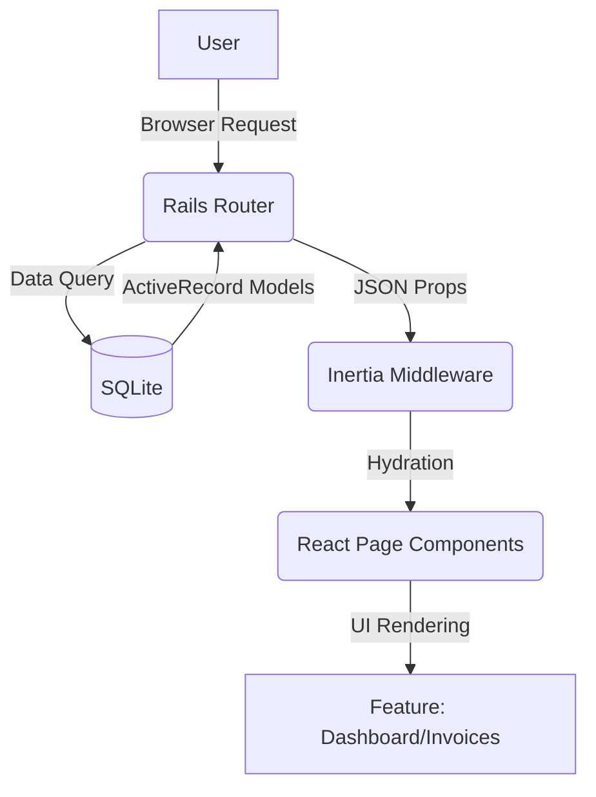

# VANTAGE

> **Swiss-Style Invoicing for the Modern SMB.**  
> Speed is a feature. Clarity is the product.


---

## ▣ Manifesto

**Vantage** is an opinionated invoicing tool built for a single purpose: **Getting paid with zero friction.**

It rejects the bloated complexity of enterprise ERPs in favor of a "Swiss Utility" aesthetic—rigid grids, high-contrast typography, and extreme legibility. It is designed for the Singaporean SMB context (SGD native), but adaptable anywhere.

### Core Philosophy
1.  **Data First:** No decorative fluff. Borders are crisp. Shadows are shallow.
2.  **Inertia Speed:** The app feels like a SPA but retains the stability of a Monolith.
3.  **Single Player:** Authentication is currently skipped for local-first velocity.

---

## ⚡ Features

### 1. Dashboard Pulse
*   **MRR Calculation:** Real-time tracking of Monthly Recurring Revenue.
*   **Activity Stream:** See when clients are created and invoices are sent.
*   **Metrics:** Overdue and Outstanding debt visualization.

### 2. Client Registry
*   **Rolodex:** Fast search and filtering of client details.
*   **Context:** dedicated "Notes" field for client-specific idiosyncrasies.
*   **History:** View lifetime value (LTV) per client.

### 3. The Invoice Engine
*   **Swiss Editor:** Keyboard-friendly line-item entry.
*   **Status Workflow:** `Draft` -> `Pending` -> `Paid` / `Overdue`.
*   **Smart Formatting:** Auto-formatted SGD currency handling.
*   **Public View:** A distraction-free, printable "Payment Page" for your clients.

---

## 🛠 Tech Stack

We are riding the **Rails 8 Renaissance** wave.

| Layer | Technology | Rationale |
| :--- | :--- | :--- |
| **Backend** | Ruby on Rails 8.0 | SQLite production ready, solid foundations. |
| **Bridge** | Inertia.js | The glue. Allows us to build React views without an API. |
| **Frontend** | React 19 | Component-based UI logic. |
| **Styling** | Tailwind CSS v4 | Utility-first, zero custom CSS files. |
| **UI Kit** | ShadCN (Customized) | Accessible primitives, stripped of "rounded" styles for our look. |
| **Icons** | Lucide React | Clean, consistent iconography. |

---

## 🏗 Architecture

We follow a **Feature-First** directory structure to keep domain logic co-located.



### Key Directories
*   `app/javascript/features/` - Where the magic happens (Business logic components).
*   `app/javascript/pages/` - The entry points for every Route.
*   `app/javascript/layouts/` - `AppLayout` (Admin) vs `PublicLayout` (Customer).

---

## 🚀 Getting Started

### Prerequisites
*   Ruby 3.2+
*   Node.js 20+
*   SQLite3

### Installation

1.  **Clone the repo**
    ```bash
    git clone https://github.com/yourusername/vantage.git
    cd vantage
    ```

2.  **Install dependencies**
    ```bash
    bundle install
    yarn install
    ```

3.  **Setup Database**
    ```bash
    bin/rails db:prepare
    ```

4.  **Start the Engine**
    ```bash
    bin/dev
    ```
    Visit `http://localhost:3000` to see the dashboard.

---

## 🎨 Design Guidelines

We enforce a strict **"Swiss Utility"** design system.

*   **Typeface:** Use `Inter Tight` for headings, `Merriweather` for documents, `JetBrains Mono` for data.
*   **Radius:** `rounded-none` or `rounded-sm`. No pills.
*   **Colors:** Monochrome base with **International Orange** (`text-orange-600`) for primary actions.
*   **Spacing:** Adhere to the grid. Use Tailwind's spacing scale rigidly.

---

## 🗺 Roadmap

- [ ] **Phase 1:** Core UI & CRUD (Current)
- [ ] **Phase 2:** PDF Generation (Puppeteer/Grover)
- [ ] **Phase 3:** Stripe/PayNow QR Integration
- [ ] **Phase 4:** Authentication (Devise/Omniauth)

---

## 🤝 Contributing

1.  Fork the project.
2.  Create your feature branch (`git checkout -b feature/AmazingFeature`).
3.  Commit your changes (`git commit -m 'Add some AmazingFeature'`).
4.  Push to the branch (`git push origin feature/AmazingFeature`).
5.  Open a Pull Request.

---

## 📄 License

Distributed under the MIT License. See `LICENSE.txt` for more information.
