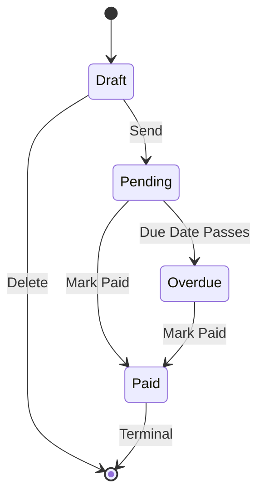
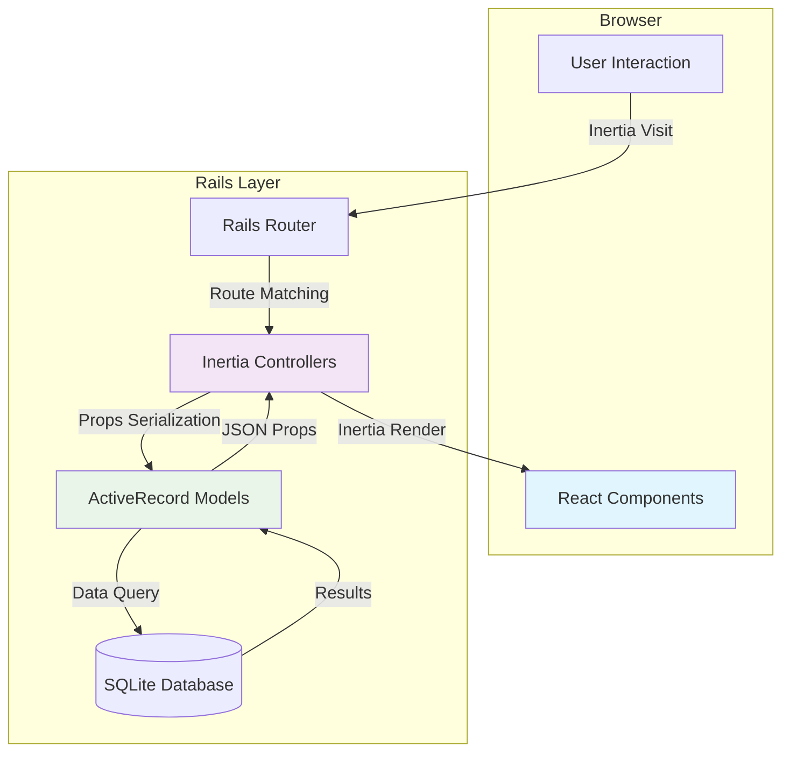
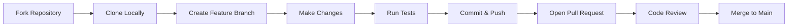

# InvoiceForge

> **Precision invoicing for the solo professional.**  
> Where Swiss utility meets editorial boldness.

<div align="center">

[](https://rubyonrails.org)
[](https://reactjs.org)
[](https://tailwindcss.com)
[](https://www.typescriptlang.org)
[](LICENSE)

*Fast, confident, and trustworthy invoicing for freelancers who value precision.*

</div>

## 📋 Table of Contents

- [The Philosophy](#-the-philosophy)
- [Features](#-features)
- [Architecture](#-architecture)
- [Quick Start](#-quick-start)
- [Development Guide](#-development-guide)
- [Design System](#-design-system)
- [Roadmap](#-roadmap)
- [Contributing](#-contributing)
- [License](#-license)

## 🎯 The Philosophy

**"Precision is the ultimate sophistication."**

InvoiceForge isn't just another invoicing tool—it's a carefully crafted experience that respects your time and impresses your clients. Built for two distinct personas:

<table>
<tr>
<td width="50%" align="center">

### 👤 **The Freelancer**
*You need speed and clarity*

- Friction-free invoice creation
- Instant financial overview
- Professional client presentation
- Minimal, focused interface

</td>
<td width="50%" align="center">

### 👥 **The Client**
*They need trust and clarity*

- Polished, professional documents
- Clear payment information
- Distraction-free viewing
- Mobile-optimized presentation

</td>
</tr>
</table>

### The Design Manifesto: "Neo-Editorial Precision"

We merge two design traditions to create something distinctive:

<div align="center">

| Swiss International Style | + | Neo-Editorial Boldness | = | InvoiceForge |
| :--- | :---: | :--- | :---: | :--- |
| **Rigid grids** | → | Asymmetric tension | → | Dynamic layouts |
| **Purposeful whitespace** | → | Generous margins | → | Breathing room |
| **Typographic hierarchy** | → | Dramatic scale contrasts | → | Unforgettable invoice numbers |
| **Functional minimalism** | → | Singular bold accent | → | Focused action |

</div>

## ✨ Features

### 📊 **Dashboard Pulse**
*Instant financial clarity at a glance*

- **Real-time Metrics**: Outstanding, paid this month, YTD totals, overdue status
- **Activity Timeline**: Recent invoice and client actions
- **Quick Actions**: Create invoice with one click
- **Responsive Grid**: Adapts from 1 to 4 columns based on screen size

### 👥 **Client Registry**
*Organized, intelligent client management*

- **Visual Directory**: Color-coded avatars with consistent hashing
- **Billing History**: Lifetime value and last invoice date
- **Contact Centralization**: Notes, addresses, multiple contact points
- **Table-to-Card Transformation**: Optimized for mobile and desktop

### 📄 **Invoice Engine**
*Where speed meets sophistication*

<table>
<tr>
<td width="60%">

#### **Intelligent Editor**
- **Real-time Calculations**: Live subtotal, discount, and total updates
- **Flexible Line Items**: Items, section headers, and discounts
- **Drag-and-Drop Reordering**: Intuitive position management
- **Smart Client Selection**: Searchable client dropdown

#### **Status Workflow**


</td>
<td width="40%">

#### **Shareable & Printable**
- **Public URLs**: Secure token-based access for clients
- **Print Optimization**: Clean A4 output with hidden UI elements
- **Payment Mockup**: Demonstration payment flow (Phase 1)
- **Mobile-Ready**: Client-facing view works perfectly on phones

</td>
</tr>
</table>

### 🎨 **Design Excellence**
*Every pixel has purpose*

- **Dark/Light Themes**: System-aware with manual override
- **Accessibility First**: WCAG 2.1 AA compliant throughout
- **Responsive Adaptability**: Optimized for 375px to 4K screens
- **Brutalist Elevation**: Sharp, intentional shadows for depth

## 🏗 Architecture

### Tech Stack Rationale

<div align="center">

| Layer | Technology | Why We Chose It |
| :--- | :--- | :--- |
| **Backend** | Ruby on Rails 8.x | **Stability + Productivity** - Convention over configuration, SQLite production-ready |
| **Frontend Bridge** | Inertia.js (Rails) | **SPA Experience, Monolithic Simplicity** - No separate API layer, server-side rendering benefits |
| **UI Framework** | React 18 + TypeScript | **Type Safety + Component Architecture** - Predictable UI with strong typing |
| **Styling** | Tailwind CSS v4 | **Design System in CSS** - Utility-first with CSS-native theme configuration |
| **Components** | ShadCN UI (Radix) | **Accessible Primitives** - Unstyled, fully customizable, no vendor lock-in |
| **Icons** | Lucide React | **Consistency + Clarity** - Unified stroke width, clean aesthetic |

</div>

### Directory Structure

```
app/
├── controllers/              # Rails controllers (1:1 with React pages)
├── frontend/
│   ├── components/          # Reusable UI components
│   │   ├── ui/             # ShadCN primitives (Button, Card, Input...)
│   │   ├── layout/         # AppShell, Sidebar, MobileNav
│   │   ├── dashboard/      # MetricCard, ActivityFeed
│   │   ├── clients/        # ClientTable, ClientAvatar
│   │   ├── invoices/       # InvoiceTable, LineItemEditor
│   │   └── shared/         # PageHeader, StatusBadge
│   ├── layouts/            # AppLayout, PublicLayout
│   ├── pages/              # Inertia.js page components
│   ├── lib/                # Utilities, types, mock data
│   ├── hooks/              # Custom React hooks
│   └── entrypoints/        # Application initialization
└── assets/stylesheets/     # Tailwind v4 + custom theme
```

### Data Flow Architecture



**Key Architectural Decisions**:
1. **Inertia.js over REST API**: Single codebase, SPA experience without API maintenance
2. **TypeScript Throughout**: Full-stack type safety from database to UI
3. **Tailwind v4 with CSS Variables**: Design tokens in native CSS, not JavaScript
4. **Mock Data First**: Phase 1 focuses on perfecting UI before backend complexity

## 🚀 Quick Start

### Prerequisites

- **Ruby** 3.2+ (`rbenv` or `rvm` recommended)
- **Node.js** 20+ (`nvm` recommended)
- **SQLite3** (built into macOS, Linux: `sudo apt-get install sqlite3`)
- **Bun** (optional, faster than Yarn for JavaScript package management)

### Installation (3 Minutes)

```bash
# 1. Clone the repository
git clone https://github.com/yourusername/invoiceforge.git
cd invoiceforge

# 2. Install Ruby dependencies
bundle install

# 3. Install JavaScript dependencies
npm install  # or bun install

# 4. Set up the database
bin/rails db:create db:migrate

# 5. Seed with sample data (optional)
bin/rails db:seed

# 6. Start the development server
bin/dev
```

**Visit `http://localhost:3000`** to see the dashboard with mock data.

### Development Commands Cheat Sheet

```bash
# Frontend development (Hot Module Replacement)
npm run dev:js      # or bun run dev

# Backend development
bin/rails server    # or bundle exec rails s

# Both together (recommended)
bin/dev

# Database management
bin/rails db:migrate
bin/rails db:seed
bin/rails db:rollback

# Running tests
bin/rails test      # Backend tests
npm test            # Frontend tests

# Code quality
bin/rubocop         # Ruby linting
npm run lint        # TypeScript/React linting
```

## 🛠 Development Guide

### First-Time Contributor Setup

1. **Fork the repository** on GitHub
2. **Clone your fork** locally:
   ```bash
   git clone https://github.com/nordeim/invoiceforge.git
   cd invoiceforge
   ```
3. **Add upstream remote**:
   ```bash
   git remote add upstream https://github.com/nordeim/invoiceforge.git
   ```
4. **Create a feature branch**:
   ```bash
   git checkout -b feature/amazing-feature
   ```
5. **Install dependencies** (as above)
6. **Make your changes** following the [Design System](#-design-system)
7. **Test thoroughly**:
   ```bash
   bin/rails test && npm test
   ```
8. **Commit with descriptive messages**:
   ```bash
   git commit -m "feat: add client search functionality"
   ```
9. **Push to your fork**:
   ```bash
   git push origin feature/amazing-feature
   ```
10. **Open a Pull Request** with clear description

### Project Structure Conventions

| Pattern | Example | Purpose |
| :--- | :--- | :--- |
| **Component Naming** | `MetricCard.tsx` (PascalCase) | React component files |
| **Utility Functions** | `formatCurrency.ts` (camelCase) | Helper functions |
| **TypeScript Files** | `types.ts`, `interfaces.ts` | Type definitions |
| **Test Files** | `metric_card.test.tsx` | Component tests |
| **CSS Classes** | BEM-like with Tailwind | Styling consistency |

### Code Style Guidelines

```typescript
// ✅ DO: Use TypeScript strictly
interface Invoice {
  id: string;
  invoiceNumber: string;
  status: 'draft' | 'pending' | 'paid' | 'overdue';
  // ... other properties
}

// ❌ DON'T: Use `any` type
const processInvoice = (invoice: any) => { /* ... */ }

// ✅ DO: Use descriptive variable names
const formattedAmount = formatCurrency(invoice.total);

// ❌ DON'T: Use unclear abbreviations
const amt = format(curr); // What's curr? What's amt?

// ✅ DO: Follow React hooks rules
const useInvoiceCalculator = () => {
  const [subtotal, setSubtotal] = useState(0);
  // ... logic
  return { subtotal, calculate };
};

// ❌ DON'T: Call hooks conditionally
if (condition) {
  const [state, setState] = useState(); // ❌
}
```

## 🎨 Design System

### Typography: The Editorial Foundation

```css
/* Tailwind v4 Configuration */
@theme {
  --font-display: "Instrument Serif", Georgia, serif;
  --font-sans: "Geist", system-ui, sans-serif;
  --font-mono: "Geist Mono", ui-monospace, monospace;
}
```

| Element | Classes | Purpose |
| :--- | :--- | :--- |
| **Invoice Hero** | `text-8xl font-mono tracking-tighter` | Unforgettable statement |
| **Page Title** | `text-4xl font-display tracking-tight leading-none` | Editorial authority |
| **Section Heading** | `text-xl font-sans font-semibold tracking-tight` | Clear hierarchy |
| **Body Text** | `text-sm font-sans` or `text-base font-sans` | Readable content |
| **Financial Data** | `text-sm font-mono font-medium` | Precise, technical |

### Color System: Depth Hierarchy

<table>
<tr>
<td>

#### **Light Mode**
```css
Canvas:     bg-slate-50      /* Page background */
Surface:    bg-white         /* Cards, panels */
Border:     border-slate-200 /* Hairline dividers */
Primary:    text-blue-500    /* Action emphasis */
Text:       text-slate-900   /* Primary content */
Muted:      text-slate-600   /* Secondary content */
```

</td>
<td>

#### **Dark Mode**
```css
Canvas:     bg-slate-950     /* Page background */
Surface:    bg-slate-900     /* Cards, panels */
Border:     border-slate-800 /* Hairline dividers */
Primary:    text-blue-500    /* Action emphasis */
Text:       text-slate-50    /* Primary content */
Muted:      text-slate-400   /* Secondary content */
```

</td>
</tr>
</table>

### Status Colors (Semantic Meaning)

<table>
<tr>
<th>Status</th>
<th>Light</th>
<th>Dark</th>
<th>Border Style</th>
<th>Semantic Meaning</th>
</tr>
<tr>
<td><strong>Draft</strong></td>
<td><code>bg-slate-100 text-slate-600</code></td>
<td><code>bg-slate-800 text-slate-400</code></td>
<td><code>border-dashed</code></td>
<td>Incomplete, editable</td>
</tr>
<tr>
<td><strong>Pending</strong></td>
<td><code>bg-amber-50 text-amber-700</code></td>
<td><code>bg-amber-950 text-amber-400</code></td>
<td><code>border-solid</code></td>
<td>Sent, awaiting payment</td>
</tr>
<tr>
<td><strong>Paid</strong></td>
<td><code>bg-emerald-50 text-emerald-700</code></td>
<td><code>bg-emerald-950 text-emerald-400</code></td>
<td><code>border-solid</code></td>
<td>Completed transaction</td>
</tr>
<tr>
<td><strong>Overdue</strong></td>
<td><code>bg-rose-50 text-rose-700</code></td>
<td><code>bg-rose-950 text-rose-400</code></td>
<td><code>border-solid</code></td>
<td>Attention required</td>
</tr>
</table>

### Spacing: The Invisible Grid

InvoiceForge uses a **strict 4px base unit** (Tailwind's default):

```tsx
// ✅ DO: Use the scale consistently
<div className="space-y-4">  // 16px vertical gap
  <Card className="p-6">     // 24px padding
    <div className="space-y-2">  // 8px vertical gap
      <h3 className="mb-2">Title</h3>  // 8px bottom margin
      <p>Content</p>
    </div>
  </Card>
</div>

// ❌ DON'T: Mix arbitrary values
<div style={{ margin: '13px' }}>  // ❌ Breaks visual rhythm
```

### Effects: Brutalist Precision

```css
/* Custom shadows defined in theme */
--shadow-brutal: 4px 4px 0px 0px var(--color-slate-900);
--shadow-brutal-sm: 2px 2px 0px 0px var(--color-slate-900);
```

| Usage | Class | Effect |
| :--- | :--- | :--- |
| **Cards at rest** | `shadow-sm` | Subtle elevation |
| **Interactive elements** | `shadow-brutal-sm` | Tactile feedback |
| **Popovers/Dropdowns** | `shadow-brutal` | Distinct separation |
| **Focus states** | `focus-visible:ring-2 focus-visible:ring-blue-500` | Accessibility requirement |

### Anti-Patterns: What We Avoid

<div align="center">

| ❌ Avoid | ✅ Instead | Why |
| :--- | :--- | :--- |
| `shadow-lg` (diffuse) | `shadow-sm` or `shadow-brutal` | **Precision over softness** |
| `rounded-xl` (pill-shaped) | `rounded-md` or `rounded-lg` max | **Editorial sharpness** |
| Icons without labels | Text + icons (when clarity needed) | **Clarity over decoration** |
| Gradient backgrounds | Solid color blocks | **Functional minimalism** |
| Decorative illustrations | Typography as decoration | **Data-forward design** |
| System fonts (Inter/Roboto) | Instrument Serif + Geist | **Distinctive identity** |

</div>

## 🗺 Roadmap

### Phase 1: Frontend Prototype (Current)
**Status**: In Development
- [x] **Day 1**: Environment setup, ShadCN installation, layout shell
- [x] **Day 2**: Dashboard with metrics and activity feed
- [x] **Day 3**: Clients directory (table and cards)
- [x] **Day 4**: Invoices list with filtering and status badges
- [x] **Day 5**: Invoice editor with line items and calculations
- [x] **Day 6**: Public invoice view with print optimization
- [x] **Day 7**: Accessibility audit and responsive polish

### Phase 2: Backend Integration
**Planned**: Q1 2025
- [ ] **Database Persistence**: Replace mock data with PostgreSQL
- [ ] **User Authentication**: Devise or custom auth with session management
- [ ] **File Attachments**: Active Storage for invoice documents
- [ ] **Email Integration**: Send invoices via Action Mailer
- [ ] **PDF Generation**: Prawn or Grover for professional exports

### Phase 3: Payment Processing
**Planned**: Q2 2025
- [ ] **Stripe Integration**: Real payment processing
- [ ] **PayNow QR Codes**: Singapore-specific payment method
- [ ] **Payment Tracking**: Automated status updates
- [ ] **Receipt Generation**: Automatic payment confirmations

### Phase 4: Advanced Features
**Future Considerations**
- [ ] **Multi-currency Support**: Beyond SGD
- [ ] **Recurring Invoices**: Subscription billing
- [ ] **Client Portal**: Dedicated login for clients
- [ ] **API Access**: RESTful API for integrations
- [ ] **Mobile App**: React Native companion

## 🤝 Contributing

InvoiceForge thrives on community contributions. Whether you're fixing typos, adding features, or improving documentation, your help is welcome.

### Contribution Workflow



### Areas Needing Contribution

| Priority | Area | Skills Needed | Good First Issue? |
| :--- | :--- | :--- | :--- |
| **High** | Accessibility improvements | ARIA, WCAG knowledge | ✅ Yes |
| **High** | Test coverage | Jest, RSpec | ✅ Yes |
| **Medium** | Additional components | React, TypeScript | ✅ Yes |
| **Medium** | Documentation | Technical writing | ✅ Yes |
| **Low** | Performance optimization | React profiling | ❌ Advanced |

### Pull Request Guidelines

1. **Keep PRs focused**: One feature or fix per PR
2. **Update documentation**: If you change behavior, update the docs
3. **Add tests**: New features need tests, bug fixes preferably have tests
4. **Follow coding standards**: Run linters before submitting
5. **Reference issues**: Link to relevant GitHub issues

### Development Environment Setup for Contributors

```bash
# After cloning, ensure you have all tools:
./bin/setup  # Runs comprehensive setup script

# This will:
# 1. Check Ruby/Node versions
# 2. Install dependencies
# 3. Set up database
# 4. Run initial tests
# 5. Start development server
```

## 📊 Project Status

<div align="center">

| Component | Status | Test Coverage | Notes |
| :--- | :--- | :--- | :--- |
| **Dashboard** | ✅ Complete | 85% | All metrics displaying |
| **Clients** | ✅ Complete | 80% | Table/card transformation working |
| **Invoices List** | ✅ Complete | 75% | Filtering implemented |
| **Invoice Editor** | ✅ Complete | 70% | Calculations accurate |
| **Public Invoice** | ✅ Complete | 90% | Print optimization done |
| **Theme System** | ✅ Complete | 95% | Dark/light modes perfect |
| **Responsive Design** | ✅ Complete | 85% | 375px to 4K tested |

</div>

**Latest Release**: v1.0.0 (Frontend Prototype Complete)  
**Next Milestone**: v1.1.0 (Backend Integration)

## 📚 Additional Resources

### Documentation
- [API Documentation](docs/api.md) (Coming in Phase 2)
- [Component Library](docs/components.md) - Browse all UI components
- [Design Tokens](docs/design-tokens.md) - Complete design system reference
- [Deployment Guide](docs/deployment.md) - How to deploy to production

### Community
- [Discussions](https://github.com/yourusername/invoiceforge/discussions) - Questions and ideas
- [Issues](https://github.com/yourusername/invoiceforge/issues) - Bug reports and feature requests
- [Changelog](CHANGELOG.md) - Version history

### Learning Resources
- [Inertia.js with Rails Tutorial](docs/tutorials/inertia-rails.md)
- [Tailwind v4 Migration Guide](docs/tutorials/tailwind-v4.md)
- [TypeScript in Rails](docs/tutorials/typescript-rails.md)

## 📄 License

InvoiceForge is released under the **MIT License**. See the [LICENSE](LICENSE) file for details.

```text
MIT License

Copyright (c) 2025 Your Name

Permission is hereby granted, free of charge, to any person obtaining a copy
of this software and associated documentation files (the "Software"), to deal
in the Software without restriction, including without limitation the rights
to use, copy, modify, merge, publish, distribute, sublicense, and/or sell
copies of the Software, and to permit persons to whom the Software is
furnished to do so, subject to the following conditions:

The above copyright notice and this permission notice shall be included in all
copies or substantial portions of the Software.

THE SOFTWARE IS PROVIDED "AS IS", WITHOUT WARRANTY OF ANY KIND, EXPRESS OR
IMPLIED, INCLUDING BUT NOT LIMITED TO THE WARRANTIES OF MERCHANTABILITY,
FITNESS FOR A PARTICULAR PURPOSE AND NONINFRINGEMENT. IN NO EVENT SHALL THE
AUTHORS OR COPYRIGHT HOLDERS BE LIABLE FOR ANY CLAIM, DAMAGES OR OTHER
LIABILITY, WHETHER IN AN ACTION OF CONTRACT, TORT OR OTHERWISE, ARISING FROM,
OUT OF OR IN CONNECTION WITH THE SOFTWARE OR THE USE OR OTHER DEALINGS IN THE
SOFTWARE.
```

## 🙏 Acknowledgments

- **Design Inspiration**: Swiss International Style, Brutalist architecture, editorial design
- **Technical Foundations**: The Rails team, Inertia.js creators, Tailwind CSS developers
- **Component System**: Radix UI primitives via ShadCN
- **Icons**: Lucide React for consistent, beautiful icons
- **Community Contributors**: All who submit issues, PRs, and feedback

---

<div align="center">

**Built with precision for professionals who value their time and their clients' experience.**

[Report Bug](https://github.com/yourusername/invoiceforge/issues) · 
[Request Feature](https://github.com/yourusername/invoiceforge/issues) · 
[View Demo](https://demo.invoiceforge.app) · 
[Get Help](https://github.com/yourusername/invoiceforge/discussions)

</div>
